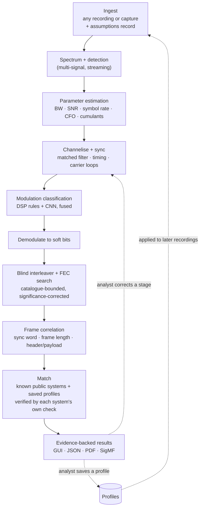

# Sanket — blind signal analysis, with evidence

**Sanket** (संकेत, "signal") is our answer to SIH26147: an **offline, CPU-only** workstation for unknown radio recordings. It takes `.iq`, `.wav`, SigMF and other recorder formats, or a capture from a connected receiver. It works out how a recording was transmitted: sample format, bandwidth, SNR, symbol rate, modulation, interleaver, error-correction code and framing. It then undoes each layer to recover the bits, and checks the result against a set of known public systems. An analyst can save what was found as a profile and reuse it on later recordings.

Every result shows the evidence behind it and how sure we are. Nothing is guessed silently.

| | |
|---|---|
| **Problem statement** | SIH26147: "Automated model for analysis of .IQ and .wav files along with signal parameter extraction". Full text: [docs/PROBLEM_STATEMENT.md](docs/PROBLEM_STATEMENT.md) |
| **Organisation** | NTRO (National Technical Research Organisation) |
| **Category / theme** | Software / Space Technology |
| **Idea submission deadline** | **30 September 2026** |
| **Status** | See [PLAN §0](docs/PLAN.md#0-progress) — the only place progress is tracked. |

---

## What the problem statement asks for

The full text is in [docs/PROBLEM_STATEMENT.md](docs/PROBLEM_STATEMENT.md). Today, analysts work out signal parameters by hand, and the recordings they get are often not enough for fine-grained work. The inputs are terrestrial HF, VHF and UHF signals (from a few kHz up to GHz), recorded as `.IQ` or `.wav` files. They come from different sensors and locations, so formats and sample rates vary, and each format has to be processed differently.

The PS asks for a GUI-based, **automated** model that takes an `.IQ` or `.wav` file and does five things:

1. **Identify signal parameters:** sampling frequency, modulation, FEC and interleaving ("additional features if feasible may be included").
2. **Demodulate** FSK, QAM and PSK.
3. **De-interleave** block, convolutional, diagonal (helical) and pseudo-random interleavers.
4. **Decode FEC:** short-constraint convolutional codes with Viterbi decoding, Reed-Solomon, concatenated codes and LDPC.
5. **Correlate the bitstream** to identify header and payload.

The GUI should improve the visibility of signal features, including sampling frequency, a **constellation plot** and a **waterfall** (time-frequency view). The PS also suggests learning from **training data in both `.IQ` and `.wav` formats**, and names GNU Radio, Python and C++ as possible tools. We use Python with Numba-compiled kernels for the product. GNU Radio is GPL-licensed, so we use it only at development time, for test signals and reference receivers.

## How it works



| Stage | What it does | Main methods |
|---|---|---|
| Ingest | Reads the recording; never guesses the format silently | One chunked reader per container (SigMF, raw, WAV/RF64, and others; see [Inputs](#inputs)); format sniffer for headerless files; quadrature check on stereo WAV |
| Detect | Finds every signal in time and frequency | Welch PSD, streaming spectrogram, OS-CFAR with hysteresis at 2–3 FFT sizes merged by non-maximum suppression |
| Estimate | Measures each signal | Occupied bandwidth, RRC roll-off, SNR from three estimators (PSD, M2M4, eigenvalue/MDL) whose agreement sets the confidence, Oerder-Meyr / cyclostationary symbol rate, M-th-power CFO, higher-order cumulants |
| Sync | Locks onto timing and carrier | RRC matched filter, Gardner / Mueller-Müller, Costas loop, FSK discriminator |
| Classify | Names the modulation | Explainable cumulant rules + a tiny (~10K-parameter) 1-D CNN on [I, Q, \|x\|, Δφ] after resampling to fixed samples-per-symbol; trained on our own impaired generator; layered unknown-signal rejection (SNR gate → energy score → prototype distance); disagreement is shown, not hidden |
| Demodulate | Produces soft bits (LLRs) | PSK/QAM slicers with Gray demapping, FSK detection, phase-ambiguity candidates |
| De-interleave + FEC | Identifies and decodes the coding layers | One bit-packed Numba GF(2) Gaussian-elimination kernel (soft GJETP) reused for code length, sync, puncturing and interleaver period; Galois-field Fourier test for RS; soft syndrome scoring against an LDPC catalogue; Viterbi, RS and min-sum decoders; false-alarm rate measured on shuffled bits |
| Frame | Finds message structure | Known sync library + blind sync discovery with a significance test; frame length; header fields |
| Match | Checks the blind results against known public systems and the analyst's saved profiles | Parameter match within tolerances, then the system's own check on this recording (CRC, sync recurrence, diversity copies); every entry counted in the ledger; blind results never overwritten |
| Report | Shows and exports everything | React GUI, JSON, PDF, SigMF annotations, profiles |

### Inputs

Every kind of input except a real-time stream. Whatever the route, Sanket analyses a file on this machine.

| Route | How |
|---|---|
| Open a file | By path; nothing is copied, which matters for multi-GB recordings |
| Upload | Drag and drop into the browser. It goes to Sanket's own local server, not the internet. |
| Folder or sequence | A folder becomes a batch (one job per file). A numbered sequence of files becomes one recording. |
| Command line | `sanket analyse <paths…>` writes the same results JSON, for scripts and batches |
| Connected receiver | Record a set duration from a USB SDR (RTL-SDR, HackRF, Airspy, USRP), or from a sound-card input carrying a receiver's audio or IQ output. It is saved as SigMF, then analysed. |

Recognised formats:
- **SigMF:** the full datatype vocabulary, archives and multi-capture recordings.
- **Raw headerless files** in all 28 SigMF datatypes, with the format sniffer.
- **WAV:** mono or stereo, integer or float, RF64/Wave64 over 4 GiB, and the SDR `auxi` chunk.
- **Compressed audio:** FLAC, MP3, Ogg.
- **Recorder containers:** SDRangel `.sdriq`, MIDAS Blue, VITA 49 packet recordings.
- **Other:** NumPy `.npy`, and `.gz`/`.zip` recordings.
- **Anything else:** read as raw bytes with a header offset.

Once a non-SigMF file's format is confirmed, **Save as SigMF** writes a `.sigmf-meta` next to it, so the format is never guessed again. The analyst can also enter **context** they already have (known parameters, a suspected standard, where and how it was recorded). Sanket checks that context against the data rather than taking it on trust.

### Known systems and profiles

After the blind chain, the **Match** stage compares the results with a small catalogue of common public systems: CCSDS telemetry coding (also used by Meteor-M LRPT), AIS, NAVTEX, MF/HF DSC and POCSAG. A match is only VERIFIED when that system's own check passes on this recording; otherwise it is at most "consistent with". This isn't a protocol library like a commercial decoder's. It is independent confirmation that the blind analysis got a real system right.

When an analysis is accepted, the analyst can **save it as a profile**: the chain it found, from sample format to frame layout and named header fields. The profile holds no samples. Applying it to a new recording, or to a folder of them, skips the rediscovery but not the checks: the decode is VERIFIED only by the new recording's own proof. If the profile doesn't fit, Sanket says so and runs the blind chain. Profiles export as files, so they can be shared between air-gapped stations.

## Evidence levels

Every value the tool reports carries one of these levels, a confidence, the method used, and its evidence:

| Level | Meaning | Example |
|---|---|---|
| **VERIFIED** | Proven by a hard check | CRC passes; sync word recurs at the frame period; re-encoded bits match with low BER |
| **MEASURED** | Read from metadata, or entered by the analyst | Sample rate from a SigMF or WAV header |
| **ESTIMATED** | Computed from the samples, with an uncertainty | Symbol rate 9,600 Bd ± 0.1% |
| **HYPOTHESIS** | A ranked candidate that isn't confirmed | "QPSK (0.71) or 8PSK (0.24): classifiers disagree" |
| **UNKNOWN** | Can't be determined, with the reason and what would settle it | "Pseudo-random interleaver: period ≤ 2,048 bits; seed not recoverable" |

Sometimes the evidence can't decide and a convention has to: a raw file doesn't say whether I or Q comes first, so we take I first, as most SDR tools write it. Such a value is always a HYPOTHESIS that names its convention. Every results file lists these values at the top under `needsReview`, so an empty list means nothing in the analysis rests on a guess.

This design builds on ideas from public SIH26147 prototypes. They include Devansh-567's five honesty states and ICHNOVA's refusals that explain what evidence is missing. See [docs/STANDARDS_TO_BEAT.md](docs/STANDARDS_TO_BEAT.md).

## Honest limits

We state these up front; they are not buried in fine print:

- **Sampling frequency is identified, with its evidence stated, and never assumed silently.** From a SigMF, WAV or recorder-container header (`.sdriq`, MIDAS Blue, VITA 49), or from a Sanket capture, it is MEASURED. The analyst can also enter it. For a headerless file we rank candidates (filename hints, the WAV `auxi` chunk, standard SDR device rates) and promote one to HYPOTHESIS when a structural match supports it: for example, only one candidate turns the measured symbol rate into a standard one. With no candidate we report normalised units and ask the analyst. The assumption is printed on every report. Relative values (symbol rate as a fraction of sample rate, bandwidth as a fraction of the recording) are always estimated. Centre frequency is handled the same way.
- **Blind FEC and interleaver identification is catalogue-bounded and probabilistic.** A result is VERIFIED only with CRC, sync-word or re-encode proof. The acceptance threshold rises with the number of hypotheses tried.
- **Pseudo-random interleavers with an unknown permutation are practically unrecoverable.** We test a catalogue of *standard* permutations (3GPP turbo, LTE QPP, 802.11, DVB-S2). Anything else is reported as UNKNOWN with the bounds we can measure, such as its period. General permutation recovery is an open research problem, so we don't claim a seed search.
- **Blind code identification needs enough clean data.** Hard-decision rank methods fail on long codes at high raw BER. For example, at 3% BER a 2,040-bit RS(255,223) row is almost never error-free. So we set identification targets per code family and use soft decisions: convolutional codes at channel BER, RS after the inner decoder, LDPC at Es/N0.
- **A raw file's layout is inferred, never assumed silently.** The format sniffer ranks every SigMF datatype by how well it explains the bytes and reports UNKNOWN when formats tie. For noise and for real low-pass signals, the real and complex readings of the same bytes fit equally well; we then propose complex, which is how raw SDR recordings are usually stored, and list it under `needsReview`.
- **A mono WAV is real-valued audio, not IQ.** Converting it with a Hilbert transform is an approximation, so digital-modulation labels from mono files are at most HYPOTHESIS. The same cap applies to lossy audio (MP3, Ogg), whose compression distorts phase.
- **The known-system catalogue is small by design.** It holds a few public systems, each with a check that can prove a match. It confirms the blind analysis; it doesn't replace a commercial decoder's library of thousands of modems.
- **Modulation classification degrades at low SNR.** We publish the accuracy-vs-SNR curve and suppress labels outside the validated range.
- **Analog signals are detected and labelled, not decoded.** The PS's demodulation list is digital (FSK, QAM, PSK), but real HF/VHF recordings are full of AM, FM and SSB voice and Morse. Sanket detects and labels these and measures their basic parameters. It keeps them out of the digital chain, so voice is never forced into a digital label. Playing the audio back is after-1.0 work.
- **Out of scope:**
  - decrypting protected payloads
  - real-time analysis of a live stream
  - capture from network-attached receivers such as KiwiSDR, which would break the no-network rule; record with the receiver's own tool and open the file instead
  - OFDM signals (Wi-Fi, LTE, DVB-T) are labelled unknown, not demodulated
  - transmitting

  Sanket can record from a locally connected receiver, but it always analyses the resulting file. We recover bits, not plaintext.
- **Planned after 1.0** ([PLAN §1](docs/PLAN.md#1-what-10-is)):
  - playable audio from analog signals
  - I/Q, amplitude, phase and frequency against time
  - an illustrative sine/cosine explain mode
  - ASK/OOK and ADS-B
  - OFDM parameters
  - payload text for catalogued systems
  - more known-system entries

## Tech stack

| Layer | Choice | Why |
|---|---|---|
| DSP core | **CPython 3.12 (pinned; numpy 2.5 requires it)**, NumPy, SciPy, Numba (pinned) for hot loops (GF(2) elimination, Viterbi, LDPC) | Fast to write and test; JIT where it matters |
| FEC | Our own implementations on top of **`galois`** (MIT) for finite fields and RS; scikit-commpy and pyldpc (stale since 2022/2020) used only as vendored references | Rivals hit bugs in these libraries (see [STANDARDS §6](docs/STANDARDS_TO_BEAT.md#6-engineering-lessons-from-rivals-free-bug-reports)). **komm (GPL-3.0) and PySDR code (CC BY-NC-SA) are kept out of the product.** |
| ML | PyTorch for training; **ONNX Runtime** (FP32, no signal processing inside the graph) for CPU inference; our own impaired generator for training; TorchSig as an independent test generator (WSL2); RadioML 2018.01A only as a public comparison benchmark | RadioML has documented SNR-label and class-name flaws and a non-commercial licence |
| Metadata | `sigmf` Python package | Standard input/output format |
| Inputs and capture | Our own chunked readers for SigMF, raw, WAV/RF64/Wave64, `.sdriq`, MIDAS Blue and VITA 49; `soundfile` (libsndfile, LGPL-2.1) for FLAC/MP3/Ogg; `sounddevice` (PortAudio, MIT) for sound-card capture; SDR recorders (`rtl_sdr`, `hackrf_transfer`, `airspy_rx`, UHD) run as **subprocesses** | Streams files of any size; GPL SDR drivers never enter the product |
| API | FastAPI + Uvicorn, SQLite, server-sent events for progress | One local process, no Redis or Postgres, air-gap friendly |
| GUI | React + TypeScript (Vite) + Tailwind. Waterfall drawn with raw WebGL2 as uint8 dB (R8) textures through a colormap LUT shader; from M2 it is fed by a server-side tiled STFT pyramid with level of detail (deck.gl TileLayer or regl only if that needs a library). uPlot for PSD and time plots. Density-texture constellation. Components borrowed from [IQEngine](https://github.com/IQEngine/IQEngine) (MIT, React/TS over FastAPI). | Handles multi-GB recordings smoothly; changing contrast needs no re-fetch |
| Reports | JSON, CSV, PDF, SigMF `.sigmf-meta` annotations; profiles as schema-versioned files | Reusable by other tools and other stations |
| Quality | pytest + Hypothesis, Vitest, Playwright E2E, ruff, pyright, ESLint, `tsc`, GitHub Actions | Measured, not claimed |
| Packaging | FastAPI serves the built frontend; offline wheelhouse; **PyInstaller one-folder** build with `NUMBA_CACHE_DIR` pointed at a writable directory; no CDN; bundled fonts. The build opens Sanket in its own **desktop window** via pywebview (bundled WebView2 runtime on Windows, WebKit2GTK on Linux), falling back to the browser | Runs with networking switched off; feels like a desktop app without a second frontend; avoids known frozen-Numba failures on Windows |

## Repository layout

```
iq-wav-analysis/
├── frontend/        React + TypeScript (Vite) workspace: waterfall, PSD, constellation, evidence, hypotheses — built
├── dsp/             (M1) Python package: ingest, synth (ground-truth generator), detect, estimate, sync, demod, gf2, deinterleave, fec, framing, systems (known-system catalogue), evidence
├── ml/              (M4) AMC training, evaluation, ONNX export
├── backend/         (M0) FastAPI app: serves the UI; later uploads, capture, jobs, SSE progress, SQLite storage, profiles, exports, CLI
├── bench/           (M1) Sealed benchmark, null set, rival comparisons, results
├── tests/           Python tests, one folder per package
├── tools/           Repo scripts: THIRD_PARTY.md generation and licence check
├── data/            Datasets and captures (git-ignored; only manifests are committed)
├── docs/            Plan, standards to beat, source dossier
├── reports/         Research report behind the plan (sources in research_notes/)
└── .claude/         Claude Code project config: CLAUDE.md, tooling map, settings, skills (dev-time only)
```

## Getting started

Sanket opens on a deterministic synthetic capture generated in the browser (clearly labelled *Synthetic demo*). Opening a real recording — including the synthetic ones in [docs/DEMO.md](docs/DEMO.md) — runs the real chain; see [PLAN §0](docs/PLAN.md#0-progress) for current status. You need **Node.js 22**, [uv](https://docs.astral.sh/uv/) and **Python 3.12** (pinned; `uv python install 3.12`).

```bash
uv sync                              # Python workspace + dev tools
npm ci --prefix frontend
npm run build --prefix frontend      # sanket serves this build
uv run sanket                        # http://127.0.0.1:8765
```

Checks, as CI runs them:

```bash
uv run ruff check && uv run ruff format --check && uv run pyright && uv run pytest
uv run python tools/third_party.py --check       # licences + THIRD_PARTY.md
cd frontend
npm run lint && npm run typecheck && npm test && npm run build
npx playwright install chromium                  # once
npm run e2e                                      # offline smoke test against sanket
```

For UI work, `npm run dev` in `frontend/` gives hot reload at http://localhost:5173. Run `uv run pre-commit install` once per clone. Nothing loads from the network: fonts, code and data are bundled.

Optional: **WSL2 Ubuntu 22.04+** for TorchSig; radioconda for GNU Radio; an RTL-SDR dongle for receive-only captures.

## Lawful use

This tool analyses recordings offline. It can also **receive** from a locally connected SDR into a SigMF file, but that is the operator's responsibility and needs authorisation (below). It is intended for authorised government, regulatory (WMO/WPC), defence and research use.

In India, lawful interception is governed by the **Telecommunications Act 2023, Section 20**, and is limited to authorised agencies. **Section 3** also requires authorisation to *possess* radio equipment unless it is exempted. The February 2025 draft rules that replace the 1965 possession rules don't clearly exempt a hobby SDR receiver, so treat our own over-the-air capture as a grey area.

For that reason, recordings come from these sources, in order of preference:
1. public licensed datasets
2. remote public KiwiSDR receivers (receive-only, broadcast and safety signals such as NAVTEX)
3. our own captures, only under an institutional umbrella and after checking with the organisers or WPC

The tool never transmits or decrypts. Its receive-only capture needs the same authorisation as the receiver itself. Record the provenance of every recording in its SigMF metadata; Sanket's own captures do this automatically.

## Documentation

- [docs/PROBLEM_STATEMENT.md](docs/PROBLEM_STATEMENT.md): the official SIH26147 problem statement
- [docs/QandA.md](docs/QandA.md): questions and answers — the radio theory, what the screen shows, and why the product is built the way it is
- [docs/PLAN.md](docs/PLAN.md): the production plan — progress, 1.0 scope, production bar, architecture, product identity, milestones M0–M8
- [docs/STANDARDS_TO_BEAT.md](docs/STANDARDS_TO_BEAT.md): commercial tools, open-source prior art, 35 verified rival repos, and our measurable targets
- [.claude/CLAUDE_SKILLS_MCP.md](.claude/CLAUDE_SKILLS_MCP.md): which Claude Code skills, plugins and MCP servers to use in each milestone, plus custom skills, CLAUDE.md rules and hooks
- [reports/SIH26147 solution research.md](reports/SIH26147%20solution%20research.md): the 2022–2026 research behind the plan's methods and targets
- [docs/SIHPS_ANALYSIS.md](docs/SIHPS_ANALYSIS.md): the source dossier, trimmed to SIH26147 and generic material (older than the documents above where they differ)

## Credits

We credit every library we ship in [`THIRD_PARTY.md`](THIRD_PARTY.md), generated from the lockfiles; CI fails on GPL/AGPL, non-commercial or unrecognised licences. Public SIH26147 repositories were studied as benchmarks, not copied. Most have no licence, which means all rights are reserved.
