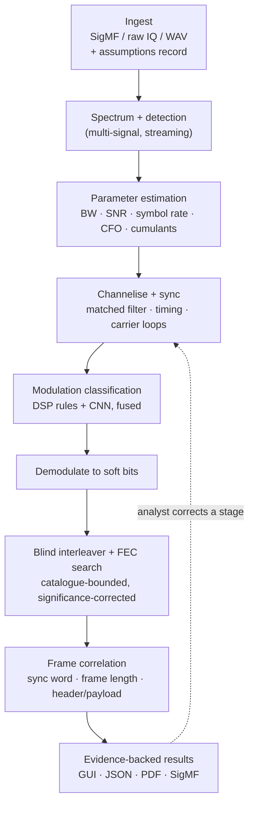

# Sanket — blind signal analysis, with evidence

**Sanket** (संकेत, "signal") is our answer to SIH26147: an **offline, CPU-only** workstation for unknown `.iq` and `.wav` radio recordings. It works out how a recording was transmitted: sample format, bandwidth, SNR, symbol rate, modulation, interleaver, error-correction code and framing. It then undoes each layer to recover the bits.

Every result shows the evidence behind it and how sure we are. Nothing is guessed silently.

| | |
|---|---|
| **Problem statement** | SIH26147: "Automated model for analysis of .IQ and .wav files along with signal parameter extraction" |
| **Organisation** | NTRO (National Technical Research Organisation) |
| **Category / theme** | Software. Theme is listed as Space Technology on recent mirrors; confirm on [sih.gov.in](https://sih.gov.in). |
| **Idea submission deadline** | **30 September 2026** |
| **Status** | M0 built: `sanket` serves the analysis workspace UI (synthetic demo data), with tests, licence gate and offline smoke test; waiting on the first CI run. Signal processing starts in M1. Details in [PLAN §0](docs/PLAN.md#0-progress). |

---

## What the problem statement asks for

The inputs are recordings of terrestrial HF, VHF and UHF signals (from a few kHz up to GHz). They come from different sensors and locations, so formats and sample rates vary. The tool must do five things ([dossier §B1](docs/SIHPS_ANALYSIS.md)):

1. **Identify signal parameters:** sampling frequency, modulation, FEC and interleaving.
2. **Demodulate** FSK, PSK and QAM.
3. **De-interleave** block, convolutional, diagonal (helical) and pseudo-random interleavers.
4. **Decode FEC:** convolutional (Viterbi), Reed-Solomon, concatenated (RS + convolutional) and LDPC.
5. **Correlate the bitstream** to find where each frame starts and to separate header from payload.

The GUI must include a **constellation plot** and a **waterfall** (spectrogram).

## How it works



| Stage | What it does | Main methods |
|---|---|---|
| Ingest | Reads the file; never guesses the format silently | SigMF `core:datatype`, WAV header, quadrature check on stereo WAV, memory-mapped chunked reads |
| Detect | Finds every signal in time and frequency | Welch PSD, streaming spectrogram, OS-CFAR with hysteresis at 2–3 FFT sizes merged by non-maximum suppression |
| Estimate | Measures each signal | Occupied bandwidth, RRC roll-off, SNR from three estimators (PSD, M2M4, eigenvalue/MDL) whose agreement sets the confidence, Oerder-Meyr / cyclostationary symbol rate, M-th-power CFO, higher-order cumulants |
| Sync | Locks onto timing and carrier | RRC matched filter, Gardner / Mueller-Müller, Costas loop, FSK discriminator |
| Classify | Names the modulation | Explainable cumulant rules + a tiny (~10K-parameter) 1-D CNN on [I, Q, \|x\|, Δφ] after resampling to fixed samples-per-symbol; trained on our own impaired generator; layered unknown-signal rejection (SNR gate → energy score → prototype distance); disagreement is shown, not hidden |
| Demodulate | Produces soft bits (LLRs) | PSK/QAM slicers with Gray demapping, FSK detection, phase-ambiguity candidates |
| De-interleave + FEC | Identifies and decodes the coding layers | One bit-packed Numba GF(2) Gaussian-elimination kernel (soft GJETP) reused for code length, sync, puncturing and interleaver period; Galois-field Fourier test for RS; soft syndrome scoring against an LDPC catalogue; Viterbi, RS and min-sum decoders; false-alarm rate measured on shuffled bits |
| Frame | Finds message structure | Known sync library + blind sync discovery with a significance test; frame length; header fields |
| Report | Shows and exports everything | React GUI, JSON, PDF, SigMF annotations |

## Evidence levels

Every value the tool reports carries one of these levels, a confidence, the method used, and its evidence:

| Level | Meaning | Example |
|---|---|---|
| **VERIFIED** | Proven by a hard check | CRC passes; sync word recurs at the frame period; re-encoded bits match with low BER |
| **MEASURED** | Read from metadata, or entered by the analyst | Sample rate from a SigMF or WAV header |
| **ESTIMATED** | Computed from the samples, with an uncertainty | Symbol rate 9,600 Bd ± 0.1% |
| **HYPOTHESIS** | A ranked candidate that isn't confirmed | "QPSK (0.71) or 8PSK (0.24): classifiers disagree" |
| **UNKNOWN** | Can't be determined, with the reason and what would settle it | "Pseudo-random interleaver: period ≤ 2,048 bits; seed not recoverable" |

This design builds on ideas from public SIH26147 prototypes. They include Devansh-567's five honesty states and ICHNOVA's refusals that explain what evidence is missing. See [docs/STANDARDS_TO_BEAT.md](docs/STANDARDS_TO_BEAT.md).

## Honest limits

We state these up front; they are not buried in fine print:

- **Absolute sample rate and centre frequency are never assumed for a headerless file.** We read them from SigMF or the WAV header. Otherwise we rank candidates (filename hints, the WAV `auxi` chunk, standard SDR device rates) and promote one to HYPOTHESIS only when a structural match supports it, such as a recognised symbol rate. With no candidate we report normalised units and ask the analyst. The assumption is printed on every report. Relative values (symbol rate as a fraction of sample rate, bandwidth as a fraction of the recording) are still estimated.
- **Blind FEC and interleaver identification is catalogue-bounded and probabilistic.** A result is VERIFIED only with CRC, sync-word or re-encode proof. The acceptance threshold rises with the number of hypotheses tried.
- **Pseudo-random interleavers with an unknown permutation are practically unrecoverable.** We test a catalogue of *standard* permutations (3GPP turbo, LTE QPP, 802.11, DVB-S2). Anything else is reported as UNKNOWN with the bounds we can measure, such as its period. General permutation recovery is an open research problem, so we don't claim a seed search.
- **Blind code identification needs enough clean data.** Hard-decision rank methods fail on long codes at high raw BER. For example, at 3% BER a 2,040-bit RS(255,223) row is almost never error-free. So we set identification targets per code family and use soft decisions: convolutional codes at channel BER, RS after the inner decoder, LDPC at Es/N0.
- **A mono WAV is real-valued audio, not IQ.** Converting it with a Hilbert transform is an approximation, so digital-modulation labels from mono files are at most HYPOTHESIS.
- **Modulation classification degrades at low SNR.** We publish the accuracy-vs-SNR curve and suppress labels outside the validated range.
- **Out of scope:** decrypting protected payloads, live capture, and transmitting. We recover bits, not plaintext.

## Tech stack

| Layer | Choice | Why |
|---|---|---|
| DSP core | **CPython 3.12 (pinned; numpy 2.5 requires it)**, NumPy, SciPy, Numba (pinned) for hot loops (GF(2) elimination, Viterbi, LDPC) | Fast to write and test; JIT where it matters |
| FEC | Our own implementations on top of **`galois`** (MIT) for finite fields and RS; scikit-commpy and pyldpc (stale since 2022/2020) used only as vendored references | Rivals hit bugs in these libraries (see [STANDARDS §6](docs/STANDARDS_TO_BEAT.md#6-engineering-lessons-from-rivals-free-bug-reports)). **komm (GPL-3.0) and PySDR code (CC BY-NC-SA) are kept out of the product.** |
| ML | PyTorch for training; **ONNX Runtime** (FP32, no signal processing inside the graph) for CPU inference; our own impaired generator for training; TorchSig as an independent test generator (WSL2); RadioML 2018.01A only as a public comparison benchmark | RadioML has documented SNR-label and class-name flaws and a non-commercial licence |
| Metadata | `sigmf` Python package | Standard input/output format |
| API | FastAPI + Uvicorn, SQLite, server-sent events for progress | One local process, no Redis or Postgres, air-gap friendly |
| GUI | React + TypeScript (Vite) + Tailwind. Waterfall drawn with raw WebGL2 as uint8 dB (R8) textures through a colormap LUT shader; from M2 it is fed by a server-side tiled STFT pyramid with level of detail (deck.gl TileLayer or regl only if that needs a library). uPlot for PSD and time plots. Density-texture constellation. Components borrowed from [IQEngine](https://github.com/IQEngine/IQEngine) (MIT, React/TS over FastAPI). | Handles multi-GB recordings smoothly; changing contrast needs no re-fetch |
| Reports | JSON, CSV, PDF, SigMF `.sigmf-meta` annotations | Reusable by other tools |
| Quality | pytest + Hypothesis, Vitest, Playwright E2E, ruff, pyright, ESLint, `tsc`, GitHub Actions | Measured, not claimed |
| Packaging | FastAPI serves the built frontend; offline wheelhouse; **PyInstaller one-folder** build with `NUMBA_CACHE_DIR` pointed at a writable directory; no CDN; bundled fonts | Runs with networking switched off; avoids known frozen-Numba failures on Windows |

## Repository layout

```
iq-wav-analysis/
├── frontend/        React + TypeScript (Vite) workspace: waterfall, PSD, constellation, evidence, hypotheses — built
├── dsp/             (M1) Python package: ingest, synth (ground-truth generator), detect, estimate, sync, demod, gf2, deinterleave, fec, framing, evidence
├── ml/              (M4) AMC training, evaluation, ONNX export
├── backend/         (M0) FastAPI app: serves the UI; later uploads, jobs, SSE progress, SQLite storage, exports
├── bench/           (M1) Sealed benchmark, null set, rival comparisons, results
├── tests/           Python tests, one folder per package
├── tools/           Repo scripts: THIRD_PARTY.md generation and licence check
├── data/            Datasets and captures (git-ignored; only manifests are committed)
├── docs/            Plan, standards to beat, source dossier
├── reports/         Research report behind the plan (sources in research_notes/)
└── .claude/         Claude Code project config: CLAUDE.md, tooling map, settings, skills (dev-time only)
```

## Getting started

Sanket runs today on a deterministic synthetic capture generated in the browser (clearly labelled *Synthetic demo*); signal processing starts in M1. You need **Node.js 22**, [uv](https://docs.astral.sh/uv/) and **Python 3.12** (pinned; `uv python install 3.12`).

```bash
uv sync                              # Python workspace + dev tools
npm ci --prefix frontend
npm run build --prefix frontend      # sanket serves this build
uv run sanket                        # http://127.0.0.1:8765
```

Checks, as CI runs them:

```bash
uv run ruff check && uv run ruff format --check && uv run pyright && uv run pytest
uv run python tools/third_party.py --check       # licences + THIRD_PARTY.md
cd frontend
npm run lint && npm run typecheck && npm test && npm run build
npx playwright install chromium                  # once
npm run e2e                                      # offline smoke test against sanket
```

For UI work, `npm run dev` in `frontend/` gives hot reload at http://localhost:5173. Run `uv run pre-commit install` once per clone. Nothing loads from the network: fonts, code and data are bundled.

Optional: **WSL2 Ubuntu 22.04+** for TorchSig; radioconda for GNU Radio; an RTL-SDR dongle for receive-only captures.

## Lawful use

This tool analyses recordings that were **already captured**, offline. It is intended for authorised government, regulatory (WMO/WPC), defence and research use.

In India, lawful interception is governed by the **Telecommunications Act 2023, Section 20**, and is limited to authorised agencies. **Section 3** also requires authorisation to *possess* radio equipment unless it is exempted. The February 2025 draft rules that replace the 1965 possession rules don't clearly exempt a hobby SDR receiver, so treat our own over-the-air capture as a grey area.

For that reason, recordings come from these sources, in order of preference:
1. public licensed datasets
2. remote public KiwiSDR receivers (receive-only, broadcast and safety signals such as NAVTEX)
3. our own captures, only under an institutional umbrella and after checking with the organisers or WPC

The tool does not capture, transmit or decrypt. Record the provenance of every recording in its SigMF metadata.

## Documentation

- [docs/PLAN.md](docs/PLAN.md): the production plan — progress, 1.0 scope, production bar, architecture, product identity, milestones M0–M8
- [docs/STANDARDS_TO_BEAT.md](docs/STANDARDS_TO_BEAT.md): commercial tools, open-source prior art, 35 verified rival repos, and our measurable targets
- [.claude/CLAUDE_SKILLS_MCP.md](.claude/CLAUDE_SKILLS_MCP.md): which Claude Code skills, plugins and MCP servers to use in each milestone, plus custom skills, CLAUDE.md rules and hooks
- [reports/SIH26147 solution research.md](reports/SIH26147%20solution%20research.md): the 2022–2026 research behind the plan's methods and targets
- [docs/SIHPS_ANALYSIS.md](docs/SIHPS_ANALYSIS.md): the source dossier, trimmed to SIH26147 and generic material (older than the documents above where they differ)

## Credits

We credit every library we ship in [`THIRD_PARTY.md`](THIRD_PARTY.md), generated from the lockfiles; CI fails on GPL/AGPL, non-commercial or unrecognised licences. Public SIH26147 repositories were studied as benchmarks, not copied. Most have no licence, which means all rights are reserved.
