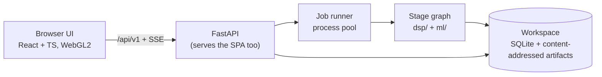

# Sanket — build plan

**Sanket** (संकेत, "signal") is our SIH26147 product: an offline, CPU-only workstation that takes an unknown `.iq` or `.wav` recording and works out how it was transmitted — sample format, bandwidth, SNR, symbol rate, modulation, interleaver, error-correction code and framing — then undoes each layer to recover the bits, showing the evidence for every claim.

This plan is written to ship **Sanket 1.0 as production software**, not a demo. It is organised by milestones with measurable exit gates rather than by calendar weeks or people. Last revised **27 September 2026**.

Related: [README](../README.md) · [Standards to beat](STANDARDS_TO_BEAT.md) · [Source dossier](SIHPS_ANALYSIS.md) · [Research report](../reports/SIH26147%20solution%20research.md) · [Claude Code tooling](../claude/CLAUDE_SKILLS_MCP.md)

---

## 1. What 1.0 is

**In scope**

- Input: SigMF (full `core:datatype` vocabulary), raw `cf32/ci16/ci8/cu8` in both byte orders and IQ/QI order, WAV mono and stereo. Files of any size, streamed.
- Multi-signal detection in time and frequency, parameter estimation, synchronisation and demodulation of PSK, QAM and FSK to soft bits.
- Modulation classification with open-set rejection.
- Blind identification and decoding of block, convolutional, helical and catalogued pseudo-random interleavers; convolutional (incl. punctured), Reed-Solomon, concatenated and catalogued LDPC codes.
- Frame sync discovery, frame length, header fields, CRC checks.
- A web GUI served locally: waterfall, PSD, constellation, eye diagram, evidence, hypothesis accounting, frames, assumptions. Analyst overrides that re-run downstream stages.
- Exports: JSON, CSV, PDF, SigMF annotations.
- One-folder installable build for Windows 10/11 x64 and Ubuntu 22.04+ that runs with networking switched off.

**Out of scope for 1.0**: live capture from SDR hardware, transmitting, decrypting protected payloads, generic pseudo-random permutation recovery, multi-user server deployment.

## 2. The production bar

1.0 ships only when every row holds, each enforced by a test or a script rather than a review comment. Numeric targets for the signal-processing itself are in [STANDARDS §8](STANDARDS_TO_BEAT.md#8-our-bar--measurable-targets); these are the product-level requirements around them.

| Area | Requirement | Enforced by |
|---|---|---|
| Correctness | Every stage is tested against exact ground truth from our generator, including a case where it must fail or abstain | pytest + `bench/` |
| Honesty | Every reported value is a `Parameter` with an evidence level; **0 silent defaults**; VERIFIED only from a CRC pass, sync-word recurrence or a re-encode match consistent with EVM | Schema validation on every result; an ingest test that enumerates every unknown-format path |
| False accepts | **0 accepted decodes on ≥ 1,000 null files** (noise, uncoded, repetition, idle) | `bench run --null` in CI (nightly) |
| Scale | Files ≥ 4 GiB processed end to end; peak memory stays bounded and independent of file size | Scale test on a generated 4 GiB file; RSS ceiling asserted |
| Performance | Full chain on 10 M samples ≤ 10 s on a 4-core laptop (excluding blind LDPC catalogue search); first waterfall tile ≤ 2 s after ingest starts; pan/zoom holds 60 fps at 1080p on integrated graphics | `bench perf` with thresholds; a frame-time check in E2E |
| Reliability | A stage that throws is marked FAILED with its error and the job continues where it can; the server never crashes on bad input; jobs survive a restart | Fault-injection tests; parser fuzzing; restart test |
| Offline | **0 outbound connections** at runtime; no CDN; fonts and assets bundled | Socket-blocking E2E run in CI; build scan for external URLs |
| Security | Binds to 127.0.0.1 by default; upload size limits; export filenames sanitised (a rival had path traversal here); no shell interpolation of filenames; dependency audit | Security tests; `pip-audit` and `npm audit` in CI |
| Reproducibility | Same file + same Sanket version + same settings → byte-identical results JSON. Results record Sanket version, catalogue version, model hash and seeds | Hash test on the bench set |
| Accessibility | Every control keyboard-reachable; WCAG 2.2 AA contrast in both themes; evidence never conveyed by colour alone; reduced-motion respected | axe checks in E2E; manual keyboard pass per release |
| Observability | Structured local logs (JSON lines, per job); per-stage timings in results; a "diagnostics bundle" export with logs and versions but no recording data | Tests on the bundle contents |
| Licensing | No GPL, AGPL or non-commercial code in the product; `THIRD_PARTY.md` generated from the lockfiles | Licence check in CI fails the build |
| Data handling | Recordings never leave the machine; the workspace directory is configurable; deleting a job deletes everything derived from it | Tests on deletion |
| Packaging | One-folder build per platform, one start command, frozen Numba works (pinned numba/llvmlite, writable `NUMBA_CACHE_DIR`, kernels pre-warmed) | Frozen-build smoke test in CI on both platforms |

## 3. Architecture



One local process tree, no external services. The pieces and the contracts between them:

- **Stage graph.** Each stage is a pure function `run(inputs, params, overrides) → StageResult {parameters, artifacts, warnings, timings}`. Its cache key is the hash of its input artifacts, parameters and stage code version. An analyst override invalidates that stage and its descendants only, which is what makes "correct a stage, re-run the rest, show the diff" (D5) cheap.
- **Evidence model.** `Parameter {value, unit, level, confidence, method, evidence[], alternatives[], warnings[], resolve_hint}` — the frontend type already exists in [`frontend/src/lib/evidence.ts`](../frontend/src/lib/evidence.ts) and the Python model must match it. Downstream proof may **promote** an upstream value (a CRC pass makes the modulation VERIFIED), and the promotion is recorded as evidence.
- **Hypothesis ledger.** Every blind search writes every candidate it tried — statistic, p-value, corrected threshold, outcome, reason — plus its shuffled-bit false-alarm runs. The D8 hypothesis table renders this ledger directly.
- **Streaming.** Readers are memory-mapped and chunked; detectors run on chunks; nothing loads a whole file.
- **Tiles.** The server computes a multi-resolution STFT pyramid quantised to uint8 dB in fixed-size tiles, **max-pooled** between levels so short bursts survive zooming out. The frontend already renders a uint8 dB texture through a LUT shader; switching it from one demo texture to server tiles is an M2 task.
- **API.** Versioned under `/api/v1`. The OpenAPI schema generates the TypeScript types the frontend compiles against, so a contract break fails the build. Progress over server-sent events. Literal routes are registered before parameterised ones.

  | Endpoint | Purpose |
  |---|---|
  | `POST /recordings` | Chunked upload, or register a local path without copying |
  | `GET /recordings/{id}` | Metadata, format candidates, assumptions |
  | `POST /jobs` · `GET /jobs/{id}/events` | Start analysis · SSE progress |
  | `GET /jobs/{id}/results` | Stage results, parameters, ledger, frames |
  | `GET /tiles/{rec}/{level}/{t}/{f}` | uint8 dB waterfall tile |
  | `POST /jobs/{id}/overrides` | Analyst correction → downstream re-run |
  | `GET /jobs/{id}/export.{json,csv,pdf,sigmf}` | Exports, each carrying the assumptions block |

- **Repository layout.**

  ```
  frontend/   React + TS + Vite — exists (identity, workspace, demo data)
  dsp/        ingest, detect, estimate, sync, demod, gf2, deinterleave, fec, framing, evidence
  ml/         AMC training, evaluation, ONNX export, model card
  backend/    FastAPI app, job runner, storage, exports, packaging
  bench/      generator presets, sealed set, null set, results, perf, decoder-truth harness
  docs/       plan, standards, dossier
  ```

## 4. Product identity (fixed)

The identity is implemented in [`frontend/`](../frontend/) and is the reference for every screen, export and slide.

| Element | Decision | Source of truth |
|---|---|---|
| Name | **Sanket** (संकेत, "signal"); tagline "Blind signal analysis, with evidence" | `frontend/src/brand.ts` — change it there only |
| Mark | A waveform resolving into a four-point constellation: signal in, symbols out | `frontend/src/components/Logo.tsx`, `frontend/public/favicon.svg` |
| Colour | Dark-first instrument UI with a light theme; accent "signal cyan"; all colours are tokens with shadcn/ui-compatible names | `frontend/src/styles/index.css` |
| Evidence levels | VERIFIED green + shield · MEASURED blue + ruler · ESTIMATED violet + Σ · HYPOTHESIS amber + dashed circle · UNKNOWN grey + slashed circle | `frontend/src/components/levelStyles.ts` |
| Type | IBM Plex Sans for UI, IBM Plex Mono with tabular numerals for every number, IBM Plex Sans Devanagari for the native name — all bundled | `frontend/src/main.tsx` |
| Colormaps | "Sanket" house map plus Viridis, Inferno, Grayscale; all tested for monotonic luminance | `frontend/src/lib/colormaps.ts` |

**UI rules** that every new screen follows:

1. An evidence level is always glyph + label + colour, never colour alone.
2. Every number shows its unit and, where it's estimated, its uncertainty. True minus signs; non-breaking space before units.
3. UNKNOWN always says why and what would settle it.
4. Demo or synthetic data is always labelled as such, on screen and in any screenshot.
5. No dead controls: a button that can't work yet isn't shown.
6. Plots are dark in both themes; their overlays use the dark palette.
7. Workspace layout: detections and pipeline on the left; waterfall, PSD and the hypotheses/frames/assumptions tabs in the centre; symbol view and evidence on the right. Below 1280 px the page scrolls and panels stack.

## 5. Milestones

Dependencies: **M0 → M1 → M2 → M3 → (M4 ∥ M5) → M6 → M8**, with **M7** running alongside from M2 onward. Every exit gate is measured in `bench/` or CI, never asserted.

| | Milestone | Status |
|---|---|---|
| M0 | Foundations and identity | Identity and workspace UI done; repo tooling and CI open |
| M1 | Ingest, evidence model, ground-truth lab, bench v0 | Not started |
| M2 | Spectrum, detection, estimation, real tiles in the UI | Not started |
| M3 | Synchronisation and demodulation | Not started |
| M4 | Modulation classification | Not started |
| M5 | GF(2) kernel, interleavers, FEC | Not started |
| M6 | Framing | Not started |
| M7 | Analyst workflow and reports | Not started |
| M8 | Hardening, validation and 1.0 release | Not started |

### M0 — Foundations and identity

- **Done:** Vite + React 19 + TypeScript (strict) + Tailwind 4 frontend; design tokens; the full analysis workspace driven by a deterministic synthetic capture generated in a Web Worker — WebGL2 waterfall (R8 dB texture + LUT shader, zoom/pan/keyboard, detection overlays, hover readout), uPlot PSD locked to the waterfall's frequency window, constellation and FSK tone views, evidence cards, hypothesis ledger, frames and assumptions tables. 26 unit tests (FFT, colormaps, generator, view maths, formatting); lint, typecheck and production build clean; verified in headless Chrome in both themes and at 390/1180/1512 px with no console errors and no network requests beyond localhost.
- **Remaining:**
  - Python 3.12 (pinned) + uv workspace for `dsp/`, `ml/`, `backend/`, `bench/`
  - FastAPI skeleton that serves the built frontend; a `sanket` start command
  - CI on Windows and Ubuntu: ruff, pyright (strict on `dsp/`), pytest, `tsc`, ESLint, Vitest, build, licence check
  - pre-commit hooks; `THIRD_PARTY.md` generated from lockfiles
  - Playwright smoke test (the identity-pass browser checks become the first E2E), run once with sockets blocked
- **Exit gate:** a clean clone goes green in CI on both platforms, and `sanket` starts one process that serves the UI with networking off.

### M1 — Ingest, evidence model, ground-truth lab, bench v0

- **Evidence model** in `dsp/evidence` matching the frontend type; JSON schema generated from it; every result validated against the schema.
- **Ingest:**
  - SigMF full `core:datatype` vocabulary; raw formats in both byte orders and IQ/QI; WAV mono (analytic signal, flagged HYPOTHESIS for digital labels) and stereo (quadrature check plus an analyst prompt)
  - memory-mapped chunked reader; file-size-versus-datatype consistency check (ORACLE's metadata says 32-bit, its data is complex128)
  - **format sniffer** that proposes ranked candidates and never picks silently: header detection, then every datatype × byte order scored on float validity, spectral non-whiteness, lag-1 autocorrelation, I/Q power balance and DC; report the margin over the runner-up. IQ/QI stays an analyst toggle — a swap only mirrors the spectrum. Validated with a confusion matrix over all format permutations.
  - **sample-rate candidates**, ranked: filename hints, the WAV `auxi` chunk, standard SDR device rates, and structural matches (a recognised symbol rate × candidate Fs within 0.1 % promotes it to HYPOTHESIS). With no candidate, output in normalised units.
  - an `Assumptions` block in every output
- **Ground-truth lab:**
  - NumPy generator as the main source: modulation × pulse shape × FEC × interleaver × framing with CRC, writing SigMF with the truth in annotations; Sig53-style impairments (AWGN, CFO, phase noise, IQ imbalance, multipath/fading, timing drift, clipping, AGC), ±10–20 % samples-per-symbol jitter, an explicit noise class
  - TorchSig (WSL2) as an **independent** test generator; generate only the subsets needed (full corpus is about 1 TB)
- **Bench v0:** fixed seeds; a **sealed** held-out set never inspected during development; the null set; `bench run` writes versioned results JSON.
- **Exit gate:** round-trip tests pass for every format; sniffer confusion matrix published; 0 silent defaults (tested); bench v0 and null set generated.

### M2 — Spectrum, detection, estimation, real tiles

- **Detection:** streaming Welch PSD and spectrogram; percentile noise floor; OS-CFAR + hysteresis + morphological clean-up + connected-component labelling; run at 2–3 FFT sizes and merge with NMS; channelisation (mix, filter, decimate). Detect FM-carrying-audio before digital classification.
- **Estimation:** occupied bandwidth; RRC roll-off by least-squares PSD fit, snapped to standard values; SNR from three estimators (PSD in-band vs guard, M2M4 for PSK, eigenvalue/MDL) with their agreement as the confidence; symbol rate from the |x|² line (x²/x⁴ for BPSK/QPSK), refined by cyclic autocorrelation and confirmed by our own FAM/SSCA, with an occupied-bandwidth fallback below β ≈ 0.1; FSK rate from instantaneous frequency; CFO by M-th power (gated for QAM); cumulants C20, C40, C42.
- **Tiles in the UI:** server STFT pyramid with max-pooling; frontend switches from the demo texture to tiled level-of-detail rendering; detection boxes from real results.
- *Stretch:* frequency-hopper clustering (DBSCAN over detections); co-channel overlap *detection* via multiple cyclic lines or MDL > 1.
- **Exit gate:** STANDARDS §8 detection and estimation targets met per SNR bucket; a 4 GiB file streams through detection with bounded memory; first tile ≤ 2 s.

### M3 — Synchronisation and demodulation

- RRC matched filter; Gardner / Mueller-Müller timing with a Farrow interpolator; Costas loop plus decision-directed tracking for QAM; FSK discriminator averaged over each symbol interior.
- BPSK, QPSK, 8PSK, 16/64-QAM, 2/4/8-FSK (stretch: MSK/GMSK, OQPSK, π/4-DQPSK); Gray demapping to LLRs; EVM and lock metrics; eye diagram in the UI.
- Phase ambiguity: carry every rotation forward; FEC and sync stages resolve it.
- **Exit gate:** BER within 1 dB of theory on AWGN for every supported modulation.

### M4 — Modulation classification

- Explainable cumulant and spectral-line rules, each decision listing its evidence.
- A ~10K-parameter complex-as-real 1-D CNN on [I, Q, |x|, Δφ] after resampling to 4–8 samples per symbol, cumulant features fused before the head, trained on our impaired generator. Temperature calibration only if expected calibration error improves.
- Three-layer open-set rejection: SNR gate → energy score → Mahalanobis distance to class prototypes with per-class thresholds; logits averaged over windows.
- Fusion: agreement → ESTIMATED; disagreement → HYPOTHESIS with both rankings.
- FP32 ONNX with no signal processing in the graph; model identity pinned in `ml/MODEL_CARD.md`.
- Evaluation on data we didn't generate (TorchSig, HisarMod, RadioML with corrected labels — its SNR labels, AM-SSB class and 2018.01A class mapping are wrong, and its licence is non-commercial); accuracy vs SNR −20 to +30 dB; open-set AUROC, FPR@95 %TPR, OSCR per SNR bin.
- **Exit gate:** STANDARDS §8 AMC targets met; labels are suppressed outside the validated SNR range.

### M5 — GF(2) kernel, interleavers, FEC

The core differentiator (D9): no public implementation of these methods exists.

- **Kernel first:** one bit-packed, Numba-JIT GF(2) Gauss-Jordan elimination (GJETP) reused for code length, sync offset, puncturing period, parity-check recovery and interleaver period; soft variant (rows ordered by LLR reliability) and rank iteration.
- **Catalogue** (versioned YAML, each entry with source and licence): convolutional K=3–9 at ½ and ⅓ with CCSDS / DVB / 802.11 punctures; RS(255,223) CCSDS, RS(204,188) DVB and shortened variants; concatenated RS + conv with a byte interleaver; LDPC from CCSDS, DVB-S2 short frames, 802.11n and 5G NR base-graph subsets.
- **Identification:** convolutional via dual-code parity checks, punctured codes via Marazin's two-stage method, scored by parity-check probability from LLRs; RS via a binary rank scan then a Galois-field Fourier transform over 16 primitive polynomials × symbol offsets plus the CCSDS dual basis (`galois`); LDPC by soft syndrome-posterior scoring against the catalogue; concatenated chains inner-first.
- **Interleavers:** block via rank-drop plus a KS test on rank distributions; Forney via an (I, J, phase) grid; helical via the dedicated period/row/column estimators; pseudo-random only against a catalogue of **standard permutations** (3GPP turbo, LTE QPP, 802.11, DVB-S2) — anything else is UNKNOWN with its measured period.
- **False-alarm control:** every hypothesis counted into the ledger; Holm (or Benjamini–Hochberg) across the whole search; rank matrices always have L ≥ w + 30 rows; every detector also runs on shuffled bits and reports its empirical false-alarm rate.
- **Decoders:** Numba Viterbi (soft), RS via `galois`, normalised min-sum LDPC.
- **Exit gate:** per-family, soft-decision FEC-ID targets from STANDARDS §8; **0 false accepts on ≥ 1,000 null files**.

### M6 — Framing

- Known-sync library (CCSDS ASM, Barker, POCSAG and others) plus blind sync discovery with a significance test against control words.
- Frame length from autocorrelation; constant-bit and counter-field tests on headers; CRC-16/32 checks.
- Frame table with header/payload split, exportable as bits, hex and JSON.
- **Exit gate:** blind sync false-alarm rate ≤ 10⁻⁶ per stream, measured and reported.

### M7 — Analyst workflow and reports

- Open-recording flow: drag-and-drop or path, format candidates shown before analysis, assumptions editable (centre frequency, sample rate, IQ swap).
- Overrides on any stage → downstream re-run → before/after diff.
- Job history; batch view; compare view.
- Exports: JSON (schema-versioned), CSV, PDF report, SigMF annotations; each carries the assumptions block and the Sanket/catalogue/model versions.
- **Exit gate:** Playwright E2E covers open → analyse → override → export, with sockets blocked.

### M8 — Hardening, validation and 1.0 release

- **Packaging:** PyInstaller one-folder builds for Windows and Linux with pinned numba/llvmlite, hidden imports, writable `NUMBA_CACHE_DIR`, kernels pre-warmed on first launch; offline wheelhouse; optional pywebview shell (check WebView2 on Windows).
- **Robustness:** wrong format and wrong sample rate deliberately; truncated, corrupt and NaN files; ≥ 4 GiB files; parser fuzzing; a Canvas2D waterfall fallback for machines without WebGL2.
- **Security and accessibility:** security review (uploads, exports, subprocess use); axe clean; full keyboard pass.
- **Real-signal validation**, sourced in this legal order (Telecommunications Act 2023 §3 makes *possessing* a receiver an authorisation question):
  1. public licensed datasets (IQEngine/SigMF samples, ORACLE, DroneDetect; licence per file)
  2. remote public KiwiSDRs — **Indian NAVTEX** from the seven DGLL stations on 518/490 kHz is the primary Indian ground truth; also AIR shortwave, VOLMET, HFDL
  3. own RTL-SDR captures only under an institutional umbrella after checking with the organisers or WPC: ADS-B and AIS (CRC-verified), **Meteor-M LRPT** as the primary satellite target; NOAA APT and FM RDS only if confirmed on air in India

  Ground truth comes from a `bench/decoder_truth/` harness that runs reference decoders (readsb, AIS-catcher, rtl_433, multimon-ng, SatDump — GPL, so **subprocess only**; redsea is MIT) and keeps only CRC-passing frames. AMC is fine-tuned on labelled real captures (e.g. CORAL) and reported before/after.
- **Head-to-head** against the leading public rival tools on the sealed bench where their licences allow, published neutrally including where they win.
- **Docs:** user guide, method notes per stage, a limits page, `bench/VALIDATION.md` with every number, script, seed and hardware spec.
- **Exit gate:** every row of §2 holds, and the release checklist in §6 is complete.

## 6. Quality system

**Tests, from fastest to slowest**

1. Unit tests against exact ground truth (bits in, exact values out), including failure and abstain cases.
2. Property-based tests (Hypothesis) for parsers, the GF(2) kernel and decoders.
3. Golden results: each bench file has a committed results JSON; any change is a reviewed diff.
4. Null-set run for false accepts (nightly).
5. Playwright E2E with networking blocked, plus axe checks.
6. Parser fuzzing (nightly).
7. `bench perf` with regression thresholds.
8. Frozen-build smoke test on both platforms.

**Definition of done** for any feature:

- [ ] Tested against known ground truth, including a failure case.
- [ ] Outputs carry an evidence level, confidence, method and evidence; UNKNOWN carries its reason.
- [ ] Limits written down in docstrings and in the user-facing text.
- [ ] `bench/` numbers updated; the README and any deck quote only those numbers.
- [ ] Visible and overridable in the GUI, following the §4 UI rules.
- [ ] Works with networking switched off.

**Release checklist (1.0)**

- [ ] All §2 rows green in CI on the release commit
- [ ] Sealed-bench and null-set results published in `bench/VALIDATION.md`
- [ ] Frozen builds pass the smoke test on a clean Windows and a clean Ubuntu machine
- [ ] `THIRD_PARTY.md` and the licence check up to date
- [ ] User guide and limits page reviewed against the shipped behaviour
- [ ] Version, results-schema version, catalogue version and model hash tagged together

## 7. Versioning and compatibility

- Semantic versioning for Sanket. The results JSON carries `schema_version`; a breaking schema change is a major version.
- The FEC/interleaver catalogue and the AMC model are versioned independently and recorded in every result, so any result can be reproduced.
- SQLite schema changes ship as migrations; the workspace from the previous minor version must open.
- A changelog entry for every user-visible change.

## 8. Risk register

| Risk | Mitigation |
|---|---|
| Blind FEC / de-interleaving is unsolved in general | Catalogue-bounded search; VERIFIED only with proof; publish the false-accept rate |
| No absolute sample rate or centre frequency in a headerless file | Ranked candidates, promoted only by structural matches; normalised units otherwise; assumptions on every output |
| AMC collapses at low SNR | Publish the curve; suppress labels outside the validated range |
| Synthetic-to-real domain gap | Impairment-rich generator; independent TorchSig tests; real-capture fine-tuning in M8 |
| Mono WAV mistaken for IQ | Channel count, quadrature check, HYPOTHESIS labels |
| False matches from many code/interleaver guesses | Ledger of every hypothesis; Holm correction; L ≥ w + 30; shuffled-bit runs; ≥ 1,000-file null set |
| Pseudo-random interleaver with an unknown permutation | Standard-permutation catalogue; otherwise UNKNOWN with the measured period |
| A flat "95 % at 3 % BER" FEC target is unreachable for long codes | Per-family, soft-decision targets (STANDARDS §8) |
| Frozen Numba fails on Windows | Pinned numba/llvmlite, one-folder build, writable cache, frozen-build test in CI |
| No WebGL2 on a target machine | Clear message today; Canvas2D fallback over the same tiles in M8 |
| Huge files exceed GPU texture limits | Tiled pyramid with level of detail, never one texture per file |
| Receiver possession needs authorisation (Telecom Act 2023 §3) | Public datasets and remote KiwiSDRs first; own captures only under an institutional umbrella after checking |
| RadioML label/SNR flaws and non-commercial licence | Train on our generator; RadioML only as a corrected benchmark |
| NOAA APT / Indian RDS may not be on air | Meteor-M LRPT and NAVTEX as primary targets |
| TorchSig needs Linux and ~1 TB | WSL2; generate only needed subsets |
| LDPC matrix licences unclear | Matrices from published standards with a recorded source |
| GPL or unlicensed code leaking into the product | Licence check in CI; rival repos studied, never copied |
| Scope too broad for 1.0 | Milestone exit gates; FEC depth before UI polish; stretch items cut first |

## 9. External dates (SIH)

- **Idea submission: Tuesday 30 September 2026.** The deck draws on this plan: the problem, the §3 architecture, the §4 identity with screenshots of the workspace (labelled *synthetic demo data*), and the STANDARDS §9 competitive matrix with our column labelled as targets. Confirm the template and PS details on sih.gov.in before submitting.
- **Grand finale:** date not yet announced; confirm on sih.gov.in. The finale demo is whatever state the milestones have reached, run from the offline build with networking switched off.
