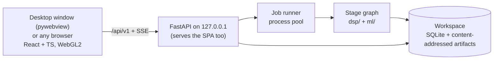

# Sanket — build plan

**Sanket** (संकेत, "signal") is our SIH26147 product: an offline, CPU-only workstation that takes an unknown `.iq` or `.wav` recording and works out how it was transmitted — sample format, bandwidth, SNR, symbol rate, modulation, interleaver, error-correction code and framing — then undoes each layer to recover the bits, showing the evidence for every claim.

This is the only plan. It ships **Sanket 1.0 as production software**, organised by milestones with measured exit gates. The PS requirements it answers are numbered R1–R5 in [PROBLEM_STATEMENT.md](PROBLEM_STATEMENT.md#requirements-as-sanket-reads-them). Last revised **30 September 2026**.

Related: [README](../README.md) · [Problem statement](PROBLEM_STATEMENT.md) · [Standards to beat](STANDARDS_TO_BEAT.md) · [UI](UI.md) · [Claude Code tooling](../.claude/CLAUDE_SKILLS_MCP.md)

---

## 0. Progress

*Checked against the repository on **30 September 2026**. This is the only place current status is tracked. Update it whenever an item lands.*

One decode chain runs end to end today (`dsp/analyse.py`, per detection, shown in the UI): BPSK/QPSK/8PSK/16QAM or 2-FSK → optional conv K=7 r½ → optional block interleaver → optional RS(255,223) → CCSDS ASM frames with CRC-16, VERIFIED only by the CRC. After demodulation every layer is a small fixed catalogue, not yet a blind search; the milestones below turn each into one.

| Stage | Built | Gate met |
|---|---|---|
| M0 Foundations and identity | Yes | Yes (27 Sep) |
| M1 Ingest, evidence model, ground-truth lab, bench v0 | Yes | Yes (27 Sep) |
| M2 Spectrum, detection, estimation, real tiles | DSP core, bench numbers, 4 GiB scale test, tile pyramid, detections in the UI | No — see Open gates |
| M3 Synchronisation and demodulation | Feed-forward sync, PSK/16QAM/64QAM demapping, 2/4/8-FSK | No |
| M4 Modulation classification | Cumulant ranking, confirmed only by CRC | No |
| M5 GF(2) kernel, interleavers, FEC | GF(2) kernel (`dsp/gf2`), blind rate-1/n convolutional identification (`dsp/fec/convident.py`, in the chain), Viterbi, 8-entry block catalogue, CCSDS RS | No |
| M6 Framing and known-system verification | CCSDS ASM search, CRC-16 catalogue, blind sync / header / CRC recovery (`dsp/blind_framing.py`, in the chain), ledger, shuffled-bit runs | No |
| M7 Analyst workflow and reports | Open by path, upload, folder or numbered sequence, with background analysis (SSE progress); `sanket analyse`; centre-frequency and IQ-order entry; Survey/Waterfall sections; deep dive | No |
| M8 Hardening, validation and 1.0 release | Not started | No |

**Open gates** (a missed number or known defect; each closes by M8)

| Gate | Target | Measured / state | Suspected cause |
|---|---|---|---|
| M2 SNR error | ±1 dB, 0–20 dB | −8.7 dB median error at 0 dB; inside ±1 dB only at ≥ 15 dB ([bench](../bench/results/bench-v0-detect.md)) | One estimator (`snr_psd`); M2M4 and eigenvalue/MDL not built |
| M2 false detections | ≤ 0.05/scene | 0.20/scene on linear modulations at 3/6/20 dB ([bench](../bench/results/bench-v0-detect.md)) | Linear: untraced, start at `merge`/`absorb_sidelobes` in `dsp/detect.py`. M-FSK: unshaped tone splatter in `dsp.synth`; a Gaussian premod filter can't fix it alone (bt ≈ 0.02–0.15 merges the splatter but breaks the analog kurtosis gate and the FSK rate estimate). `merge_tone_combs` now needs tone SNRs within 6 dB; not re-benched |
| M2 first tile ≤ 2 s | ≤ 2 s | Not benched; opening the 4-signal sample scene now returns in about 0.6 s on the dev laptop (was about 45 s) | `RecordingStore.open` still builds the whole pyramid and runs detection before returning; coarse-first tiles not built |
| Mono/lossy HYPOTHESIS cap | Digital labels from mono or lossy audio capped at HYPOTHESIS | Flagged by `dsp/ingest/dispatch.py`, ignored by `analyse` | Not wired |
| Structural sample-rate match | A snapped standard symbol rate promotes a rate candidate | `rate.structural_test` exists and is tested, never called | Not wired |
| Shuffled-bit control | A shuffled-bit accept blocks acceptance | Recorded only (`analyse.py`, `_search`) | Not wired |
| Null-bench decode time | No slower than before a search widens | 30 Sep, after the Forney grid, QPP, 64QAM, the 31-entry CRC catalogue and the M-FSK orders: 0 accepted decodes and 0 VERIFIED values on 1,000 files, as before; total chain time 12,689 s against 7,134 s (about 1.8×) ([bench](../bench/results/bench-v0-null.md)) | The block-interleaver catalogue scan runs on every branch nothing else decoded (about 1.1 s per branch), and 64QAM adds four rotation branches to each failing signal; a first-pass syndrome screen on a subset of offsets would cut the scan |
| Wide-channel leak | Neighbours filtered out | A decimation-1 channel is mixed, not filtered | Filtering breaks `snr_psd` and the analog test, which expect noise across the channel |
| M-FSK rate on crowded or narrow channels | Rate estimated on any channel | `fsk_symbol_rates` fails on decimated/crowded channels; 8-FSK at 32 samples per symbol returns harmonics 12–15× the true rate | Edge-rate comb; replaced in M3 |

**Next** — the build order. PS coverage comes first; real recordings last.
1. **M5:** interleavers still open: block, helical and convolutional found blind rather than from a catalogue (rank-drop period), the byte-level convolutional interleavers of DVB and J.83 scored by the outer code, the LTE sub-block and DVB-S2 bit interleavers, and the rest of the QPP table.
2. **M5:** LDPC catalogue.
3. **M6:** the known-system catalogue and Match stage; the frame table split at real header fields.
4. **M3:** the FSK symbol rate on narrow and crowded channels, OQPSK (its symbol-rate line in |x|² cancels, so it needs its own rate and timing estimator), drift tracking.
5. **M7:** exports (the results document has no frames, ledger or headline yet, so `sanket analyse` writes stages only), overrides.
6. **M4:** the CNN and open-set rejection.
7. **M8:** first real-recording pass.

---

## 1. What 1.0 is

The PS requirements (R1–R5, G1–G3) and how we read each are in [PROBLEM_STATEMENT.md](PROBLEM_STATEMENT.md#requirements-as-sanket-reads-them). 1.0 delivers all of them plus:

- **Every kind of input except real-time streams.** Every analysis runs on a file; files of any size are streamed.
  - **Formats (M1):** SigMF (full `core:datatype` vocabulary, archives, multi-capture, metadata pointing at another file); raw headerless files in all 28 SigMF datatypes, both byte orders, IQ or QI; WAV mono/stereo, integer/float, RF64/Wave64, the SDR `auxi` chunk; FLAC/MP3/Ogg; SDRangel `.sdriq`, MIDAS Blue, VITA 49, NumPy `.npy`, `.gz`/`.zip`; anything else as raw bytes with a header offset and the format sniffer.
  - **Routes:** open a path (nothing copied); drag-and-drop upload to the local server; a folder as a batch; a numbered file sequence as one recording; the `sanket analyse` CLI; capture from a locally connected receiver (M7): a USB SDR, or a sound-card input carrying a receiver's audio or IQ.
- **Analyst context:** known parameters, a suspected standard, capture details — checked against the data, never trusted.
- **Save as SigMF** for any confirmed non-SigMF recording.
- **Known-system verification** (M6): CCSDS telemetry coding, Meteor-M LRPT, AIS, NAVTEX, MF/HF DSC, POCSAG; VERIFIED only when that system's own check passes. NAVTEX messages and POCSAG alphanumeric pages are shown as text once verified.
- **Analyst profiles** (M7): save a found chain, apply it to later recordings, still checked every time.
- Multi-signal detection; slow frequency drift (a satellite pass's Doppler, an oscillator warming up) measured, reported and tracked; analog AM/FM/SSB/CW detected, labelled, measured and kept out of the digital chain; classification with open-set rejection.
- A local web GUI (waterfall, PSD, constellation, eye diagram, evidence, hypothesis ledger, frames, assumptions) with analyst overrides that re-run downstream stages.
- Exports: JSON, CSV, PDF, SigMF annotations, profiles, each tied to the recording by its SHA-256; the PDF and UI open with a plain-language summary generated from the results.
- One-folder builds for Windows 10/11 x64 and Ubuntu 22.04+ that run with networking off, in their **own desktop window** (pywebview) over the local server, with any browser at 127.0.0.1 as the fallback.

**Out of scope for 1.0:** real-time analysis of a live stream; capture from network-attached receivers (KiwiSDR, LAN SDRs, VITA 49 over UDP — it breaks the 0-outbound-connections rule; record with the receiver's tool, then open the file); transmitting; decrypting; generic pseudo-random permutation recovery; a large protocol library; multi-user deployment.

**After 1.0** (not scheduled): playable audio for analog AM/FM/SSB (digital voice stays out: patented codecs); Doppler pre-correction from orbital elements (TLEs); time-domain views (I/Q, amplitude, phase, instantaneous frequency); OFDM detection with subcarrier spacing and CP length (until then labelled unknown); an *illustrative* sine/cosine explain mode; ASK/OOK and pulse-position demodulation (enables ADS-B); payload text for further catalogued systems; more known systems (MIL-STD-188-110, STANAG 4285, ACARS).

## 2. The production bar

1.0 ships only when every row holds, each enforced by a test or a script. Signal-processing targets are in [STANDARDS §8](STANDARDS_TO_BEAT.md#8-our-bar--measurable-targets).

| Area | Requirement | Enforced by |
|---|---|---|
| Correctness | Every stage tested against exact ground truth from our generator, including a case where it must fail or abstain; whole chains tested as a cross-product (every modulation × code × interleaver × framing combination the catalogues support), so no stage passes only in the combination it was built with | pytest + `bench/` (chain matrix) |
| Honesty | Every value a `Parameter` with an evidence level; **0 silent defaults**; VERIFIED only from a CRC pass, sync-word recurrence or a re-encode match consistent with EVM; every value taken on a convention is a HYPOTHESIS listed under `needsReview` | Schema validation on every result; an ingest test over every unknown-format path |
| False accepts | **0 accepted decodes on ≥ 1,000 null files** (noise, uncoded, repetition, idle) | `bench run null` in CI (nightly) |
| Scale | Files ≥ 4 GiB end to end; peak memory bounded and independent of file size | Scale test on a generated 4 GiB file; RSS ceiling asserted |
| Performance | Full chain on 10 M samples ≤ 10 s on a 4-core laptop (excluding blind LDPC search); first tile ≤ 2 s after ingest starts; pan/zoom 60 fps at 1080p on integrated graphics | `bench perf` thresholds; frame-time check in E2E |
| Reliability | A throwing stage is marked FAILED with its error and the job continues; the server never crashes on bad input; jobs survive a restart | Fault injection; parser fuzzing; restart test |
| Offline | **0 outbound connections**; no CDN; fonts and assets bundled | Socket-blocking E2E in CI; build scan for external URLs |
| Security | Binds 127.0.0.1; upload size limits; sanitised export names; no shell interpolation; recorders run from an argument list; archive extraction guarded against traversal and bombs; profiles are schema-validated data, never code; dependency audit | Security tests; `pip-audit`, `npm audit` |
| Reproducibility | Same file + version + settings → byte-identical results JSON; results record the recording's SHA-256, version, catalogue versions, model hash, seeds and any applied profile; exports carry the results' SHA-256, so any report traces to the exact file and run | Hash test on the bench set |
| Accessibility | Keyboard-reachable controls; WCAG 2.2 AA contrast in both themes; evidence never colour-only; reduced motion respected | axe in E2E; manual keyboard pass per release |
| Observability | JSON-lines logs per job; per-stage timings in the run record, not the results; a diagnostics bundle with logs and versions, no recording data | Tests on bundle and run-record contents |
| Licensing | No GPL, AGPL or non-commercial code in the product; `THIRD_PARTY.md` generated from the lockfiles | Licence check fails the build |
| Data handling | Recordings never leave the machine; configurable workspace; deleting a job deletes everything derived from it; profiles hold no samples | Deletion and profile-content tests |
| Packaging | One-folder build per platform, one start command; frozen Numba works (pinned numba/llvmlite, writable `NUMBA_CACHE_DIR`, pre-warmed kernels); window or browser fallback, both passing the offline check | Frozen-build smoke test in CI on both platforms |

## 3. Architecture



One local process tree, no external services.

- **Stages:** Ingest → Detect → Estimate → Sync → Classify → Demodulate → De-interleave → FEC → Frame → **Match**. Each is a pure function `run(inputs, params, overrides) → StageResult {parameters, artifacts, warnings}`, cached on the hash of its inputs, parameters and code version, so an analyst override re-runs only that stage and its descendants (D5). Match runs last against the known-system catalogue and profiles, runs each candidate's own check, and never overwrites a blind result.
- **Evidence model:** `Parameter {value, unit, uncertainty, level, confidence, method, evidence[], alternatives[], warnings[], resolve_hint, proof, convention}` in [`dsp/src/dsp/evidence.py`](../dsp/src/dsp/evidence.py) is the source of truth; it enforces the honesty rules at construction (levels are defined in the [README](../README.md#evidence-levels)). Downstream proof may **promote** an upstream value (a CRC pass makes the modulation VERIFIED), recorded as evidence. The frontend's hand-written `lib/evidence.ts` and `lib/api.ts` are replaced by types generated from the OpenAPI schema.
- **Results and run record:** `results.json` ([`dsp/results.py`](../dsp/src/dsp/results.py), schema in `results.schema.json`) holds only conclusions — the Assumptions block, stage results, parameters, and `needsReview` (every value resting on a convention, derived from the parameters) — and is byte-identical across runs. `run.json` holds how the run went (job id, results SHA-256, per-stage timing and cache hits, peak memory, version, hardware class, OS); never hostname, username or paths.
- **Hypothesis ledger:** every blind search writes every candidate tried (statistic, p-value, corrected threshold, outcome, reason) plus shuffled-bit false-alarm runs. Known-system and profile matches are counted in the same ledger. The UI renders it directly (D8).
- **Inputs:** every route produces a *recording* (files + container description) behind one chunked, memory-mapped reader interface. Capture is a job that runs a recorder subprocess, then writes SigMF.
- **Tiles:** server STFT pyramid, uint8 dB, fixed-size tiles, max-pooled between levels so short bursts survive zooming out; the frontend draws them through a LUT shader.
- **API** (`/api/v1`; literal routes before parameterised ones; progress over SSE):

  | Endpoint | Purpose |
  |---|---|
  | `POST /recordings` | Chunked upload, or register a path, folder or file sequence without copying |
  | `GET /recordings/{id}` | Metadata, container, format candidates, assumptions |
  | `PUT /recordings/{id}/context` | Analyst context |
  | `POST /recordings/{id}/sigmf` | Write a `.sigmf-meta` for a confirmed recording |
  | `GET /devices` · `POST /captures` | Local receivers · record a set duration to SigMF |
  | `GET/POST /profiles` · `GET /profiles/{id}/export` · `POST /profiles/import` | Profiles |
  | `POST /jobs` · `GET /jobs/{id}/events` · `GET /jobs/{id}/results` | Analyse (optionally with a profile) · SSE progress · results, ledger, frames |
  | `GET /tiles/{rec}/{level}/{t}/{f}` | Waterfall tile |
  | `POST /jobs/{id}/overrides` | Analyst correction → downstream re-run |
  | `GET /jobs/{id}/export.{json,csv,pdf,sigmf}` | Exports, each with the Assumptions block; run record included unless opted out |

  Built today: `GET /health`, `POST /recordings` (path only; analysis continues in the background), `GET /recordings/{id}`, `PUT /recordings/{id}/assumptions` (analyst-entered sample rate / centre frequency), `GET /recordings/{id}/events` (SSE), `PUT /uploads/{batch}/{name}` (streamed, size-capped, into the workspace), `GET /tiles/...`.

- **Tech stack:**

  | Layer | Choice |
  |---|---|
  | DSP | CPython 3.12 (pinned), NumPy, SciPy, Numba (pinned) for GF(2), Viterbi, LDPC |
  | FEC | Our own code on `galois` (MIT) for finite fields and RS; scikit-commpy/pyldpc only as vendored references; komm (GPL) and PySDR code (CC BY-NC-SA) never in the product |
  | ML | PyTorch for training; ONNX Runtime FP32 for inference; trained on `dsp.synth`; TorchSig (WSL2) as independent test generator; RadioML only as a corrected benchmark |
  | Inputs | Own readers; `soundfile` (libsndfile, LGPL) for compressed audio; `sounddevice` (PortAudio, MIT) for sound-card capture; SDR recorders as subprocesses |
  | API | FastAPI + Uvicorn, SQLite, SSE |
  | GUI | React 19 + TS strict (Vite) + Tailwind 4; WebGL2 waterfall (R8 textures + LUT); uPlot; layout in [UI.md](UI.md) |
  | Quality | pytest + Hypothesis, Vitest, Playwright, ruff, pyright, ESLint, GitHub Actions |
  | Packaging | PyInstaller one-folder, offline wheelhouse, pywebview (WebView2 bundled on Windows, WebKit2GTK on Linux) |

- **Repository layout:**

  ```
  frontend/   React + TS + Vite (e2e/ holds the Playwright tests)
  dsp/        ingest, synth, spectrum, detect, channel, estimate, analog, sync, demod, fsk,
              deinterleave, fec, framing, analyse, evidence, results; planned: gf2, systems
  ml/         AMC training, evaluation, ONNX export, model card (empty)
  backend/    FastAPI app, recordings, CLI; planned: jobs, storage, capture, profiles, exports
  bench/      presets, sealed set, null set, results, perf, decoder-truth harness
  tests/      Python tests, one folder per package
  tools/      THIRD_PARTY.md and licence check, inspect_iq, make_demo (sample recordings), schema
  docs/       this plan, problem statement, standards, UI
  ```

## 4. Product identity (fixed)

| Element | Decision | Source of truth |
|---|---|---|
| Name | **Sanket** (संकेत, "signal"); tagline "Blind signal analysis, with evidence" | `frontend/src/brand.ts` only |
| Mark | A waveform resolving into a four-point constellation | `frontend/src/components/Logo.tsx`, `frontend/public/favicon.svg` |
| Colour | Dark-first instrument UI with a light theme; accent "signal cyan"; all colours are shadcn-compatible tokens | `frontend/src/styles/index.css` |
| Evidence levels | VERIFIED green + shield · MEASURED blue + ruler · ESTIMATED violet + Σ · HYPOTHESIS amber + dashed circle · UNKNOWN grey + slashed circle | `frontend/src/components/levelStyles.ts` |
| Type | IBM Plex Sans (UI), IBM Plex Mono with tabular numerals (numbers), IBM Plex Sans Devanagari (native name) — bundled | `frontend/src/main.tsx` |
| Colormaps | "Sanket" house map plus Viridis, Inferno, Grayscale; monotonic luminance tested | `frontend/src/lib/colormaps.ts` |

**UI rules** for every screen:
1. An evidence level is always glyph + label + colour, never colour alone.
2. Every number shows its unit and, where estimated, its uncertainty; true minus signs; non-breaking space before units.
3. UNKNOWN always says why and what would settle it.
4. Synthetic data is always labelled as such, on screen and in any screenshot.
5. No dead controls: a button that can't work yet isn't shown.
6. Plots are dark in both themes.
7. A value taken on a convention says so and offers the alternative; `needsReview` items are visible without opening each parameter.
8. Layout follows [UI.md](UI.md); the page never scrolls as a whole.

## 5. Milestones

Dependencies: **M0 → M1 → M2 → M3 → (M4 ∥ M5) → M6 → M8**, with **M7** alongside from M2. **Build order** from here is §0 **Next**: PS coverage (M5, M6, M3) before depth, M4's CNN after it, real recordings last. Tooling per milestone: [CLAUDE_SKILLS_MCP](../.claude/CLAUDE_SKILLS_MCP.md#1-tooling-by-milestone).

**Gate policy:** a missed exit-gate number becomes an Open gate in §0 rather than blocking the next milestone; every open gate closes by M8.

**Work rules:** while iterating, run the ground-truth test file for the item; run the full check list (`.claude/CLAUDE.md`) before each commit; run `dsp-reviewer`/`evidence-auditor` and the benches at each milestone exit, and the null bench whenever a blind search widens. When an item lands, tick it here and update §0.

### M0 — Foundations and identity ✅

- [x] Vite + React 19 + TS strict + Tailwind 4; §4 identity and tokens
- [x] Workspace on a synthetic in-browser capture: WebGL2 waterfall, uPlot PSD, constellation/FSK views, evidence cards, ledger, frames and assumptions tables; unit tests
- [x] uv workspace (`dsp`/`ml`/`backend`/`bench`), Python 3.12; ruff + pyright (strict on `dsp/`) + pytest; pytest-socket (loopback only); pre-commit; generated `THIRD_PARTY.md` failing on GPL/AGPL/non-commercial
- [x] FastAPI app + `sanket` bound to 127.0.0.1; Playwright smoke test with outside requests aborted; CI green on Windows and Ubuntu
- **Exit gate (met 27 Sep):** clean clone green in CI on both platforms; `sanket` serves the UI with networking off.

### M1 — Ingest, evidence model, ground-truth lab, bench v0 ✅

- [x] Evidence model with honesty rules at construction and `promote()`; generated JSON schema; `needsReview`; results with the Assumptions block
- [x] All 28 SigMF datatypes round-tripped; IQ/QI; chunked random-access reader with header offset and trailing bytes; file-size vs datatype check
- [x] Format sniffer (code length under a linear predictor; ranked candidates with margins; UNKNOWN on ties; real/complex tie → complex as a `needsReview` HYPOTHESIS): **0 wrong formats on 864 files** ([sniffer.md](../bench/results/sniffer.md))
- [x] Sample-rate candidates: file-name hints, device rates, `auxi`; structural-match test at α = 1 % (not yet called by the chain — Open gate)
- [x] Readers: WAV (RIFF/RIFX/RF64/Wave64, int/float, EXTENSIBLE, `auxi`, stereo quadrature check), SigMF archives/multi-capture/NCD, `.npy`, `.sdriq`, Blue, VITA 49, FLAC/MP3/Ogg (lossy flagged), `.gz`/`.zip` (traversal and bomb guards), numbered sequences; recorder extensions only as sniffer hints
- [x] 0 silent defaults tested for every reader
- [x] `dsp.synth`: bits → frames/CRC → scrambler → RS → byte interleaver → conv/LDPC/repetition → bit interleaver (block, helical, Forney, QPP, 802.11, random) → PSK/QAM/FSK/AM/FM → impairments; SigMF with truth in annotations; regenerable from (scene, seed)
- [x] TorchSig 2.2.0 (WSL2) as an independent generator, dev-time only
- [x] Bench v0 (`uv run bench generate|run dev|null|sealed|torchsig`): [dev](../bench/results/bench-v0-dev.md) 200 files, [null](../bench/results/bench-v0-null.md) 1,000 files (since 30 Sep also through the decode chain: 0 accepted decodes on 4,381 detections; the blind convolutional search names a code on 677 of 5,857 branch runs, all on repetition and idle files or on demodulated streams whose bits repeat because the symbol rate candidate was a sub-multiple, and the CRC gate rejects every one), [TorchSig](../bench/results/bench-v0-torchsig.md) 84 files — 0 ingest mismatches, 0 wrong formats; sealed set never run during development
- **Exit gate (met 27 Sep):** round trip for every format; sniffer confusion matrix published; 0 silent defaults; bench v0 and null set generated.

### M2 — Spectrum, detection, estimation, real tiles

- [x] Reader dispatcher by header magic and name (`dsp/ingest/dispatch.py`)
- [x] Streaming Welch spectrogram/PSD bounded by `MAX_CELLS`; real input keeps non-negative frequencies
- [x] Detection: OS-CFAR, split-sample significance test Bonferroni-corrected over cells and searches, hysteresis, morphology, connected components, multi-FFT merge, sidelobe absorption, I/Q-image mirroring (`dsp/detect.py`)
- [x] Channelisation: streaming mix + Kaiser low-pass + decimate (`dsp/channel.py`)
- [x] Estimation: symbol rate from the |x|² line, CFO by M-th power (gated for QAM), occupied bandwidth, SNR (one estimator), RRC roll-off fit, cumulants (`dsp/estimate/`)
- [x] Analog AM/FM detection with a kurtosis gate against M-FSK (`dsp/analog.py`); FM skips the digital chain
- [x] 4 GiB file streams with RSS < 512 MiB (`tests/dsp/test_scale.py`, `-m slow`)
- [x] Tile pyramid served over `/api/v1/tiles`; frontend on server tiles; detections as `Parameter`s with boxes on the real waterfall
- [ ] SNR from three estimators (PSD, M2M4, eigenvalue/MDL), agreement as confidence
- [ ] Symbol-rate refinement by cyclic autocorrelation and FAM/SSCA; bandwidth fallback below β ≈ 0.1
- [ ] **Capture quality** as `Parameter`s beside the Assumptions block: clipping fraction, DC offset, I/Q gain and phase imbalance, dropped-sample gaps (the checks `tools/inspect_iq.py` already prints), so a failed decode can be traced to the capture
- [ ] **Drift:** a signal whose frequency moves slowly stays one detection, with its drift rate (Hz/s) as an ESTIMATED `Parameter`
- [ ] Estimation and analog outputs as `Parameter`s; analog measurements (carrier, bandwidth, FM deviation); SSB and Morse CW with synth generators
- [ ] First tile ≤ 2 s (pyramid in the background, coarse first); level-of-detail tiles (today only `levels[0]` is fetched)
- [ ] Real/complex ties carried as two branches, decided by downstream proof (replaces the complex-by-convention rule)
- [ ] OpenAPI-generated frontend types
- [ ] *Stretch:* frequency-hopper clustering; co-channel overlap detection
- **Exit gate:** STANDARDS §8 detection/estimation targets per SNR bucket (recall, rate and CFO met; SNR and false detections open); 4 GiB bounded memory (met); first tile ≤ 2 s.

### M3 — Synchronisation and demodulation (R2)

- [x] Sinc resampling to 4 samples/symbol, RRC matched filter, Oerder-Meyr timing per block, M-th-power carrier with per-block phase (`dsp/sync.py`)
- [x] BPSK/QPSK/8PSK/16QAM/64QAM Gray max-log LLRs, EVM-based noise variance, M-fold rotation candidates (`dsp/demod.py`)
- [x] Non-coherent 2-FSK (`dsp/fsk.py`)
- [ ] Gardner / Mueller-Müller timing with a Farrow interpolator; Costas loop plus decision-directed tracking for QAM; carrier tracking that follows a LEO pass's Doppler (about ±3.5 kHz at 137 MHz), tested on a synth drift ramp
- [x] 64QAM: Gray demapping (`dsp/demod.py`), cumulant entry (0.619, 0.619), four more rotation branches; decodes end to end to VERIFIED at 25 dB Es/N0 behind the K=7 code (`tests/dsp/test_slice.py`); the demapper's hard decisions sit within 1 dB of theory for BPSK, QPSK, 8PSK, 16QAM and 64QAM (`tests/dsp/test_demod.py`). Limit: 16QAM and 64QAM differ by 0.06 in −C42, so the ranking is only a starting order there and the CRC decides
- [ ] 2/4/8-FSK: built (`dsp/fsk.py`): the tone count is the order (2, 4, 8) whose equally spaced, equally likely levels fit the per-symbol mean frequencies best (one Gaussian variance; the log-likelihoods are in the report), tone energies give Gray-labelled max-log bit LLRs, and a mirrored spectrum is its own branch (it flips only each label's first bit); 2-, 4- and 8-FSK (16 samples per symbol) decode end to end to VERIFIED, mirrored or not (`tests/dsp/test_slice.py`). An FM verdict from the analog check now yields to a CRC-verified FSK decode, since noisy tones pull the frequency kurtosis toward FM's. Still open, of the original wording: tones from a GMM by BIC (this is the equal-spacing special case), the symbol rate from the |dIF/dt| line on decimated and crowded channels (8-FSK at 32 samples per symbol gets only high harmonics from `fsk_symbol_rates`, so it does not decode), and the tone view in the UI. Original: tones from an instantaneous-frequency histogram (GMM, order by BIC, equal spacing), rate from the |dIF/dt| line, h = Δf/Rs; works on decimated and crowded channels; tone view for real detections
- [x] Eye diagram data in the report and an eye view in the UI: `dsp/eye.py` reads 200 symbols' matched-filter output over one symbol either side, turned by the accepted carrier correction (`DetectionReport.eye`); the symbol view toggles Constellation / Eye for a real linear signal. Tested against ground truth: a clean QPSK eye sits on ±1/√2 at the instant and is wide open between, and noise closes it (`tests/dsp/test_eye.py`). Limit: linear signals only, no eye for FSK
- [ ] OQPSK (Meteor-M LRPT's 80 kBd mode)
- [ ] *Stretch:* MSK/GMSK (needed for AIS), π/4-DQPSK
- **Exit gate:** BER within 1 dB of theory on AWGN for every supported modulation.

### M4 — Modulation classification (R1)

- [x] Cumulant ranking (|C40|, −C42) over BPSK/QPSK/8PSK/16QAM; confirmed only by a downstream CRC
- [ ] Explainable cumulant and spectral-line rules, each listing its evidence
- [ ] ~10K-parameter complex-as-real 1-D CNN on [I, Q, |x|, Δφ] at 4–8 samples/symbol, cumulants fused before the head, trained on `dsp.synth`; temperature calibration only if ECE improves
- [ ] Open-set rejection: SNR gate → energy score → Mahalanobis distance to class prototypes; an "analog" outcome beside "unknown"
- [ ] Fusion: agreement → ESTIMATED; disagreement → HYPOTHESIS with both rankings
- [ ] FP32 ONNX, no DSP in the graph; `ml/MODEL_CARD.md`
- [ ] Evaluation on data we didn't generate (TorchSig, HisarMod, RadioML with corrected labels): accuracy −20 to +30 dB; AUROC, FPR@95 %TPR, OSCR per SNR bin; organiser data, if supplied, for evaluation and fine-tuning only
- **Exit gate:** STANDARDS §8 AMC targets; labels suppressed outside the validated SNR range.

### M5 — GF(2) kernel, interleavers, FEC (R1, R3, R4)

The core differentiator (D9). Built so far: soft Viterbi (numba) for K=7 r½ (171,133) only; an 8-entry block-interleaver catalogue aligned by the code's parity syndrome; RS(255,223) CCSDS via `galois` with the grid found from an error-free codeword.

- [x] **GF(2) kernel** (`dsp/gf2`): bit-packed uint64 rows, Numba popcount, Gauss-Jordan elimination (RREF, rank, null space), rank profile over window matrices, soft variant (windows kept by weakest-bit LLR). The only elimination routine; reused for code length, sync offset, puncturing and interleaver period. Rank matrices always have L ≥ w + 30 rows, enforced in `check_rows`. Tested against `galois` (Hypothesis) and against `dsp.synth` convolutional codes: the rank scan finds the exact first deficient width, and random and shuffled-bit streams never show one. Not built: total-pivoting GJETP.
- [ ] **Convolutional identification:** `identify_convolutional` is built, tested and wired into `analyse` (`_blind_conv_cells`: tried after the catalogue and before the interleavers, one data-chosen cell per branch in the Bonferroni count, shown as a FEC row marked "blind search"; a K=9 r½, a K=7 r⅓ and a K=3 r½ code each decode end to end to VERIFIED); still open: blind identification of a punctured code (the K=7 code at the four DVB-S rates is in the fixed grid instead, below); one inverted branch (CCSDS's second generator) is not searched, and a found code is reported as an equivalent description (branch order, delay and common factors are not identifiable), with its offset and polarity as their own parameters; the search's accounting is in the ledger. It needs no prior n, K, generators, offset or polarity: for each (n, offset) the branch pairs (0, b) are interleaved and the GF(2) rank scan finds the one parity check `g_b·c₀ + g₀·c_b = 0`, whose taps are the generators; pairs join by polynomial lcm, and the code must pass its minimal check on non-overlapping windows (syndrome weight against Binomial(L, ½), Bonferroni over 2 × Σn × (K_max − 1) hypotheses, α = 10⁻⁶). Polarity is read from odd-weight checks. Rows are the most reliable windows, so it works on soft input at about 3 % raw bit errors (5 test codes, K = 3–9, n = 2–4, exact generators and offset recovered). When more than one description fits (a rate-¼ stream also passes as a weaker rate-½ code) the largest n wins. 0 of 1,000 null streams identified (`-m slow`, `tests/dsp/test_convident.py`). Earlier text: a rank scan gives n and K (aligned windows of w bits depend on ⌈w/n⌉ + K − 1 input bits, so the first deficient width is the least w with w > ⌈w/n⌉ + K − 1: 14 for K=7 r½, 11 for K=7 r⅓, not nK in general); Su 2014's syndrome-weight test (λ ≈ 6–8) is the model for the acceptance statistic; punctured codes: a catalogue of 2/3, 3/4, 5/6, 7/8 patterns on the standard mother codes at every phase (Marazin 2012 for the general case).
- [x] **Viterbi** for any K ≤ 9, rate 1/n, with depuncturing (erasures as zero LLRs): `dsp.fec.viterbi.decode` on K = 3, 7, 9 and n = 2, 3; `dsp.fec.puncture` for the DVB-S 2/3, 3/4, 5/6 and 7/8 patterns of the K=7 code at every phase, decoded end to end to VERIFIED (a re-encode screen on the first 2,000 blocks keeps wrong cells from costing a frame search). 802.11's and other patterns are not catalogued yet
- [ ] **Interleavers:** built: the catalogue in `dsp/deinterleave.py`, aligned by the K=7 code's parity syndrome and decided by the CRC: block and helical at four fixed sizes, 802.11 at four N_CBPS, LTE QPP at nine table entries (K = 40–96 and 6,144; the other table rows are added only when checked against TS 36.212), and a generic convolutional (Forney) grid, I ∈ {2,3,4,5,6,8} × M ∈ {1,2,3,4,6,8}, at every lane phase and code phase, each decoded end to end to VERIFIED in `tests/dsp/test_slice.py`. Not built: the items below. Planned: block found blind (rank-drop period and sync, then R×C factorisations scored by the code syndrome; KS test on rank distributions); helical/diagonal (period from rank, then rows, columns and step); convolutional/Forney (catalogue DVB (12,17), J.83-B pairs, Meteor-M LRPT 80k (36 branches × 2,048 symbols), then a generic B ≤ 64, M ≤ 32 grid, scored by RS zero-syndrome fraction after the inner decoder); pseudo-random only against **standard permutations** (802.11 N_CBPS 48/96/192/288, LTE sub-block, LTE QPP, DVB-S2), else UNKNOWN with its measured period
- [ ] **RS:** binary rank scan, then Galois-field Fourier transform over 16 primitive polynomials × symbol offsets plus the CCSDS dual basis; interleave-depth scan (I = 1–5, 8; `rs.scan_interleave_depths` exists, not wired); shortened codes (RS(204,188))
- [ ] **LDPC catalogue:** CCSDS TC (128,64) and (512,256), 802.11n 648-bit at four rates first; then CCSDS C2, DVB-S2 short, 5G NR BG2 (Sionna's Apache-2.0 base-graph files); each matrix with its source and licence recorded. Identified by the soft syndrome statistic (mean ∏ tanh(L/2) over checks; Moosavi–Larsson 2014) over code × offset × polarity, z > 6 with correction; decoded by layered normalised min-sum (α ≈ 0.75). Decoders are cross-checked in tests against independent implementations (`galois` for RS, the MIT `ldpc` package for min-sum), used as dev-time oracles only
- [ ] **Concatenated chains** identified inner code first
- [ ] **Chain matrix bench** (`bench run chains`): every modulation × code × interleaver × framing combination at fixed SNRs, reporting per-cell VERIFIED rate and false accepts
- [ ] **Catalogue** as versioned YAML with source and licence per entry
- [ ] **False-alarm control:** every hypothesis counted in the ledger; Holm (or Benjamini–Hochberg) across the whole search; every detector also run on shuffled bits, and a shuffled accept blocks acceptance
- [ ] *Stretch:* a gradient-boosted code-family pre-classifier that only orders the search, built only if the search misses the §2 performance target
- **Exit gate:** per-family, soft-decision FEC-ID targets from STANDARDS §8; **0 false accepts on ≥ 1,000 null files**.

### M6 — Framing and known-system verification (R5)

Built so far: correlation search for the CCSDS ASM (≤ 3 bit errors, both polarities), frame length from hit spacing, three CRC-16s at the frame end, a Bonferroni-corrected ledger of every cell tried, and shuffled-bit re-runs (`dsp/framing.py`, `dsp/analyse.py`).

- [ ] Known-sync library: CCSDS ASM and POCSAG are in (`framing.SYNC_WORDS`); short words (Barker-13, HDLC flag) match random positions too often for a bit-error search and are left to the blind discovery
- [x] **Blind sync discovery** (`dsp.blind_framing.discover_sync`): an autocorrelation screen proposes frame lengths, column constancy over each (a run of ≥ 8 columns each lopsided at p ≤ 0.01, `0.01^R` per start, Bonferroni over the periods tested) finds the frame's *constant prefix*, and the second half of the rows, which discovery never read, counts recurrences against the chance a random row matches (the only thing that verifies it). Inverted streams give the complemented word; NRZ-I is searched as a differenced variant. Needs ≥ 64 frames of one length; sync plus constant header bytes cannot be told apart (reported as a constant prefix, with a warning). 0 of 300 structureless streams discovered (`-m slow`). Not built: k-gram recurrence for short or few frames (Qin's u ≥ 150 is relaxed to 32 rows per half)
- [x] **Header fields** (`header_fields`): byte-aligned constant and counter fields after the prefix (step read from consecutive frames, judged against the chance rate), ending at the first variable byte; alignment from the CRC when there is one. Shown as one HYPOTHESIS parameter with each field's p-value; idle (near-constant) streams are rejected by the discovery guard
- [ ] **CRCs:** the catalogue is built (`dsp/framing.py`: 31 entries, 16 CRC-16, 8 CRC-8 and 7 CRC-32 parameter sets from the reveng catalogue, each tested against its published check value; the frame check runs in Numba over all frames at once). Open: a position search (CRC not at the frame end); then **blind CRC recovery** (`recover_crc`, in the chain) for frames no catalogue entry fits — XOR two equal-length frames to cancel init and xor-out, take the GCD of the resulting polynomials to get the generator (Ewing's differential method; candidates from windows of three multiples, so a few corrupted frames do not spoil it), for widths 8/16/24/32 and all four reflections. Init and xor-out are not separable at one frame length, so they are fitted as one affine constant, and named when a catalogued CRC matches (nine entries). The polynomial is fitted on half the frames and counts as a `crc` proof only on the held-out half, judged at ALPHA over every stream tried; a complemented stream fits equally (only the constant changes), which the report says unless the CRC is named. Still open: CRC not at the frame end, CRC-24, mixed frame lengths
- [ ] Descrambler catalogue: CCSDS additive and G3RUH self-synchronising are in (`dsp/scramble.py`, each one hypothesis in the grid, decided by the frame check, reported as a promoted `descrambler` parameter); 802.11 (per-frame seed) is not, and "entropy drop" is not used, the CRC decides
- [ ] Frame table split into header and payload, exportable as bits, hex and JSON: the export is built (`dsp/frame_table.py`; JSON and CSV carry every frame with its CRC outcome, hex and bits only the CRC-passing payloads; `GET /recordings/{id}/detections/{i}/frames?format=`, download links in the Frames tab, `sanket analyse --frames`), limited to the report's first 500 frames. Still open: the table shows a fixed 4-byte header column and the whole body as payload; the split at the frame's real header fields comes from blind framing's header fields
- [ ] **Known-system catalogue** (`dsp/systems`, versioned YAML). An entry records its public specification and licence note, signal parameters, interleaver, FEC, sync, frame layout, the system's own check, and link-layer steps from a fixed set (NRZI, HDLC de-stuffing, descrambling, time-diversity combining). 1.0 entries:

  | System | Specification | Signal | Proof (existing proof kinds only) |
  |---|---|---|---|
  | CCSDS telemetry coding | CCSDS 131.0-B-5, 132.0-B-3 | BPSK/QPSK; ASM `0x1ACFFC1D`; conv K=7 r½, RS(255,223) | ASM recurrence; frame CRC-16 |
  | Meteor-M LRPT (M2-3, M2-4) | CCSDS coding as above; no official public spec, so modes come from community decoder documentation and are confirmed on real recordings | QPSK 72 kBd; 80 kBd interleaved mode (OQPSK, 36 × 2,048 convolutional interleaver, 8-bit sync every 80 symbols); RS interleave depth 4 | ASM recurrence; RS decodes and CRC |
  | AIS | ITU-R M.1371-6 | GMSK 9,600 bit/s; NRZI; HDLC | CRC-16 per packet |
  | NAVTEX (SITOR-B) | ITU-R M.540-2, M.476-5/M.625-4 | 2-FSK 100 Bd, 170 Hz; 4-of-7 code; time diversity | Phasing recurrence; diversity copies agree (`reencode`) |
  | MF/HF DSC | ITU-R M.493-16 | 2-FSK 100 Bd, 170 Hz; 10-bit check; time diversity | Phasing recurrence; check bits and copies agree (`reencode`) |
  | POCSAG | ITU-R M.584-2 | 2-FSK 512/1,200/2,400 bit/s | Sync `0x7CD215D8` recurrence; BCH(31,21) re-encode |

  AIS needs GMSK (M3 stretch); if that slips, AIS moves after 1.0. Once an entry is VERIFIED, plain-text payloads are rendered: NAVTEX messages (CCIR 476 characters) and POCSAG alphanumeric pages (7-bit ASCII). Text is shown only for verified frames and is never used as evidence itself.
- [ ] **Match stage:** compare each entry's parameters with the blind results within tolerances; run the fitting entries' link layer and check on this recording; count every entry in the ledger with Holm; output a `System` parameter — VERIFIED when the check passes, HYPOTHESIS "consistent with …" when it can't run or fails, UNKNOWN with the closest entries and why each failed. Blind results always stand; differences are shown.
- [ ] Each entry ships a `dsp.synth` preset and test; the null set gains near-misses (right rate, wrong sync; right sync, failing check)
- **Exit gate:** blind sync false-alarm rate ≤ 10⁻⁶ per stream, measured; every entry VERIFIED on its preset; 0 false system matches on the null set.

### M7 — Analyst workflow and reports (G1–G3)

Built so far: open by path (`POST /recordings`, returns after tiles and detection; analysis runs in the background over SSE); Survey and Waterfall sections, the Assumptions modal (read-only), upload by picker or window drop, a raw file with an unknown sample rate opening in normalised units with a rate prompt (entered rate is MEASURED "by the analyst" and restarts the analysis), the full-screen deep dive, a persisted split ([UI.md](UI.md)); real detections, rail, constellation, ledger and frames from the chain.

- [x] **Background analysis:** open returns after tiles and detection; per-detection analysis runs as a job with SSE progress (`backend/jobs.py`, `GET /recordings/{id}/events`; the UI follows it and fills reports in as they land)
- [ ] **Job store:** the job on a process pool, results kept in the SQLite workspace and surviving a restart (today: one in-memory worker thread)
- [x] **Every input route:** drag-and-drop upload (picker and window drop, `backend/uploads.py`, `--workspace`); a folder as a batch (`POST /inputs`, a chooser in the UI, every file in one `sanket analyse` run); a numbered sequence as one recording (`sequence` on open, "Join numbered files", `--sequence`); `sanket analyse <paths…>` writes one results JSON per recording, byte-identical across runs. Limits: a folder's list is a chooser, not a running batch view (that is with job history); the JSON holds stage results only until the exports carry frames and the ledger
- [ ] **Raw files open:** ~~an unknown sample rate shows normalised units plus a prompt instead of a refusal~~ (done: `SampleRatePrompt`, candidates from the file-name and device hints); centre frequency and IQ order are entered in the Assumptions modal (IQ swap tiles the recording again from the mirrored samples); an UNKNOWN sample format is a question, not a refusal (`FormatUnknownError`, a prompt strip with the sniffer's candidates, `--datatype`); still open: entered values checked against the data; `needsReview` items shown as prompts
- [ ] **Analyst context:** known parameters, a suspected standard, capture details; entered values are MEASURED "entered by the analyst", checked against the data, conflicts shown as warnings; a suspected standard only reorders searches
- [ ] **Save as SigMF** for confirmed non-SigMF recordings (samples untouched, source referenced with its offset)
- [ ] **Overrides** on any stage → downstream re-run → before/after diff; job history, batch and compare views
- [ ] **Exports:** JSON (schema-versioned), CSV, PDF, SigMF annotations, each with the Assumptions block, versions, the recording's SHA-256 and the results' SHA-256; an "Include run record" checkbox (default on, remembered; CLI `--no-run-record`)
- [ ] **Plain-language summary:** deterministic templates over `results.json` (no LLM, no network), one sentence per Parameter stating its level in words, never firmer than its level; at the top of the PDF and above the pipeline rail; `needsReview` items as open questions; tested per synth preset
- [ ] **Profiles:** the accepted chain (assumptions, channel, modulation, sync, interleaver, FEC, sync word, frame layout, named header fields) plus name, notes, author, versions and the source hash — no samples. Applied values enter as analyst-entered and are checked; VERIFIED only by this recording's own proof; on failure say so and run the blind chain. Suggested by Match and counted in the ledger. Exported and imported as schema-validated files, never executed; every edit is a new version.
- [ ] **Capture** (receive-only): record a set duration to SigMF with device, gain, rate, frequency and time. USB SDRs through their own recorders as subprocesses (`rtl_sdr`, `hackrf_transfer`, `airspy_rx`, `rx_samples_to_file`), never linked; sound-card input via `sounddevice`. Devices shown only when present; the UI states that capture needs authorisation. Tested against a simulated recorder and a virtual audio input.
- [ ] Replace the in-browser scripted synthetic capture with the bundled sample recordings, so the UI only ever shows real engine output
- **Exit gate:** Playwright E2E covers open → analyse → override → save profile → apply to a second recording → export, with sockets blocked; the PDF opens with the summary; capture tested end to end against the simulated recorder.

### M8 — Hardening, validation and 1.0 release

- [ ] **Packaging:** PyInstaller one-folder builds for Windows and Linux (pinned numba/llvmlite, hidden imports, writable `NUMBA_CACHE_DIR`, kernels pre-warmed); offline wheelhouse
- [ ] **Desktop window:** pywebview (BSD-3); Windows via Edge WebView2 with the fixed-version runtime bundled; Linux via GTK/WebKit2GTK (never the GPL Qt backend); no webview → open the browser with a message (`sanket --browser` on purpose); only 127.0.0.1 navigable; closing the window stops the server, asking first if jobs run
- [ ] **Robustness:** wrong format and rate on purpose; truncated, corrupt and NaN files; ≥ 4 GiB files; parser fuzzing per container; malicious archives and profiles; Canvas2D waterfall fallback without WebGL2
- [ ] **Security and accessibility:** review of uploads, exports and subprocesses; axe clean; full keyboard pass
- [ ] **Real recordings,** in this legal order (Telecom Act 2023 §3 makes possessing a receiver an authorisation question): (1) public licensed datasets (IQEngine/SigMF samples, ORACLE, DroneDetect); (2) remote public KiwiSDRs — Indian NAVTEX from the DGLL stations on 518/490 kHz as the primary Indian ground truth, plus AIR shortwave, VOLMET, HFDL; (3) own RTL-SDR captures only under an institutional umbrella after checking with the organisers or WPC (ADS-B, AIS, Meteor-M LRPT — or published Meteor-M recordings used with their author's permission, [STANDARDS §11](STANDARDS_TO_BEAT.md#11-references); NOAA APT and FM RDS only if confirmed on air in India). Each file listed in `bench/real/manifest.json` with source, licence and SHA-256, plus the result expected for it, **committed before the first run** so the expectations can't be tuned to the output. Results, including abstains and why, in `bench/results/real-v0.md`. Every failure on a real recording gets a `dsp.synth` reproduction as a regression test.
- [ ] **Decoder truth:** a `bench/decoder_truth/` harness runs reference decoders (readsb, AIS-catcher, rtl_433, multimon-ng, SatDump — GPL, subprocess only; redsea MIT) and keeps only CRC-passing frames; real recordings of catalogued systems must be VERIFIED by Match and agree frame by frame
- [ ] AMC fine-tuned, or CORAL-adapted, on labelled real captures (e.g. Real-World IQ, Mendeley 2026), reported before and after
- [ ] **Head-to-head** against public rival tools on the sealed bench where licences allow, published neutrally
- [ ] **Docs:** user guide, method notes per stage, limits page, `bench/VALIDATION.md` with every number, script, seed and hardware spec
- **Exit gate:** every §2 row holds and the §6 release checklist is complete.

## 6. Quality system

**Tests, fastest first:** unit tests against exact ground truth (including fail/abstain cases) → property tests (Hypothesis) for parsers, the GF(2) kernel and decoders → golden results per bench file → nightly null-set run → Playwright E2E with networking blocked plus axe → nightly parser fuzzing → `bench perf` regression thresholds → frozen-build smoke test on both platforms.

**Definition of done:** tested against ground truth including a failure case; outputs carry level, confidence, method and evidence (UNKNOWN with its reason); limits written in docstrings and user-facing text; `bench/` numbers updated, and the README or any deck quotes only those; visible and overridable in the GUI per §4; works offline.

**Release checklist (1.0):** all §2 rows green on the release commit; sealed-bench and null-set results in `bench/VALIDATION.md`; frozen builds pass on clean Windows and Ubuntu machines; `THIRD_PARTY.md` current; user guide and limits page match the shipped behaviour; version, results-schema, profile-schema, both catalogue versions and model hash tagged together.

## 7. Versioning and compatibility

Semantic versioning; results JSON carries `schema_version` (a breaking change is a major version). The FEC/interleaver catalogue, the known-system catalogue and the AMC model are versioned independently and recorded in every result. Profiles carry a schema version and a version per edit; an older minor version's profile must import, and a reference to a removed catalogue entry is reported. SQLite changes ship as migrations. A changelog entry for every user-visible change.

## 8. Risk register

| Risk | Mitigation |
|---|---|
| Blind FEC / de-interleaving is unsolved in general; many guesses cause false matches | Catalogue-bounded search; every hypothesis in the ledger; Holm correction; L ≥ w + 30; shuffled-bit runs; ≥ 1,000-file null set; VERIFIED only with proof |
| No absolute sample rate or centre frequency in a headerless file | Ranked candidates, promoted only by structural matches; normalised units; assumptions on every output |
| Pseudo-random interleaver with an unknown permutation | Standard-permutation catalogue; otherwise UNKNOWN with the measured period |
| A flat "95 % at 3 % BER" FEC target is unreachable for long codes | Per-family, soft-decision targets (STANDARDS §8) |
| AMC collapses at low SNR; synthetic-to-real gap | Publish the curve; suppress labels outside the validated range; impairment-rich generator; TorchSig tests; real-capture fine-tuning |
| Mono WAV mistaken for IQ; lossy audio distorts phase | Channel count, quadrature check, HYPOTHESIS caps with the reason |
| Analog voice mislabelled as digital | Analog check before classification (M2); "analog" outcome in open-set rejection (M4) |
| Analyst context, a profile or a known-system match is wrong | Entered and profile values are checked; hints only reorder searches; the system's own check must pass; near-misses in the null set |
| Many containers multiply parser bugs | One reader interface; round-trip tests and fuzzing per container |
| GPL or unlicensed code in the product (SDR drivers, rival repos, LDPC matrices) | Drivers only as subprocesses; licence check in CI; rival repos studied, never copied; matrices from published standards with a recorded source |
| Frozen Numba fails on Windows; WebView2 or WebKit2GTK missing; no WebGL2; huge files exceed texture limits | Pinned builds and a frozen-build test; bundled WebView2 runtime and browser fallback; Canvas2D fallback; tiled pyramid with level of detail |
| Receiver possession needs authorisation (Telecom Act 2023 §3) | Public datasets and remote KiwiSDRs first; own captures only under an institutional umbrella; the capture UI says so |
| RadioML label/SNR flaws and non-commercial licence | Train on our generator; RadioML only as a corrected benchmark |
| NOAA APT / Indian RDS may not be on air; TorchSig needs Linux and ~1 TB | Meteor-M LRPT and NAVTEX as primary targets; WSL2 and only the subsets needed |
| Scope too broad; gate-chasing stalls the build | Exit gates; FEC depth before UI polish; stretch items cut first; missed numbers become Open gates |

## 9. External dates (SIH)

- **Idea submission:** submitted by 30 Sep 2026; the deck was built outside this repository. Template, rules and evaluation criteria are in [PROBLEM_STATEMENT.md](PROBLEM_STATEMENT.md#sih-2026-facts).
- **Rival scan:** re-run on 30 Sep ([STANDARDS §5](STANDARDS_TO_BEAT.md#5-sih26147-rival-repositories)); re-run before every pitch ([STANDARDS §10](STANDARDS_TO_BEAT.md#10-how-to-refresh-this-document)).
- **Grand finale:** proposed for December 2026; dates not yet published. The finale demo is whatever state the milestones have reached, run from the offline build with networking off.
