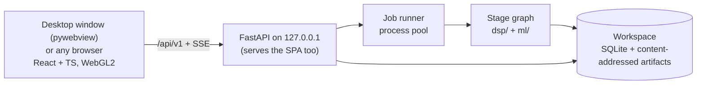

# Sanket — build plan

**Sanket** (संकेत, "signal") is our SIH26147 product: an offline, CPU-only workstation that takes an unknown `.iq` or `.wav` recording, works out how it was transmitted (sample format, bandwidth, SNR, symbol rate, modulation, interleaver, error-correction code, framing), then undoes each layer to recover the bits, with the evidence for every claim.

This is the only plan. It ships **Sanket 1.0 as production software**, by milestones with measured exit gates; the PS requirements are R1–R5 in [PROBLEM_STATEMENT.md](PROBLEM_STATEMENT.md#requirements-as-sanket-reads-them). Last revised **3 October 2026**.

**How to read it:** §0 every session; §5 only for the milestone you are working on; §10 only when working on the null-bench or speed gate. Related: [README](../README.md) · [Problem statement](PROBLEM_STATEMENT.md) · [Standards to beat](STANDARDS_TO_BEAT.md) · [UI](UI.md) · [Claude Code tooling](../.claude/CLAUDE_SKILLS_MCP.md)

---

## 0. Progress

*Checked against the repository on **3 October 2026**. The only place current status is tracked: update it whenever an item lands.*

One decode chain runs end to end (`dsp/analyse.py`, per detection, shown in the UI): BPSK/QPSK/8PSK/16QAM/64QAM, offset QPSK or 2/4/8-FSK (MSK/GMSK as a hypothesis) → optional conv code (K=7 r½ and its punctured rates from a catalogue, or any rate-1/n code found blind) → optional interleaver (block, helical, 802.11, QPP, convolutional from catalogues; block and helical also found blind) → optional RS(255,223) or catalogue LDPC → ASM or blind-found frames with a CRC (31-entry catalogue, or recovered blind) → Match against the known-system catalogue. VERIFIED only by a CRC pass, sync-word recurrence or re-encode match.

| Stage | State | Still open |
|---|---|---|
| M0 Foundations and identity | Done (27 Sep) | — |
| M1 Ingest, evidence model, lab, bench v0 | Done (27 Sep) | — |
| M2 Spectrum, detection, estimation, tiles | DSP core, tile pyramid, detections in the UI, capture quality, structural sample rate, analog measurements; gate not met | Drift, SSB/CW, eigenvalue/MDL SNR, cyclic rate refinement, first tile ≤ 2 s, real/complex branches, OpenAPI types |
| M3 Sync and demodulation | Feed-forward sync, PSK/QAM, 2/4/8-FSK, offset QPSK, MSK/GMSK, eye | Gardner/Costas and Doppler tracking, FSK rate at low SNR and on crowded channels, tone view |
| M4 Modulation classification | Cumulant ranking, confirmed only by CRC | Rules, CNN, open-set, fusion, ONNX, evaluation. `ml/` is empty |
| M5 GF(2), interleavers, FEC | GF(2) kernel, blind rate-1/n conv ID, Viterbi K ≤ 9 with puncturing, interleaver catalogues, blind block and helical, CCSDS RS, 13 LDPC codes (7 in the chain) | Blind punctured codes, blind Forney, RS GFFT/depth scan, TM LDPC in the chain, C2, DVB-S2, 5G NR, concatenated-chain ID, chain-matrix bench, Holm over the whole search |
| M6 Framing and known systems | ASM search, 31 CRCs, blind sync/header/CRC, 2 descramblers, frame table and field map, Match stage with 6 systems | Meteor-M LRPT, CRC position search, 802.11 descrambler, named header fields beyond CCSDS, null-set near-misses |
| M7 Analyst workflow and reports | Every input route, background analysis, History, exports (JSON 0.6.0, CSV, summary, PDF, run record, SigMF), Save as SigMF, summary strip, onboarding | Overrides with downstream re-run, process-pool job store, analyst-context checks, profiles, capture |
| M8 Hardening and 1.0 | Windows build with a CI smoke job, desktop window, bad-input tests | Linux build, fuzzing, real recordings, decoder truth, sealed run, head-to-head, docs |

**Open gates** (a missed number or known defect; each closes by M8)

| Gate | Target | State |
|---|---|---|
| M2 false detections | ≤ 0.05/scene | Linear modulations 0.00 in every SNR bucket (was 0.20; fixed 2 Oct, see M2). M-FSK 0.02–1.58, rising with SNR ([bench](../bench/results/bench-v0-detect.md)): unshaped tone splatter in `dsp.synth`; a Gaussian pre-filter (bt ≈ 0.02–0.15) merges the splatter but breaks the analog kurtosis gate and the FSK rate; `merge_tone_combs` needs tone SNRs within 6 dB |
| M2 first tile | ≤ 2 s | Not benched. The 4-signal sample opens in about 0.6 s (was about 45 s); in the frozen build the 1–2 M-sample samples open in 0.14–0.57 s. `RecordingStore.open` still builds the whole pyramid and detects before returning; coarse-first tiles not built |
| Null bench | 0 accepted decodes, 0 VERIFIED, 0 system matches on 1,000 files; decode time no worse after a search widens | Correctness held on every rerun (last: the final tree of 2 Oct, 0 / 0 / 0 on 4,373 detections, [bench](../bench/results/bench-v0-null.md)). Time open: about 2.9× slower after the widening of 30 Sep–1 Oct, then cut by the 2 Oct speed-ups; the punctured grid still decodes cells that share bits; Match and the extra FSK demodulations are unprofiled. Runs and profiles in §10 |
| Wide-channel leak | Neighbours filtered out | A decimation-1 channel is mixed, not filtered; filtering breaks `snr_psd` and the analog test, which expect noise across the channel |
| M-FSK rate on crowded or narrow channels | Rate found on any channel | Improved (`tests/dsp/test_fsk_rate.py`): the true rate is among three candidates for 2-FSK at 15 dB Es/N0 and 16 or 32 samples per channel sample, 4-FSK at 18 dB and 8-FSK at 22 dB at 16–64 samples per symbol (before: none, or harmonics 12–15× the rate); NAVTEX at 16 and 32 samples per symbol reaches its system. Open: 2-FSK at 10 dB and 16 samples per symbol (per-sample SNR −2 dB), a 64-samples-per-symbol 2-FSK channel that the chain decimates to 16, crowded channels (a neighbour inside the band; untested) |

**Next** — the build order. The finale demo (December, dates unpublished) needs the first five, ordered by credibility risk and lead time. Estimates are working days.
1. **M4: the CNN and open-set rejection** (5–7). `ml/` is empty, so an AMC demo has nothing behind it: the biggest credibility risk.
2. **M7: overrides** (4–5): a stage cache, the override endpoint, downstream re-run, before/after diff, UI. Judges demo it; no rival does it fully (D5).
3. **M8: real recordings, started now** (4–6 of work, 1–3 weeks elapsed): public datasets and remote KiwiSDRs first (Indian NAVTEX), manifest and expectations committed before the first run. The lead time is legal and external, not code.
4. **M3: FSK rate at low SNR, Gardner/Costas, drift** (6–9): NAVTEX and RTTY demos, LEO Doppler.
5. **M5: LDPC in the blind chain** (6–8): TM codes first, then DVB-S2, C2, 5G NR, each with a null-bench rerun.
6. **M5/M6 depth:** blind Forney (3–4), RS GFFT and depth scan, concatenated-chain ID, the chain-matrix bench, named header fields beyond CCSDS (1), Meteor-M LRPT once real recordings exist, null-set near-misses.
7. **M2 leftovers:** first tile ≤ 2 s (1–2), OpenAPI types (1), SSB/CW (2–3), real/complex branches (1–2), wide-channel leak (1).
8. **M7/M8 close-out:** job store on a process pool, profiles, capture; Linux build, fuzzing; the **sealed run once, last**, then head-to-head and `VALIDATION.md`.

---

## 1. What 1.0 is

The PS requirements (R1–R5, G1–G3) and how we read each are in [PROBLEM_STATEMENT.md](PROBLEM_STATEMENT.md#requirements-as-sanket-reads-them). 1.0 delivers all of them plus:

- **Every kind of input except real-time streams.** Every analysis runs on a file; files of any size are streamed.
  - **Formats (M1):** SigMF (full `core:datatype` vocabulary, archives, multi-capture, metadata pointing at another file); raw headerless files in all 28 SigMF datatypes, both byte orders, IQ or QI; WAV mono/stereo, integer/float, RF64/Wave64, the SDR `auxi` chunk; FLAC/MP3/Ogg; SDRangel `.sdriq`, MIDAS Blue, VITA 49, NumPy `.npy`, `.gz`/`.zip`; anything else as raw bytes with a header offset and the format sniffer.
  - **Routes:** open a path (nothing copied); drag-and-drop upload to the local server; a folder as a batch; a numbered file sequence as one recording; the `sanket analyse` CLI; capture from a locally connected receiver (M7): a USB SDR, or a sound-card input carrying a receiver's audio or IQ.
- **Analyst context:** known parameters, a suspected standard, capture details — checked against the data, never trusted.
- **Save as SigMF** for any confirmed non-SigMF recording.
- **Known-system verification** (M6): CCSDS telemetry coding, Meteor-M LRPT, AIS, NAVTEX, MF/HF DSC, POCSAG; VERIFIED only when that system's own check passes. NAVTEX messages and POCSAG alphanumeric pages shown as text once verified.
- **Analyst profiles** (M7): save a found chain, apply it to later recordings, still checked every time.
- Multi-signal detection; slow frequency drift (a satellite pass's Doppler, an oscillator warming up) measured, reported and tracked; analog AM/FM/SSB/CW detected, labelled, measured and kept out of the digital chain; classification with open-set rejection.
- A local web GUI (waterfall, PSD, constellation, eye diagram, evidence, hypothesis ledger, frames, assumptions) with analyst overrides that re-run downstream stages.
- Exports: JSON, CSV, PDF, SigMF annotations, profiles, each tied to the recording by its SHA-256; the PDF and UI open with a plain-language summary generated from the results.
- One-folder builds for Windows 10/11 x64 and Ubuntu 22.04+ that run with networking off, in their **own desktop window** (pywebview) over the local server, with any browser at 127.0.0.1 as the fallback.

**Out of scope for 1.0:** real-time analysis of a live stream; capture from network-attached receivers (KiwiSDR, LAN SDRs, VITA 49 over UDP: it breaks the 0-outbound-connections rule; record with the receiver's tool, then open the file); transmitting; decrypting; generic pseudo-random permutation recovery; a large protocol library; multi-user deployment.

**After 1.0** (not scheduled): playable audio for analog AM/FM/SSB (digital voice stays out: patented codecs); Doppler pre-correction from orbital elements (TLEs); time-domain views (I/Q, amplitude, phase, instantaneous frequency); OFDM detection with subcarrier spacing and CP length (until then labelled unknown); an *illustrative* sine/cosine explain mode; ASK/OOK and pulse-position demodulation (garage remotes, 433 MHz sensors, RFID, ADS-B; it would let ADS-B join the known-system catalogue); payload text for further catalogued systems; more known systems (MIL-STD-188-110, STANAG 4285, ACARS).

## 2. The production bar

1.0 ships only when every row holds, each enforced by a test or a script. Signal-processing targets are in [STANDARDS §8](STANDARDS_TO_BEAT.md#8-our-bar--measurable-targets).

| Area | Requirement | Enforced by |
|---|---|---|
| Correctness | Every stage tested against exact ground truth from our generator, including a case where it must fail or abstain; whole chains tested as a cross-product (every modulation × code × interleaver × framing the catalogues support), so no stage passes only in the combination it was built with | pytest + `bench/` (chain matrix) |
| Honesty | Every value a `Parameter` with an evidence level; **0 silent defaults**; VERIFIED only from a CRC pass, sync-word recurrence or a re-encode match consistent with EVM; every value taken on a convention is a HYPOTHESIS listed under `needsReview` | Schema validation on every result; an ingest test over every unknown-format path |
| False accepts | **0 accepted decodes on ≥ 1,000 null files** (noise, uncoded, repetition, idle) | `bench run null` in CI (nightly) |
| Scale | Files ≥ 4 GiB end to end; peak memory bounded and independent of file size | Scale test on a generated 4 GiB file; RSS ceiling asserted |
| Performance | Full chain on 10 M samples ≤ 10 s on a 4-core laptop (excluding blind LDPC search); first tile ≤ 2 s after ingest starts; pan/zoom 60 fps at 1080p on integrated graphics | `bench perf` thresholds; frame-time check in E2E |
| Reliability | A throwing stage is marked FAILED with its error and the job continues; the server never crashes on bad input; jobs survive a restart | Fault injection; parser fuzzing; restart test |
| Offline | **0 outbound connections**; no CDN; fonts and assets bundled | Socket-blocking E2E in CI; build scan for external URLs |
| Security | Binds 127.0.0.1; upload size limits; sanitised export names; no shell interpolation; recorders run from an argument list; archive extraction guarded against traversal and bombs; profiles are schema-validated data, never code; dependency audit | Security tests; `pip-audit`, `npm audit` |
| Reproducibility | Same file + version + settings → byte-identical results JSON; results record the recording's SHA-256, version, catalogue versions, model hash, seeds and any applied profile; exports carry the results' SHA-256 | Hash test on the bench set |
| Accessibility | Keyboard-reachable controls; WCAG 2.2 AA contrast in both themes; evidence never colour-only; reduced motion respected | axe in E2E; manual keyboard pass per release |
| Observability | JSON-lines logs per job; per-stage timings in the run record, not the results; a diagnostics bundle with logs and versions, no recording data | Tests on bundle and run-record contents |
| Licensing | No GPL, AGPL or non-commercial code in the product; `THIRD_PARTY.md` generated from the lockfiles | Licence check fails the build |
| Data handling | Recordings never leave the machine; configurable workspace; deleting a job deletes everything derived from it; profiles hold no samples | Deletion and profile-content tests |
| Packaging | One-folder build per platform, one start command; frozen Numba works (pinned numba/llvmlite, writable `NUMBA_CACHE_DIR`, pre-warmed kernels); window or browser fallback, both passing the offline check | Frozen-build smoke test in CI on both platforms |

## 3. Architecture



One local process tree, no external services.

- **Stages:** Ingest → Detect → Estimate → Sync → Classify → Demodulate → De-interleave → FEC → Frame → **Match**. Each is a pure function `run(inputs, params, overrides) → StageResult {parameters, artifacts, warnings}`, cached on the hash of its inputs, parameters and code version, so an override re-runs only that stage and its descendants (D5). Match runs last against the known-system catalogue and profiles, runs each candidate's own check, and never overwrites a blind result.
- **Evidence model:** `Parameter {value, unit, uncertainty, level, confidence, method, evidence[], alternatives[], warnings[], resolve_hint, proof, convention}` in [`dsp/src/dsp/evidence.py`](../dsp/src/dsp/evidence.py) is the source of truth and enforces the honesty rules at construction (levels in the [README](../README.md#evidence-levels)). Downstream proof may **promote** an upstream value (a CRC pass makes the modulation VERIFIED), recorded as evidence. The frontend's hand-written `lib/evidence.ts` and `lib/api.ts` are to be replaced by types generated from the OpenAPI schema.
- **Results and run record:** `results.json` ([`dsp/results.py`](../dsp/src/dsp/results.py), schema `results.schema.json`) holds only conclusions — the Assumptions block, stage results, parameters, `needsReview` (every value resting on a convention) and per signal its label, kind, headline with its level, the hypothesis ledger (every layer including Match, `matchTried`) and the frame table (at most 500 frames; `SignalFindings` in [`dsp/findings.py`](../dsp/src/dsp/findings.py), shared with the chain's `DetectionReport`) — and is byte-identical across runs. It leaves out what only live views draw (constellation, eye). `run.json` holds how the run went (job id, results SHA-256, per-stage timing and cache hits, peak memory, version, hardware class, OS); never hostname, username or paths.
- **Hypothesis ledger:** every blind search writes every candidate tried (statistic, p-value, corrected threshold, outcome, reason) plus shuffled-bit false-alarm runs; known-system and profile matches count in the same ledger; the UI renders it directly (D8).
- **Inputs:** every route produces a *recording* (files + container description) behind one chunked, memory-mapped reader interface. Capture is a job that runs a recorder subprocess, then writes SigMF.
- **Tiles:** server STFT pyramid, uint8 dB, fixed-size tiles, max-pooled between levels so short bursts survive zooming out; the frontend draws them through a LUT shader.
- **API** (`/api/v1`; literal routes before parameterised ones; progress over SSE). Planned:

  | Endpoint | Purpose |
  |---|---|
  | `POST /recordings` | Chunked upload, or register a path, folder or file sequence without copying |
  | `GET /recordings/{id}` | Metadata, container, format candidates, assumptions |
  | `PUT /recordings/{id}/context` | Analyst context |
  | `POST /recordings/{id}/sigmf` | Write a `.sigmf-meta` for a confirmed recording |
  | `GET /devices` · `POST /captures` | Local receivers · record a set duration to SigMF |
  | `GET/POST /profiles` · `GET /profiles/{id}/export` · `POST /profiles/import` | Profiles |
  | `POST /jobs` · `GET /jobs/{id}/events` · `GET /jobs/{id}/results` | Analyse (optionally with a profile) · SSE progress · results, ledger, frames |
  | `GET /tiles/{rec}/{level}/{t}/{f}` | Waterfall tile |
  | `POST /jobs/{id}/overrides` | Analyst correction → downstream re-run |
  | `GET /jobs/{id}/export.{json,csv,pdf,sigmf}` | Exports, each with the Assumptions block; the run record is its own download (`format=run`) |

  **Built (3 Oct):** `GET /health`; `POST /recordings` (path, folder or sequence; analysis continues in the background) and `POST /inputs` (expands a folder or sequence); `GET /samples`, `POST /samples/{id}/open`; `GET /recordings/{id}`; `PUT /recordings/{id}/assumptions` (analyst-entered sample rate, centre frequency, IQ order); `GET /recordings/{id}/events` (SSE); `PUT /uploads/{batch}/{name}` (streamed, size-capped); `GET /tiles/...`; exports as `GET /recordings/{id}/results?format=json|csv|txt|pdf|run|sigmf` (keyed by recording until the job store exists), `POST /recordings/{id}/sigmf`, `GET /recordings/{id}/detections/{i}/frames?format=`; `GET /history`, `GET /history/{id}/results?format=`, `DELETE /history/{id}`. Not built: `/jobs`, overrides, context, profiles, devices, captures.

- **Tech stack:**

  | Layer | Choice |
  |---|---|
  | DSP | CPython 3.12 (pinned), NumPy, SciPy, Numba (pinned) for GF(2), Viterbi, LDPC, RS |
  | FEC | Our own code on `galois` (MIT) for finite fields and the RS encoder; the RS decoder is our Numba port of galois's algorithm (`dsp/fec/rs.py`, checked word for word against galois in `tests/dsp/test_rs.py`: galois spent about 45 s of JIT in every process before its first decode); scikit-commpy/pyldpc only as vendored references; komm (GPL) and PySDR code (CC BY-NC-SA) never in the product |
  | ML | PyTorch for training; ONNX Runtime FP32 for inference; trained on `dsp.synth`; TorchSig (WSL2) as independent test generator; RadioML only as a corrected benchmark |
  | Inputs | Own readers; `soundfile` (libsndfile, LGPL) for compressed audio; `sounddevice` (PortAudio, MIT) for sound-card capture; SDR recorders as subprocesses |
  | API | FastAPI + Uvicorn, SQLite, SSE |
  | GUI | React 19 + TS strict (Vite) + Tailwind 4; WebGL2 waterfall (R8 textures + LUT); uPlot; layout in [UI.md](UI.md) |
  | Reports | ReportLab (BSD, brings Pillow) for the PDF, IBM Plex TTFs (OFL) in `dsp/fonts/` |
  | Quality | pytest + Hypothesis, Vitest, Playwright, ruff, pyright, ESLint, GitHub Actions |
  | Packaging | PyInstaller one-folder, offline wheelhouse, pywebview (WebView2 on Windows, WebKit2GTK on Linux) |

- **Repository layout:**

  ```
  frontend/   React + TS + Vite (e2e/ holds the Playwright tests)
  dsp/        ingest, synth, spectrum, detect, channel, estimate, analog, quality, sync, demod, fsk, eye,
              deinterleave, blind_interleaver, fec, framing, blind_framing, scramble, gf2, systems,
              analyse, report, findings, evidence, results, results_table, summary, report_pdf, sigmf_out
  ml/         AMC training, evaluation, ONNX export, model card (empty)
  backend/    FastAPI app, recordings, jobs, uploads, inputs, analysis, history, runrecord, identity,
              samples, sigmf_export, window, warm, CLI; planned: capture, profiles
  bench/      presets, sealed set, null set, results, detect and sniffer benches; planned: perf, chains, decoder truth
  tests/      Python tests, one folder per package
  tools/      THIRD_PARTY.md and licence check, inspect_iq, make_demo, build, smoke_frozen, gen_ldpc_data, results schema
  packaging/  PyInstaller spec and launcher
  docs/       this plan, problem statement, standards, UI
  ```

## 4. Product identity (fixed)

| Element | Decision | Source of truth |
|---|---|---|
| Name | **Sanket** (संकेत, "signal"); tagline "Blind signal analysis, with evidence" | `frontend/src/brand.ts` only |
| Mark | A waveform resolving into a four-point constellation | `frontend/src/components/Logo.tsx`, `frontend/public/favicon.svg` |
| Colour | Dark-first instrument UI with a light theme; accent "signal cyan"; all colours are shadcn-compatible tokens | `frontend/src/styles/index.css` |
| Evidence levels | VERIFIED green + shield · MEASURED blue + ruler · ESTIMATED violet + Σ · HYPOTHESIS amber + dashed circle · UNKNOWN grey + slashed circle | `frontend/src/components/levelStyles.ts` |
| Type | IBM Plex Sans (UI), IBM Plex Mono with tabular numerals (numbers), IBM Plex Sans Devanagari (native name), bundled | `frontend/src/main.tsx` |
| Colormaps | "Sanket" house map plus Viridis, Inferno, Grayscale; monotonic luminance tested | `frontend/src/lib/colormaps.ts` |

**UI rules** for every screen:
1. An evidence level is always glyph + label + colour, never colour alone.
2. Every number shows its unit and, where estimated, its uncertainty; true minus signs; non-breaking space before units.
3. UNKNOWN always says why and what would settle it.
4. Synthetic data is always labelled as such, on screen and in any screenshot.
5. No dead controls: a button that can't work yet isn't shown.
6. Plots are dark in both themes.
7. A value taken on a convention says so and offers the alternative; `needsReview` items are visible without opening each parameter.
8. Layout follows [UI.md](UI.md); the page never scrolls as a whole.

## 5. Milestones

Dependencies: **M0 → M1 → M2 → M3 → (M4 ∥ M5) → M6 → M8**, with **M7** alongside from M2. The build order is §0 **Next**. Tooling per milestone: [CLAUDE_SKILLS_MCP](../.claude/CLAUDE_SKILLS_MCP.md#1-tooling-by-milestone).

**Gate policy:** a missed exit-gate number becomes an Open gate in §0 rather than blocking the next milestone; every open gate closes by M8.

**Work rules:** while iterating, run the ground-truth test file for the item; run the full check list (`.claude/CLAUDE.md`) before each commit; run `dsp-reviewer`/`evidence-auditor` and the benches at each milestone exit, and the null bench whenever a blind search widens. When an item lands, tick it here and update §0. Each item is its status, measurements and limits; how a method works is in the module's docstring and its tests.

### M0 — Foundations and identity ✅

- [x] Vite + React 19 + TS strict + Tailwind 4; §4 identity and tokens
- [x] Workspace UI with WebGL2 waterfall, uPlot PSD, constellation/FSK views, evidence cards, ledger, frames and assumptions tables (first on an in-browser synthetic capture, since replaced by real output, M7); unit tests
- [x] uv workspace (`dsp`/`ml`/`backend`/`bench`), Python 3.12; ruff, pyright (strict on `dsp/`), pytest with pytest-socket (loopback only), pre-commit, generated `THIRD_PARTY.md` failing on GPL/AGPL/non-commercial
- [x] FastAPI app and `sanket` bound to 127.0.0.1; Playwright smoke test with outside requests aborted; CI green on Windows and Ubuntu
- **Exit gate (met 27 Sep):** clean clone green in CI on both platforms; `sanket` serves the UI with networking off.

### M1 — Ingest, evidence model, ground-truth lab, bench v0 ✅

- [x] Evidence model with honesty rules at construction and `promote()`; generated JSON schema; `needsReview`; results with the Assumptions block
- [x] All 28 SigMF datatypes round-tripped; IQ/QI; chunked random-access reader with header offset and trailing bytes; file-size vs datatype check
- [x] Format sniffer (code length under a linear predictor; ranked candidates with margins; UNKNOWN on ties; a real/complex tie goes complex as a `needsReview` HYPOTHESIS): **0 wrong formats on 864 files** ([sniffer.md](../bench/results/sniffer.md))
- [x] Sample-rate candidates: file-name hints, device rates, `auxi`; structural-match test at α = 1 % (`backend.analysis.infer_sample_rate`, M2)
- [x] Readers: WAV (RIFF/RIFX/RF64/Wave64 over 4 GiB, integer and float PCM, `WAVE_FORMAT_EXTENSIBLE`, the `auxi` chunk written by SDR#, HDSDR and SDRuno read as MEASURED centre frequency and start time, stereo quadrature check), SigMF archives/multi-capture/NCD, `.npy`, `.sdriq`, MIDAS Blue (type 1000/1001, both byte orders, S/C × B/I/L/F/D, rate from `xdelta`, centre frequency from an `RF_FREQ` keyword, detached `.det` data), VITA 49, FLAC/MP3/Ogg (lossy flagged), `.gz`/`.zip` (traversal and bomb guards), numbered sequences; recorder extensions (`.cfile`, `.cu8`, `.cs8`, `.cs16`, `.cf32`, `.raw`, `.bin`, `.dat`) only rank the sniffer's candidates, never taken as fact. 0 silent defaults tested for every reader
- [x] `dsp.synth`: bits → frames/CRC → scrambler → RS → byte interleaver → conv/LDPC/repetition → bit interleaver (block, helical, Forney, QPP, 802.11, random) → PSK/QAM/FSK/AM/FM → impairments; SigMF with truth in annotations; regenerable from (scene, seed). TorchSig 2.2.0 (WSL2) as an independent generator, dev-time only
- [x] Bench v0 (`uv run bench generate|run dev|null|sealed|torchsig`): [dev](../bench/results/bench-v0-dev.md) 200 files, [null](../bench/results/bench-v0-null.md) 1,000 files, [TorchSig](../bench/results/bench-v0-torchsig.md) 84 files: 0 ingest mismatches, 0 wrong formats. The null set runs through the decode chain since 30 Sep (§10). The sealed set has never been run
- **Exit gate (met 27 Sep):** round trip for every format; sniffer confusion matrix published; 0 silent defaults; bench v0 and null set generated.

### M2 — Spectrum, detection, estimation, real tiles

- [x] Reader dispatcher by header magic and name (`dsp/ingest/dispatch.py`); streaming Welch spectrogram/PSD bounded by `MAX_CELLS` (real input keeps non-negative frequencies)
- [x] **Detection** (`dsp/detect.py`): OS-CFAR, split-sample significance test Bonferroni-corrected over cells and searches, hysteresis, morphology, connected components, multi-FFT merge, sidelobe absorption, I/Q-image mirroring. Fixed 2 Oct: the noise floor's running percentile continued the spectrum's ends by repeating the edge bin (`nearest`), so a low edge bin pulled the floor down and a 1–2 bin line appeared at 0.46–0.5 cycles/sample on pure noise (0.06/scene, 12 in 200 scenes); the window now wraps (a complex spectrum is periodic; a real signal's one-sided spectrum reflects): 0 detections in 600 noise scenes (`tests/dsp/test_detect.py`). It merges four similar, evenly spaced, co-temporal signals into one box
- [x] Channelisation (`dsp/channel.py`): streaming mix + Kaiser low-pass + decimate
- [x] **Estimation** (`dsp/estimate/`): symbol rate from the |x|² line, CFO by M-th power (gated for QAM), occupied bandwidth, SNR, RRC roll-off fit, cumulants
- [x] **Analog** (`dsp/analog.py`): AM/FM detection with a kurtosis gate against M-FSK (FM skips the digital chain; the decision needs 15–20 dB SNR for AM, more for FM) and measurements (`dsp.analog.measure_analog`, an `estimate` stage in the analog report, tested in `tests/dsp/test_analog.py` against messages of known statistics): carrier (detection centre plus the power-weighted mean frequency, the phase of the lag-one autocorrelation) within 2×10⁻⁴ cycles/sample on AM and 2×10⁻³ on FM (whose mean moves with the message), occupied bandwidth, AM RMS depth (envelope coefficient of variation less the AWGN floor's, in quadrature) within 10 % at 35 dB and audio bandwidth (99 % of the envelope's power above its floor) within 25 %, FM RMS deviation (the frequency spread less the floor's) within 10 %; the messages are built from `dsp.synth.modulate` with their statistics known exactly. Limits: RMS figures, not peaks (a peak needs the message's crest factor); FM audio bandwidth not measured (discriminator noise rises with frequency)
- [x] A 4 GiB `cf64_le` file streams with RSS growth under 512 MiB and a planted burst still found (`tests/dsp/test_scale.py`, `-m slow`); tile pyramid over `/api/v1/tiles`; detections as `Parameter`s with boxes on the real waterfall
- [x] **Capture quality** (`dsp/quality.py`; measured on open; a `capture` stage between ingest and detect; `captureQuality` in `GET /recordings/{id}`; a section in the Assumptions modal): clipping as a plateau (the peak level's count against the level below, at least 4×, so quantised constant-envelope signals such as 8-bit FM, FSK or CW are not called clipped; a one-level signal has no plateau), DC as the power of the mean over total power, I/Q gain and phase imbalance (ESTIMATED, uncertainty from the scatter of 65,536-sample blocks, complex files only), gaps (runs of ≥ 32 repeated samples, counted across read-chunk joins), non-finite samples (M8). A file over 2²⁶ samples is read as 64 evenly spaced pieces and says so. Limits: a noise-free signal repeats samples by construction; a file shorter than one block gets one I/Q estimate assuming independent samples; the I/Q figures read the whole band, so a real-axis signal (BPSK at the carrier) biases them; DC cannot tell a hardware offset from a carrier at 0 Hz; a gap filled with noise is not seen; `sanket analyse --summary` words the warnings, the PDF does not
- [x] **Structural sample rate** for a raw file that states none (`backend.analysis.infer_sample_rate`): the three strongest linear signals' symbol rates (|x|² line alone, `dsp.analyse.measure_symbol_rate`, a few ppm) tested against recognised symbol rates at every candidate sample rate, the error budget divided by the signals tried; a significant, unambiguous match sets a HYPOTHESIS under `needsReview` and the analysis runs in hertz, else UNKNOWN with the test in its evidence; an analyst's entry replaces it. Signals deciding different rates decide nothing (each listed); real-valued files are not inferred; values in Hz, baud or seconds warn that they rest on the inferred rate. Limits: linear signals only (FSK's rate is not measured here), constant-envelope signals skipped, a periodic non-symbol structure (pulse repetition, TDMA frames) could match, which the null bench does not cover
- [x] **HYPOTHESIS cap** on a digital signal's labels from lossy audio or a real-valued recording (`dsp.report.cap_digital_labels`, applied in `backend.analysis.analyse_detection`): MEASURED and ESTIMATED drop to HYPOTHESIS with the reason; a CRC-verified chain stays VERIFIED; the detect stage and analog signals untouched
- [ ] **SNR from three estimators, agreement as confidence.** Built: `dsp.estimate.params.snr_psd` (noise floor from off-signal bins, signal as the excess, noise-equivalent bandwidth S² over the summed squared excess; it replaced an occupied-band fit that read 9 dB low at 0 dB), within 0.7 dB over 0–30 dB on every linear modulation (median −0.4 dB; it measures Rs/(1 − β/4)); `esn0` on the same moments is within 0.2 dB from 3 dB up (0 dB outliers are scenes whose rate was not found); `snr_m2m4` (unbiased at 3–15 dB, scatter growing below 0 and above 18 dB) and EVM (high below about 8 dB) as evidence; confidence 1 / (1 + spread in dB of the estimators trusted at the primary's level), an agreement score, not a probability (`tests/dsp/test_esn0.py`). Limits: raises when the signal leaves under 40 % of in-band bins as noise or the excess is under 6× the scatter of a noise-only sum (0 readings in 100 noise trials), and the analysis falls back to EVM; rectangular pulses read up to 1.3 dB low (reported uncertainty 1 dB) and it raises on them from about 15 dB up. Open: eigenvalue/MDL; FSK not scored (separate tones)
- [ ] Symbol-rate refinement by cyclic autocorrelation and FAM/SSCA; bandwidth fallback below β ≈ 0.1
- [ ] **Drift:** a slowly moving signal stays one detection, with its drift rate (Hz/s) as an ESTIMATED `Parameter`
- [ ] SSB and Morse CW with synth generators: detected before digital classification from the envelope, the FM discriminator output and the spectrum's sideband symmetry, labelled and measured (carrier, occupied bandwidth, Morse keying speed), kept out of the digital chain with the reason stated (FM carrying audio otherwise looks like FSK or PSK, STANDARDS §6.11)
- [ ] First tile ≤ 2 s (pyramid in the background, coarse first); level-of-detail tiles (only `levels[0]` is fetched)
- [ ] Real/complex ties carried as two branches decided by downstream proof (replaces the complex-by-convention rule)
- [ ] OpenAPI-generated frontend types (the hand-written `lib/api.ts` can drift)
- [ ] *Stretch:* frequency-hopper clustering (detections clustered with DBSCAN: hop set, dwell time); co-channel overlap detection
- **Exit gate:** STANDARDS §8 detection/estimation targets per SNR bucket (recall, rate and CFO met; SNR and false detections open); 4 GiB bounded memory (met); first tile ≤ 2 s.

### M3 — Synchronisation and demodulation (R2)

- [x] Sinc resampling to 4 samples/symbol, RRC matched filter, Oerder-Meyr timing per block, M-th-power carrier with per-block phase (`dsp/sync.py`)
- [x] BPSK/QPSK/8PSK/16QAM/64QAM Gray max-log LLRs, EVM-based noise variance, M-fold rotation candidates (`dsp/demod.py`); hard decisions within 1 dB of theory for all five (`tests/dsp/test_demod.py`). 64QAM has a cumulant entry (0.619, 0.619) and four more rotation branches, and decodes to VERIFIED at 25 dB Es/N0 behind the K=7 code; 16QAM and 64QAM differ by 0.06 in −C42, so the ranking only orders them and the CRC decides
- [x] **2/4/8-FSK** (`dsp/fsk.py`): the tone count is the order whose equally spaced, equally likely levels fit the per-symbol mean frequencies best (one Gaussian variance; log-likelihoods in the report); Gray max-log LLRs from tone energies; a mirrored spectrum is its own branch (it flips only each label's first bit); 2-, 4- and 8-FSK at 16 samples per symbol decode to VERIFIED, mirrored or not (`tests/dsp/test_slice.py`). An FM verdict yields to a CRC-verified FSK decode (noisy tones pull frequency kurtosis toward FM's). Symbol rate (`fsk_symbol_rates`): edge energy also on frequency averaged over 2, 4 and 8 samples (scale L trusted for fundamentals ≥ 4L samples; the per-sample line vanishes above about 8 samples per symbol), a candidate is a line with another of its harmonics (f…4f), ranked by comb strength (a structured payload has combs of its own); the per-sample lowest-line rule only when no scale has a candidate; 0.06–0.4 s per call; noise gives none. The FSK trial is no longer blocked by a weak |x|² line (ratio < 50: noisy FSK shows about 20, linear modulations hundreds to thousands). 4-FSK decodes only alone (the M-FSK gate)
- [ ] **FSK rate at low SNR and on crowded channels** (Open gate). The original item, still open beyond what is built: tones from an instantaneous-frequency histogram (GMM, order by BIC, equal spacing; today the equal-spacing special case), rate from the |dIF/dt| line, h = Δf/Rs, working on decimated and crowded channels, a tone view for real detections
- [x] **Eye diagram** (`dsp/eye.py`; `DetectionReport.eye`; Constellation/Eye toggle): 200 symbols of matched-filter output over one symbol either side, turned by the accepted carrier correction; a clean QPSK eye sits on ±1/√2 and is wide open, noise closes it (`tests/dsp/test_eye.py`). Linear signals only
- [x] **Offset QPSK** (Meteor-M LRPT's 80 kBd mode; `dsp.synth` `pulse_shape_offset`, `oqpsk`): its |x|² line cancels, so `analyse` tries it only where |x|² shows none or a weak line, before the analog check (which would call it AM). `dsp.estimate.offset` finds a balanced line pair in x² at 2f ± R (none for QPSK; a stronger centre line means BPSK); `recover_timing(offset=True)` removes f, takes the carrier phase modulo a quarter turn from the fourth power of each timing block (the x² line's phase carries twice the carrier phase, so timing needs it first; the time average of x⁴ is negative because shaped binary I and Q have negative excess kurtosis), times from the x² line, and reads the real part at the instant and the imaginary part half a symbol later (`symbols`) or earlier (`alternate`): which stream leads is the quarter turn left open, and a wrong pairing inverts alternate bits rather than rotating, so both are searched as two modulations (8 branches, in Bonferroni) and the report shows one `OQPSK`, noting an early pairing in the phase-ambiguity value. Then QPSK's demapper, codes, framing and Match (`demod.base_modulation`). Tested (`tests/dsp/test_oqpsk.py`): rate to 1×10⁻⁴ and offset to 2×10⁻⁵ cycles/sample at 20 and 8 dB, no pair on QPSK or noise (40 seeds), BER within 1 dB of QPSK at 6–10 dB and five carrier phases, coded and uncoded frames VERIFIED; false-alarm threshold 10⁻⁶ (0 pairs in 1,000 noise trials at 8,192 and 32,768 samples); null bench with the trial: 0 / 0 / 0. Limits: RRC-like pulses only (a half-sine MSK pulse is the GMSK item), roll-off near 0.1 too weak; a structured payload puts combs of its own in x², which matters only where |x|² has a line (the pair search is gated on that); the finite-data mean of x² puts a line at 2f that must not throw the true pair out, so the centre line counts as BPSK only above 3× the stronger pair line; the rate must be 0.4–1.2 of the detected bandwidth, which a spurious or half-rate pair fails; the pair must not wrap (2|f| + R < 0.5, rate ≤ 0.25 symbols/sample, else nothing is returned, never an aliased rate); the carrier must hold still, since the x² lines move twice as far as the carrier and leave their bin past about 1/(2N²) cycles/sample² (a LEO pass's Doppler does, and the signal is then not called offset QPSK: carrier-drift tracking is the item below); the offset is returned only with 1σ within 2×10⁻⁵; no eye; not in the structural sample-rate test
- [x] **MSK/GMSK** (for AIS): 2-FSK of index ½. GMSK's tone comb vanishes under the Gaussian filter (BT 0.4: no candidate at 8–24 dB), but squaring leaves two lines one symbol rate apart (`msk_symbol_rate`, the OQPSK pair finder; ratios in the hundreds at 8 dB). The rate rests on index ½, so the symbol rate is a HYPOTHESIS naming it (`SymbolRate.assumption`), promoted by a known system's check. `_fsk_candidates` adds it only when the comb has not explained the pair (spacing R: index ½; spacing 2R: index 1, every NAVTEX, DSC and POCSAG scene), so existing FSK scenes gain no hypothesis. The existing demodulator reads GMSK at about 1 % raw errors at 18 dB Es/N0 and none from 25 dB (intersymbol interference from the filter; no Gaussian-matched filter or MLSE). Limits: other indices get no pair-based rate; drift past about 1/(2N²) loses the pair
- [ ] **Gardner/Mueller-Müller timing with a Farrow interpolator; Costas plus decision-directed tracking for QAM; carrier tracking through a LEO pass's Doppler** (about ±3.5 kHz at 137 MHz), tested on a synth ramp (`Impairments.cfo_rate`). Feed-forward `correct_carrier` verifies QPSK behind the K=7 code through 1×10⁻⁹ cycles/sample² (2×10⁻⁴ cycles/sample over a 200,000-sample burst; 70 % of frames), half the frames at 1×10⁻⁸, none at 3×10⁻⁸ where the per-block phase stops unwrapping (`tests/dsp/test_drift.py`). The chain reads at most 2¹⁸ channel samples from a detection's start, so only the drift in that window counts; a loop is needed for narrow signals or longer windows
- [ ] *Stretch:* π/4-DQPSK
- **Exit gate:** BER within 1 dB of theory on AWGN for every supported modulation.

### M4 — Modulation classification (R1)

- [x] Cumulant ranking (|C40|, −C42) over BPSK/QPSK/8PSK/16QAM/64QAM; confirmed only by a downstream CRC
- [ ] Explainable cumulant and spectral-line rules, each listing its evidence
- [ ] ~10K-parameter complex-as-real 1-D CNN (ULCNN/LDCVNN style) on [I, Q, |x|, Δφ] at 4–8 samples/symbol, cumulants fused before the head, trained on `dsp.synth`; temperature calibration only if ECE improves
- [ ] Open-set rejection: SNR gate → energy score → Mahalanobis distance to class prototypes; an "analog" outcome beside "unknown"
- [ ] Fusion: agreement → ESTIMATED; disagreement → HYPOTHESIS with both rankings
- [ ] FP32 ONNX, no DSP in the graph (if quantising, static QDQ for the CNN, then re-fit the temperature and rejection thresholds); `ml/MODEL_CARD.md`
- [ ] Evaluation on data we didn't generate (TorchSig, HisarMod, RadioML with corrected labels): accuracy −20 to +30 dB; AUROC, FPR@95 %TPR, OSCR per SNR bin; organiser data, if supplied, for evaluation and fine-tuning only
- **Exit gate:** STANDARDS §8 AMC targets; labels suppressed outside the validated SNR range.

### M5 — GF(2) kernel, interleavers, FEC (R1, R3, R4)

The core differentiator (D9).

- [x] **GF(2) kernel** (`dsp/gf2`): bit-packed uint64 rows, Numba popcount, Gauss-Jordan (RREF, rank, null space), rank profile over window matrices, soft variant (windows kept by weakest-bit LLR). The only elimination routine, reused for code length, sync offset, puncturing and interleaver period; rank matrices always have L ≥ w + 30 rows (`check_rows`). Tested against `galois` (Hypothesis) and synth convolutional codes: the exact first deficient width found, never one on random or shuffled streams. Not built: total-pivoting GJETP
- [x] **Convolutional identification** (`identify_convolutional` in `dsp/fec/convident.py`; `_blind_conv_cells` after the catalogue and before the interleavers, one data-chosen cell per branch in Bonferroni, a FEC row marked "blind search"): no prior n, K, generators, offset or polarity. Per (n, offset) the rank scan finds the parity check `g_b·c₀ + g₀·c_b = 0` between branch pairs, pairs join by polynomial lcm, and the code must pass its minimal check on non-overlapping windows (syndrome weight against Binomial(L, ½), Bonferroni over 2 × Σn × (K_max − 1), α = 10⁻⁶); polarity from odd-weight checks; rows are the most reliable windows; the largest fitting n wins (a rate-¼ stream also passes as a weaker rate-½ code). The rank scan's first deficient width is the least w with w > ⌈w/n⌉ + K − 1 (14 for K=7 r½, 11 for K=7 r⅓, not nK in general); Su 2014's syndrome-weight test (λ ≈ 6–8) is the model for the acceptance statistic. Soft input at about 3 % raw errors, 5 test codes (K = 3–9, n = 2–4) with exact generators and offset; K=9 r½, K=7 r⅓, K=3 r½ decode to VERIFIED; 0 of 1,000 null streams (`-m slow`, `tests/dsp/test_convident.py`). A found code is an equivalent description (branch order, delay, common factors not identifiable), with offset and polarity as their own parameters. Not searched: one inverted branch (CCSDS's second generator)
- [ ] Blind identification of punctured codes (the K=7 code at the four DVB-S rates is a fixed grid instead; Marazin 2012 for the general case)
- [x] **Viterbi** for any K ≤ 9, rate 1/n, depuncturing with erasures as zero LLRs (`dsp.fec.viterbi`, tested at K = 3, 7, 9 and n = 2, 3; `dsp.fec.puncture`: DVB-S 2/3, 3/4, 5/6, 7/8 at every phase, each to VERIFIED; a re-encode screen on the first 2,000 blocks keeps wrong cells from costing a frame search). Not catalogued: 802.11's and other puncture patterns
- [ ] **Interleavers.** Built (`dsp/deinterleave.py`, aligned by the K=7 parity syndrome and decided by the CRC, each to VERIFIED in `tests/dsp/test_slice.py`): block and helical at four sizes, 802.11 at four N_CBPS, LTE QPP at nine table entries (K = 40–96 and 6,144), a generic Forney grid I ∈ {2,3,4,5,6,8} × M ∈ {1,2,3,4,6,8} at every lane and code phase. **Block found blind** (`dsp/blind_interleaver.py`): R from the K=7 syndrome of each stride 2–256 (z ≥ 7 over 510 strides and phases; more than three strides passing means a structured stream, nothing claimed), C from folding the syndrome failures (which occur at every join) modulo a trial row length (the sharpest fold and its double); at most six `Block(R, C)` candidates, R × C ≤ 65,536, aligned and decided like a catalogued one, odd sizes given a code phase; finds 10×30 to 64×100 at 2 % hard errors, refuses random, zero, alternating, repeated, uninterleaved and shuffled streams (`tests/dsp/test_blind_interleaver.py`); 10×30, 20×40, 37×19 to VERIFIED; its cells (3 strides × 2 lengths × 65,536 alignments) counted in `tried`. **Helical found blind** (`find_helical`, inside `find_blocks`; the walk rule `helix_indices` is checked against the catalogue permutation): every R ≤ 32 at every column phase, larger R at the three best constant strides; a walk must read below 0.4, beat the constant stride R − 1 by 0.05, carry 35–65 % ones and not match another row count (z ≥ 7 over about 1,300 walks; a block interleaver of R − 1 rows is read by the helix of R rows between its wraps, so the spurious block of R − 1 rows is dropped); the row length is where the failures fold along one long walk; 24×48, 16×36, 32×60, 40×100, 64×50, 8×30, 20×40 found at 0–2 % errors, none in 300 random streams or any block or null stream; 20×40 and 30×50 to VERIFIED outside the catalogue; missed: R < 6, 100×40 at 2 %, 5×41. Limits (both): hard decisions, K=7 only, about 3 % raw errors at most. Open: Forney found blind (Xu 2019; catalogue DVB (12,17), J.83-B pairs, Meteor-M LRPT 36 × 2,048, then B ≤ 64, M ≤ 32, scored by the RS zero-syndrome fraction after the inner decoder), soft input and other codes, DVB and J.83 byte-level convolutional interleavers, LTE sub-block and DVB-S2 bit interleavers, the rest of the QPP table (rows added only when checked against TS 36.212), pseudo-random only against **standard permutations** (802.11 N_CBPS 48/96/192/288, LTE sub-block, LTE QPP, DVB-S2), else UNKNOWN with its measured period
- [ ] **RS.** Built: CCSDS RS(255,223) (`dsp/fec/rs.py`, Numba port of galois's decoder) with the grid found from an error-free codeword. Decoders are cross-checked in tests against independent implementations used as dev-time oracles only (`galois` for RS; the MIT `ldpc` package for min-sum, still open below). Open: binary rank scan, then Galois-field Fourier over 16 primitive polynomials × symbol offsets plus the CCSDS dual basis; the interleave-depth scan (I = 1–5, 8; `rs.scan_interleave_depths` exists, not wired); shortened codes (RS(204,188))
- [ ] **LDPC.** Built (`dsp/fec/ldpc.py`; tables in `ldpc_data.py` generated by `tools/gen_ldpc_data.py` from the MIT-licensed labrador-ldpc (CCSDS) and yairmz/ldpc (802.11n) files in `ldpc_codes/`, licences shipped beside them and in the frozen build, listed in THIRD_PARTY.md as "derived from"): 13 codes — 802.11n n=648 at ½, ⅔, ¾, ⅚; CCSDS TC (128,64), (256,128), (512,256); CCSDS TM AR4JA k=1024 and 4096 at ½, ⅔, ⅘ (last M columns punctured, re-inserted as erasures). Layered normalised min-sum (α ≈ 0.75) in Numba (2,000–3,000 words/s on 802.11n, 100–500 on TM; positive LLR = bit 0), a systematic encoder through `dsp.gf2`, `find_alignment` (up to 8 windows, every offset scored by the soft syndrome z, Moosavi–Larsson; the best few decoded; `found` only when every scanned block converges; constant, near-constant and periodic windows skipped; NaN/inf cleaned). Recall equals the decoder's own ceiling (802.11n r½ 14 of 20 at 1.5 dB Eb/N0 on 6 blocks, TC128 18 of 20 at 3 dB); 0 false alarms in 3,000 noise streams per family; about 3 ms per call for n = 648 on 6 blocks (24 ms worst), about 110 ms for all seven codes on a long stream. The synth encodes through `galois` (`synth.fec.standard_ldpc`, tested equal to the GF(2) encoder). **In the chain:** the seven unpunctured codes after the catalogued conv codes and before the blind ones (`analyse._ldpc_cells`, each alignment in `tried`), then the sync/CRC search, VERIFIED only by the CRC (`tests/dsp/test_ldpc_chain.py`: 802.11n r½ and r⅚ and TC (256,128) to the exact frames). The `code` Parameter carries block size, alignment, the screen's z against its gate, offsets and windows corrected for, blocks converged, bits dropped, and a polarity note (five codes' complement is not a code word; the TC codes and r⅚ accept both, so only the CRC vouches). Reviewed by an LDPC reviewer and the evidence auditor, findings fixed. Open: TM codes in the chain (seconds per branch; Match already recognises them), TM k=16384, CCSDS C2, DVB-S2 short, 5G NR BG2 (Sionna's Apache-2.0 base graphs), a polarity search of its own, LDPC behind an interleaver, bursts shorter than about 3 blocks, a cross-check of the decoder against an independent implementation (the MIT `ldpc` package, dev-time oracle). Limit: the CCSDS tables' CRC-32s match labrador-ldpc's; the 802.11n tables are checked by structure and the known first row only, never against the standards' PDFs
- [ ] **Concatenated chains** identified inner code first
- [ ] **Chain-matrix bench** (`bench run chains`): every modulation × code × interleaver × framing combination at fixed SNRs, per-cell VERIFIED rate and false accepts
- [ ] **FEC/interleaver catalogue** as versioned data with source and licence per entry (the known-system catalogue is TOML, read with `tomllib`, so no new dependency; the earlier "YAML" is dropped)
- [ ] **False-alarm control.** Built: every hypothesis counted in the ledger; the best three significant chains re-run on shuffled bits, and one that passes there is blocked and shown as such (`tests/dsp/test_slice.py`). Open: Holm (or Benjamini–Hochberg) across the whole search in place of Bonferroni
- [ ] *Stretch:* a gradient-boosted code-family pre-classifier that only orders the search, built only if the search misses the §2 performance target
- **Exit gate:** per-family, soft-decision FEC-ID targets from STANDARDS §8; **0 false accepts on ≥ 1,000 null files**.

### M6 — Framing and known-system verification (R5)

- [ ] Known-sync library: CCSDS ASM (correlation search, ≤ 3 bit errors, both polarities; frame length from the hit spacing; `dsp/framing.py`) and POCSAG are in (`framing.SYNC_WORDS`); short words (Barker-13, HDLC flag) match random positions too often for a bit-error search and are left to blind discovery
- [x] **Blind sync discovery** (`dsp.blind_framing.discover_sync`): an autocorrelation screen proposes frame lengths, column constancy finds the constant prefix (a run of ≥ 8 columns each lopsided at p ≤ 0.01, `0.01^R` per start, Bonferroni over the periods tested), and the unread second half of the rows counts recurrences against chance (the only thing that verifies it). Inverted streams give the complemented word; NRZ-I is a differenced variant. Needs ≥ 64 frames of one length; sync and constant header bytes cannot be told apart (reported as a constant prefix, with a warning); 0 of 300 structureless streams (`-m slow`). Not built: k-gram recurrence for short or few frames (Qin's u ≥ 150 relaxed to 32 rows per half)
- [x] **Header fields** (`header_fields`): byte-aligned constant and counter fields after the prefix (step from consecutive frames, judged against chance), ending at the first variable byte, aligned by the CRC when there is one; one HYPOTHESIS parameter with each field's p-value; idle streams rejected by the discovery guard
- [ ] **CRCs.** Built: 31 entries (16 CRC-16, 8 CRC-8, 7 CRC-32 from the reveng catalogue, each against its published check value), a Numba check over all frames at once, and **blind CRC recovery** (`recover_crc`, in the chain): XOR two equal-length frames, GCD of the polynomials (Ewing's method; candidates from windows of three multiples, so a few corrupt frames don't spoil it), widths 8/16/24/32, all four reflections; init and xor-out fitted as one affine constant, named when a catalogue CRC matches (nine entries); fitted on half the frames, a `crc` proof only on the held-out half at ALPHA over every stream tried; a complemented stream fits equally, which the report says unless the CRC is named. Open: a position search (CRC not at the frame end), CRC-24, mixed frame lengths
- [ ] Descramblers: CCSDS additive and G3RUH self-synchronising (`dsp/scramble.py`, each a hypothesis in the grid, decided by the frame check, a promoted `descrambler` parameter); 802.11 (per-frame seed) is not in; no "entropy drop", the CRC decides
- [x] **Frame table and export** (`dsp/frame_table.py`: JSON and CSV carry every frame with its CRC outcome, hex and bits only the CRC-passing payloads; `GET /recordings/{id}/detections/{i}/frames?format=`, Frames tab links, `sanket analyse --frames`; the first 500 frames). Blind frames split at the header fields found (the synth's 16-bit counter comes out as the 2-byte header, `tests/dsp/test_slice.py`); a CCSDS-matched stream at the catalogue's 6-byte primary header (`header_bytes`, `relayout`, `tests/dsp/test_systems.py`)
- [x] **Header and payload by correlation** (the Bit stream tab's field map, `lib/fieldmap.ts`, from the frame table alone): the first 512 bits of the CRC-passing frames (all frames when fewer than 8 pass; nothing claimed from fewer than 8), compared column by column: whole-byte counters first (commonest non-zero step, at least half the steps agreeing, chance × 255 steps × byte windows ≤ 10⁻⁶), then constants at any bit (chance 2^(−bits × (frames − 1)) × columns ≤ 10⁻⁶). It shows agreement bars, a solid/hatched/dotted band, a table with each field's value or step and chance, and where the fixed part ends (the likely payload start); when no compared bit varies it says no boundary can be seen. An analyst's tool, never evidence. Tested (`lib/fieldmap.test.ts`, `components/BitstreamView.test.tsx`, an e2e on the AIS sample): sync, header and counter, bit-level constants, counting down, a missed frame, CRC-failing frames excluded, nothing from 7 frames, no field in 300 sets of 8 random frames; on the samples it reads CCSDS's fixed run to bit 48 and AIS's type and repeat indicator to bit 17. Limits: counters in whole bytes only (no 12- or 14-bit counters, no 16-bit counter as one field); no engine-side Parameter for it
- [ ] Named header fields for catalogue systems other than CCSDS (POCSAG, NAVTEX, DSC show their own frame text); a stream framed by the generic ASM search and not matched keeps a fixed 4-byte header column
- [ ] **Known-system catalogue** (`dsp/systems`, `catalogue.toml`, versioned: 0.2.0 added AIS, 0.3.0 CCSDS TM LDPC). An entry records its public specification and licence note, signal parameters, sync, frame check, and names the check in code that verifies it; link-layer steps (NRZI, HDLC de-stuffing, descrambling, time-diversity combining) come with the entries that need them. Open: Meteor-M LRPT

  | System | Specification | Signal | Proof (existing proof kinds only) |
  |---|---|---|---|
  | CCSDS telemetry coding | CCSDS 131.0-B-5, 132.0-B-3 | BPSK/QPSK; ASM `0x1ACFFC1D`; conv K=7 r½, RS(255,223) | ASM recurrence; frame CRC-16 |
  | CCSDS TM LDPC (AR4JA) | CCSDS 131.0-B | the six catalogued codes | ASM recurrence; code words satisfy every check |
  | Meteor-M LRPT (M2-3, M2-4) **open** | no official spec; community decoder documentation, confirmed on real recordings | QPSK 72 kBd; 80 kBd interleaved OQPSK (36 × 2,048 convolutional interleaver, 8-bit sync every 80 symbols); RS depth 4 | ASM recurrence; RS decodes and CRC |
  | AIS | ITU-R M.1371-6 | GMSK 9,600 bit/s; NRZI; HDLC | CRC-16 per packet |
  | NAVTEX (SITOR-B) | ITU-R M.540-2, M.476-5/M.625-4 | 2-FSK 100 Bd, 170 Hz; 4-of-7 code; time diversity | Phasing recurrence; diversity copies agree (`reencode`) |
  | MF/HF DSC | ITU-R M.493-16 | 2-FSK 100 Bd, 170 Hz; 10-bit check; time diversity | Phasing recurrence; check bits and copies agree (`reencode`) |
  | POCSAG | ITU-R M.584-2 | 2-FSK 512/1,200/2,400 bit/s | Sync `0x7CD215D8` recurrence; BCH(31,21) re-encode |

- [x] **Match stage** (`dsp/systems/match.py`, after `frame` in every digital report): compares each entry with the blind findings (modulation, symbol rate within the larger of 3σ and 2 %, code, interleaver, descrambler; tone spacing shown, not a condition), runs the fitting entries' own check, and counts every check in the ledger (layer `Match`, `matchTried`) with **Holm** among themselves at **α = 10⁻⁶** (`match.MATCH_ALPHA`, Holm in `match.holm`; at 0.01 a first NAVTEX version let about 1 in 300 random streams through, the best of the 4-of-7 pre-filter's survivors having p ≈ 0.003; real matches have p ≤ 10⁻¹⁰⁰). `system` is **VERIFIED** only when the check passes, **HYPOTHESIS** "consistent with …" when the parameters fit but the check could not run (too few bits), **UNKNOWN** naming every entry and why otherwise (a check that ran and failed is never "consistent with"); an entry whose parameters conflict is listed and not checked (a pass on bits demodulated for something else proves nothing). Blind results stand; the proof also promotes the modulation and bit mapping it ran on; the blind FEC row keeps what the blind search found. A verified system ends the blind walk early (`_search(settled=…)`, the stop rule's alpha split over every rate candidate; a test forbids blind cells after a verification). Match rows come after the blind rows, an accepted one first; consumers counting accepted rows (bench `acceptedDecodes`, the UI's Accepted stat) exclude them, and the bench reports `acceptedSystems` separately; a Match run with nothing to check (CCSDS without an accepted chain) is listed but not a hypothesis. Decoded text is shown only from passing frames, as a HYPOTHESIS under `needsReview`, never as evidence. Per entry:
  - **CCSDS telemetry coding** (`ccsds.py`): the marker recurring plus CRC-16/CCITT-FALSE and version 0 in the primary headers (`crc` proof), only for the exact CCSDS codes: (171,133) r½ or punctured to 2/3, 3/4, 5/6, 7/8, with RS(255,223) or none, the CCSDS pseudo-randomiser or none
  - **CCSDS TM LDPC** (`ccsds_ldpc.py`): the 32-bit ASM recurring at (transmitted + 32) bits in either polarity (for QPSK under the four bit-pair arrangements) and up to six code words on that grid, derandomised with and without the CCSDS randomiser, each satisfying every check (`sync_recurrence`); p = Poisson tail of the marker pairs × per valid block 2^k × P(Binomial(tx, ½) ≤ d) × arrangements; one ledger row per code; a verified system ends the walk (1.5 s instead of about 50 s). `synth.systems.CcsdsLdpc` (galois encoder, own randomiser) with near-misses (wrong randomiser, no ASM, shuffled bits, random parity, another AR4JA code, 15 % bit errors) that stay unverified; 0 accepts on 600 noise streams; one flipped bit per code word still verifies (the soft decoder corrects it as a channel error). **Not verified against CCSDS 131.0-B** (no PDF was available): assumed a 32-bit ASM only (a 64-bit marker would be missed), the randomiser restarting per code word and skipping the ASM, the transmitted word being the first n − M columns with the message first, k bits being one transfer frame (its header a HYPOTHESIS); the tables are labrador-ldpc's, shared by our encoder and decoder
  - **POCSAG** (`pocsag.py`; `synth.systems.Pocsag` written independently of the decoder): the sync codeword recurring every 544 bits plus BCH(31,21) and parity re-encoded on the codewords between (`reencode`), p ≈ 2⁻¹¹ per codeword, doubled for both polarities; sync words and the all-zero/all-one words are not counted, so a constant body is no match; function-3 pages read as 7-bit ASCII by convention. Limits: needs two consecutive batches; no error correction (a page with a failed codeword is not rendered); numeric pages recognised, not rendered; 2-FSK at 512/1,200/2,400 Bd only; a real ±4.5 kHz shift at 512 Bd (index 17.6) is untried against tone splatter (the synth uses index 1; the spacing difference is shown)
  - **NAVTEX / SITOR-B** (`ccir476.scan`): every group four-of-seven and every repetition slot equal to the first copy five places earlier (`reencode`; a random pair agrees with probability ≤ 35/128²), over polarity × group boundary × repeat parity (28 hypotheses, in the p-value), with ≥ 8 distinct characters, so a constant character, a period-35 stream or alpha/beta phasing is no match. A damaged first copy is read from its repetition; both damaged shows `?`. Messages (ZCZC B1B2B3B4 … NNNN, one frame each, passing when every character was recovered) use the CCIR 476 table as tabulated in the English Wikipedia article (citing the ARRL Handbook and ITU-R 625; its control codes match alpha 0001111, beta 0110011, repeat 1100110, and each set has 35 four-of-seven codes, both tested), MSB first, mark = 1, international figures set; both bit orders are decoded and the one with ZCZC headers taken. Limits: the table was not checked against the ITU text and the synth shares it, so a wrong entry would not be caught; tests use index 1 (115 Hz) instead of the real 170 Hz, because tone splatter and the FSK rate on narrow channels (Open gates) stop the real shift reaching Match
  - **MF/HF DSC** (`dsc.scan`, ITU-R M.493-16 Annex 1, read from the text): a 10-bit character is seven information bits LSB first plus the count of B (0) elements as three check bits MSB first; RX slot k repeats DX slot k − 5; phasing 125 (DX) and 111…104 (RX); EOS 117/122/127 three times; the ECC is the even vertical parity of the format specifier, content and one EOS. The NAVTEX statistic on 10-bit characters (≤ 128/1024² per random pair; 40 hypotheses); calls read from first copies as doubled format specifier, content, three EOS and ECC (ECC match as further evidence; a call passes when complete with a matching ECC). Limits: a complemented stream is also valid (symbol s reads as 127 − s), so the check cannot settle polarity: the polarity in which a call reads wins, else upright is assumed and said; content shown as symbol numbers with the first five as a ten-digit number (an MMSI's coding, a HYPOTHESIS), field meanings not decoded; the synth call is simplified at its ends (uniform repetition, two filler symbols); VHF DSC (1,200 Bd sub-carrier) not in the entry
  - **AIS** (`ais.py`; `synth.systems.Ais` writes position reports from the Recommendation with its own CRC and stuffing): NRZI-decode (so polarity and mirroring don't matter), 01111110 flags, HDLC de-stuffing, CRC-16/X.25 (check value 0x906E tested) on whole-byte frames ≥ 80 bits; a `crc` proof when ≥ 2 frames pass, p the binomial tail at 2⁻¹⁶ per candidate frame (0 hits in 2,000 random and 3 idle streams); message type and MMSI per M.1371-6 Table 1 as a HYPOTHESIS; one frame per candidate, first five bytes as header. On GMSK (BT 0.4, 9,600 Bd, 16 samples a symbol): VERIFIED at 18 dB Es/N0 (8 of 42 packets pass), 90 % from 26 dB, mirrored too, not claimed at 2 dB. Limits: whole-byte messages only, no error repair, packets back to back in the synth (no TDMA gaps or ramp-up), nothing decoded beyond type and MMSI
- [ ] Each entry ships a `dsp.synth` preset and test (CCSDS, CCSDS LDPC, POCSAG, AIS and the NAVTEX/DSC streams have them); the null set gains near-misses (right rate, wrong sync; right sync, failing check: unit tests so far, the bench set is not extended)
- **Exit gate:** blind sync false-alarm rate ≤ 10⁻⁶ per stream, measured; every entry VERIFIED on its preset; 0 false system matches on the null set.

### M7 — Analyst workflow and reports (G1–G3)

- [x] **Background analysis:** open returns after tiles and detection; per-detection analysis runs as a job with SSE progress (`backend/jobs.py`, `GET /recordings/{id}/events`); the UI fills reports in as they land
- [x] **Every input route:** path; drag-and-drop or picker upload (`backend/uploads.py`, `--workspace`); a folder as a batch (`POST /inputs`, a chooser in the UI, not a running batch view); a numbered sequence as one recording ("Join numbered files", `--sequence`); `sanket analyse <paths…>` (one results JSON per recording, byte-identical across runs)
- [ ] **Job store.** Built (`backend/history.py`): each finished analysis (results and run record exactly as produced, plus name, container, signal count, VERIFIED count, results SHA-256) in `<workspace>/history.sqlite3`, saved by the worker thread on completion (not when a new assumption cancels it; a failed save is logged and never stops the worker); `GET /history`, `GET /history/{id}/results?format=json|csv|txt|pdf|run` (equal to the live download byte for byte, also after a restart: tested with a second server on the same workspace), `DELETE /history/{id}` (SQLite `secure_delete`: tested by looking for the hash in the file); without a named workspace (`create_app(dist)`, tests) the store is in memory; a recording finished with no sample rate is not kept; the History section (UI.md). Open: the job on a process pool and resumable (today one in-memory worker thread; a restart loses a running analysis), SigMF from a kept analysis (needs the recording's files), reopening a kept analysis in the workspace views
- [ ] **Raw files open.** Built: an unknown sample rate opens in normalised units with a prompt (`SampleRatePrompt`, candidates from file-name and device hints; a structural match sets a HYPOTHESIS first; an entered rate is MEASURED "by the analyst" and restarts the analysis); centre frequency and IQ order in the Assumptions modal (an IQ swap re-tiles from the mirrored samples); an UNKNOWN format is a prompt strip with the sniffer's candidates (`FormatUnknownError`, `--datatype`). Open: entered values checked against the data; `needsReview` items shown as prompts
- [ ] **Analyst context:** known parameters, a suspected standard, capture details; entered values are MEASURED "entered by the analyst", checked against the data, a conflict (entered 9,600 Bd, measured 4,800 Bd) shown as a warning for the analyst to resolve; a suspected standard only reorders searches
- [x] **Save as SigMF** for raw files (`dsp/sigmf_out.py`; `sanket analyse --save-sigmf`; `POST /recordings/{id}/sigmf`; a button shown only for raw files): a Non-Conforming Dataset (`core:dataset` names the file, `core:header_bytes` its offset) written beside it, never overwriting one (409), never touching the samples. Standard fields carry only what the results stand behind: the datatype with its level in `sanket:provenance`; `core:sample_rate` and `core:frequency` only when MEASURED or VERIFIED (a HYPOTHESIS rate recorded with its level instead); Q-first order and an UNKNOWN datatype refused; WAV, archives and sequences refused with the reason; file and results SHA-256s in the metadata. Round-trips through our reader (`tests/backend/test_sigmf_export.py`); **validated with the reference `sigmf-python` validator** (3 Oct, dev-time via `uvx`; not in CI, the package is LGPL), which found annotations written in signal order (a recording with two signals detected out of order failed); they are now sorted by `core:sample_start`, the recording's own annotations merged in, ties keeping their order (`tests/dsp/test_sigmf_out.py`)
- [ ] **Overrides** on any stage → downstream re-run → before/after diff; batch and compare views. Needs the stage cache (§3)
- [x] **Exports**, each with the Assumptions block and tied to the recording by SHA-256:
  - **JSON** (schema **0.6.0**; 0.5.0 added per-signal findings, 0.6.0 identity; an older file does not validate, results are regenerated from the recording): per signal `label`, `kind`, `headline`, `level`, `search` (every ledger row, `tried`, `matchTried`, shuffled-bit counts; or null with `noSearchReason`) and `frames` (≤ 500 with CRC outcomes; or `noFramesReason`), built by `backend/analysis.py` `signal_of`, models shared through `dsp/findings.py` with the same validators (a VERIFIED signal needs a CRC-passing frame); `recording` lists each file by name, size and SHA-256 (`backend/identity.py`, 8 MiB chunks, cached on size and mtime; names only, never paths); `catalogues` holds the FEC/interleaver, framing and known-system rule-set versions (`dsp/versions.py`, bumped when an entry changes). Byte-identical across runs (`tests/backend/test_cli.py`); `sanket analyse` writes exact bytes (`write_text` turned newlines into CRLF on Windows, changing the hash); `--frames` writes the frame tables, whose JSON equals the document's `frames`
  - **CSV** (`dsp/results_table.py`, `--csv`): one row per value with level, proof, convention, evidence and warnings in their own columns, a headline row per signal. **Text summary** (`dsp/summary.py`, `--summary`, below). Both carry `results_sha256`, the file hashes and the rule-set versions
  - **PDF** (`dsp/report_pdf.py` `render_pdf`, `--pdf`; ReportLab with a typed wrapper `dsp/_reportlab.py`): files with SHA-256s, versions and the results hash, then the summary exactly as `render_summary` words it, assumptions, capture quality, values needing review, per signal every parameter with its level as a drawn glyph and word, proofs, warnings, each UNKNOWN's reason and what would settle it, the whole ledger and the first 40 frames (payloads cut at 64 characters, with a count of those not shown); each footer carries the results hash prefix and "page n of m". Byte-identical across runs and processes (invariant mode, fixed dates). IBM Plex TTFs (OFL, the webfont subsets converted unmodified, in `dsp/fonts/` with the licence) lack ≥ ≤ → ≈, which are spelled in ASCII; any other missing glyph prints `?`, so the export never raises. Limits: no constellation or eye (deliberately not in the document); a very large ledger makes a long PDF
  - **Run record** (`backend/runrecord.py`, `run.json` schema 0.1.0; `--no-run-record` skips it): wall-clock seconds per phase (detect, capture quality, sample rate, identity, each signal; on the server tiles, detect, capture quality, each signal), peak memory, finish time, the paired results SHA-256, Python version, OS and release, machine type and logical cores; never host, user or path (tested). No stage cache, so no cache hits; per-stage timing needs instrumenting the chain. The plan's "include run record" checkbox was dropped: it is its own download
  - **SigMF annotations** (`--sigmf` writes `<name>.sanket.sigmf-meta`, copied beside the data to use it; `format=sigmf`): each signal's sample span, band (absolute when the centre frequency is stated, else baseband, said in the annotation), label, headline and level, added to a copy of a SigMF recording's own metadata or to a new description of a raw file, sorted by sample start
  - **In the UI:** `GET /recordings/{id}/results?format=` serves the same bytes `sanket analyse` writes (tested equal), 409 until the analysis finishes. The top bar offers JSON, CSV, Summary, PDF, Run record, SigMF when the recording can be described (`RecordingInfo.sigmf`: `annotate`, `save` or `none`) and Save as SigMF for a raw file (the written path or the server's reason in a dismissible message); below 1536 px one Results menu; below 1280 px the Devanagari name, the offline pill's text and the dividers give way, so the 48 px bar never wraps; measured at 1918, 1440, 1100, 900, 700 and 390 px in both themes (until 3 Oct the downloads were hidden below 768 px)
- [x] **Plain-language summary:** deterministic templates over `results.json` (`dsp/summary.py`; no LLM, no network): what was proved, what is only estimated, what is unknown and what would settle it, what rests on a convention; each sentence comes from one Parameter and states its level in words ("verified by CRC", "estimated", "a guess based on a convention", "could not be determined, because …"), e.g. "A signal was found at +120 kHz. Its modulation is QPSK, verified: 44 of 44 frames passed their CRC.", never firmer than the level; in the text download, at the top of the PDF, and as the Survey's collapsible strip (`SummaryStrip.tsx`, UI.md)
- [ ] **Profiles:** the accepted chain (assumptions, channel, modulation, sync, interleaver, FEC, sync word, frame layout, named header fields) plus name, notes, author, versions and the source hash, no samples. Applied values enter as analyst-entered and are checked; VERIFIED only by this recording's own proof; on failure say so and run the blind chain. Suggested by Match and counted in the ledger. Exported and imported as schema-validated files, never executed; every edit is a new version
- [ ] **Capture** (receive-only): record a set duration to SigMF with device, gain, rate, frequency and time. USB SDRs through their own recorders as subprocesses (`rtl_sdr`, `hackrf_transfer`, `airspy_rx`, `rx_samples_to_file`), never linked; sound-card input via `sounddevice`. Devices shown only when present; the UI states that capture needs authorisation. Tested against a simulated recorder and a virtual audio input
- [x] **Onboarding and clarity** (UI.md): start screen with nine bundled samples, each labelled synthetic (`tools/make_demo.py`; README); welcome dialog and guided tour (driver.js, MIT, bundled; ten `data-tour` anchors); Help button; glossary and InfoTips; plain-language headlines never firmer than their level; per-signal Analysing state and a progress bar; Decoded-message card; Bit stream tab; an ASCII column in the Frames tab; per-tab captions; truncated open errors; frame exports in the overlay; fixed: Alt+4 blanking the workspace (and being stored across reloads), the Assumptions count, Esc on its modal. Muted text and primary colours raised to WCAG AA; Lighthouse accessibility 100 on the start screen and the dashboard in both themes. The in-browser scripted capture is deleted, so the UI only shows real engine output. Tested (Vitest, Playwright with the page never scrolling at 1918 and 1440 in both themes)
- **Exit gate:** Playwright E2E covers open → analyse → override → save profile → apply to a second recording → export, with sockets blocked; the PDF opens with the summary; capture tested end to end against the simulated recorder.

### M8 — Hardening, validation and 1.0 release

- [ ] **Packaging.** Built for Windows: `uv run python tools/build.py` builds the frontend and runs `packaging/sanket.spec` (entry `packaging/launcher.py`) into `dist/sanket/sanket.exe` (289 MiB folder) carrying the built UI, the results schema, the system catalogue, the PDF fonts, galois's tables and package metadata; `tools/smoke_frozen.py` starts it, checks it serves the bundled UI and decodes a recording from a cold cache; CI's `frozen` job runs both on Windows and Ubuntu (Ubuntu reports but does not fail the run). Numba's cache is per-user (`backend/appdata.py`, `NUMBA_CACHE_DIR`, `backend/numba_cache.py`'s locator, since a frozen function's source exists nowhere on disk); `sanket warm` and a start-up thread (`--no-warm`) compile every kernel, galois's RS included (`backend/warm.py`). Checked: the build serves the UI, decodes `data/demo/scene.sigmf-meta`'s coded signals VERIFIED, and its results JSON has the source run's SHA-256. Open: the Linux build (it may not build yet), the offline wheelhouse, a measured cold-cache first-run time
- [ ] **Desktop window.** Built (`backend/window.py`, pip extra `window`): pywebview over the local server (Edge WebView2 forced on Windows, GTK/WebKit2GTK on Linux, never the GPL Qt back end or MSHTML; only 127.0.0.1 navigable, anything else sent back home); `sanket` opens it, `--browser` the system browser, `--no-open` (or `SANKET_NO_OPEN`, `CI`) only serves; no pywebview or runtime falls back to the browser with a message; closing stops the server and asks first while an analysis runs; sized from the screen it opens on (`window.fit_size`: a 900 px window hid the status bar on a 1536 × 960 laptop). Open: bundling the fixed-version WebView2 runtime (today the system's; Windows 11 and current Windows 10 ship it); the Linux back end is untested
- [ ] **Robustness.** Started (`tests/backend/test_bad_input.py`): 22 broken files (empty, one byte, random, truncated and lying WAV headers, bad SigMF metadata, bad `.npy`, `.gz`, `.zip`) and 9 hostile sample sets (all zero, DC only, all NaN, a NaN burst, infinities, clipped, 1e30 and 1e−30 scale, a pure tone) through the API: no 500, every export answers, the server stays healthy. Found and fixed: a file shorter than one spectrogram window gave a 500 (now a 422 saying so); NaN or infinite samples broke the tile pyramid (now read as 0 and counted as `non_finite_samples`, MEASURED, with a warning). Open: ≥ 4 GiB files in this test, per-container parser fuzzing, malicious archives and profiles, the Canvas2D waterfall fallback
- [ ] **Security and accessibility:** review of uploads, exports and subprocesses; axe clean; full keyboard pass
- [ ] **Real recordings,** in this legal order (Telecom Act 2023 §3 makes possessing a receiver an authorisation question): (1) public licensed datasets (IQEngine/SigMF samples, ORACLE, DroneDetect); (2) remote public KiwiSDRs (e.g. in Bangalore, recorded with `kiwirecorder.py -m iq --kiwi-wav`, which adds GPS timestamps): Indian NAVTEX from the DGLL stations on 518/490 kHz as the primary Indian ground truth, plus AIR shortwave, VOLMET, HFDL; (3) own RTL-SDR captures only under an institutional umbrella after checking with the organisers or WPC (ADS-B at 1090 MHz near airports and AIS at 162 MHz in coastal cities, both CRC-verified; Meteor-M LRPT, or published Meteor-M recordings used with their author's permission, [STANDARDS §11](STANDARDS_TO_BEAT.md#11-references); NOAA APT and FM RDS only if confirmed on air in India). Each file in `bench/real/manifest.json` with source, licence and SHA-256 plus its expected result, **committed before the first run**. Results, including abstains and why, in `bench/results/real-v0.md`. Every failure gets a `dsp.synth` reproduction as a regression test
- [ ] **Decoder truth:** `bench/decoder_truth/` runs reference decoders (readsb, AIS-catcher, rtl_433, multimon-ng, SatDump: GPL, subprocess only; redsea MIT) and keeps only CRC-passing frames; real recordings of catalogued systems must be VERIFIED by Match and agree frame by frame
- [ ] AMC fine-tuned, or CORAL-adapted, on labelled real captures (e.g. Real-World IQ, Mendeley 2026), reported before and after
- [ ] **Sealed run, once, last;** then a **head-to-head** against public rival tools on the sealed bench where licences allow, published neutrally
- [ ] **Docs:** user guide, method notes per stage, limits page, `bench/VALIDATION.md` with every number, script, seed and hardware spec
- **Exit gate:** every §2 row holds and the §6 release checklist is complete.

## 6. Quality system

**Tests, fastest first:** unit tests against exact ground truth (including fail/abstain cases) → property tests (Hypothesis) for parsers, the GF(2) kernel and decoders → golden results per bench file → nightly null-set run → Playwright E2E with networking blocked plus axe → nightly parser fuzzing → `bench perf` regression thresholds → frozen-build smoke test on both platforms.

**Definition of done:** tested against ground truth including a failure case; outputs carry level, confidence, method and evidence (UNKNOWN with its reason); limits written in docstrings and user-facing text; `bench/` numbers updated, and the README or any deck quotes only those; visible and overridable in the GUI per §4; works offline.

**Release checklist (1.0):** all §2 rows green on the release commit; sealed-bench and null-set results in `bench/VALIDATION.md`; frozen builds pass on clean Windows and Ubuntu machines; `THIRD_PARTY.md` current; user guide and limits page match the shipped behaviour; version, results-schema, profile-schema, both catalogue versions and model hash tagged together.

## 7. Versioning and compatibility

Semantic versioning; results JSON carries `schema_version` (a breaking change is a major version). The FEC/interleaver catalogue, the known-system catalogue and the AMC model are versioned independently and recorded in every result. Profiles carry a schema version and a version per edit; an older minor version's profile must import, and a reference to a removed catalogue entry is reported. SQLite changes ship as migrations. A changelog entry for every user-visible change.

## 8. Risk register

| Risk | Mitigation |
|---|---|
| Blind FEC / de-interleaving is unsolved in general; many guesses cause false matches | Catalogue-bounded search; every hypothesis in the ledger; Holm correction; L ≥ w + 30; shuffled-bit runs; ≥ 1,000-file null set; VERIFIED only with proof |
| No absolute sample rate or centre frequency in a headerless file | Ranked candidates, promoted only by structural matches; normalised units; assumptions on every output |
| Pseudo-random interleaver with an unknown permutation | Standard-permutation catalogue; otherwise UNKNOWN with the measured period |
| A flat "95 % at 3 % BER" FEC target is unreachable for long codes | Per-family, soft-decision targets (STANDARDS §8) |
| AMC collapses at low SNR; synthetic-to-real gap | Publish the curve; suppress labels outside the validated range; impairment-rich generator; TorchSig tests; real-capture fine-tuning |
| Mono WAV mistaken for IQ; lossy audio distorts phase | Channel count, quadrature check, HYPOTHESIS caps with the reason |
| Analog voice mislabelled as digital | Analog check before classification (M2); "analog" outcome in open-set rejection (M4) |
| Analyst context, a profile or a known-system match is wrong | Entered and profile values are checked; hints only reorder searches; the system's own check must pass; near-misses in the null set |
| Many containers multiply parser bugs | One reader interface; round-trip tests and fuzzing per container |
| GPL or unlicensed code in the product (SDR drivers, rival repos, LDPC matrices) | Drivers only as subprocesses; licence check in CI; rival repos studied, never copied; matrices from published standards with a recorded source |
| Frozen Numba fails on Windows; WebView2 or WebKit2GTK missing; no WebGL2; huge files exceed texture limits | Pinned builds and a frozen-build test; bundled WebView2 runtime and browser fallback; Canvas2D fallback; tiled pyramid with level of detail |
| Receiver possession needs authorisation (Telecom Act 2023 §3) | Public datasets and remote KiwiSDRs first; own captures only under an institutional umbrella; the capture UI says so |
| RadioML label/SNR flaws and non-commercial licence | Train on our generator; RadioML only as a corrected benchmark |
| NOAA APT / Indian RDS may not be on air; TorchSig needs Linux and ~1 TB | Meteor-M LRPT and NAVTEX as primary targets; WSL2 and only the subsets needed |
| Scope too broad; gate-chasing stalls the build | Exit gates; FEC depth before UI polish; stretch items cut first; missed numbers become Open gates |

## 9. External dates (SIH)

- **Idea submission:** submitted by 30 Sep 2026; the deck was built outside this repository. Template, rules and evaluation criteria: [PROBLEM_STATEMENT.md](PROBLEM_STATEMENT.md#sih-2026-facts).
- **Rival scan:** re-run on 30 Sep ([STANDARDS §5](STANDARDS_TO_BEAT.md#5-sih26147-rival-repositories)); re-run before every pitch ([STANDARDS §10](STANDARDS_TO_BEAT.md#10-how-to-refresh-this-document)).
- **Grand finale:** proposed for December 2026; dates not yet published. The demo is whatever state the milestones have reached, run from the offline build with networking off.

## 10. Null-bench and speed log

Read only when working on the null-bench gate. Every rerun is on the 1,000 null files ([bench](../bench/results/bench-v0-null.md)); "decodes / VERIFIED / systems" are accepted decodes, VERIFIED values and accepted system matches; "searched / named" are branches the blind code search ran on and those where it named a code (the CRC gate rejected every one; they are repetition and idle files, or streams whose bits repeat because the rate candidate was a sub-multiple).

| Run | What had widened | Decodes / VERIFIED / systems | Searched / named | Time |
|---|---|---|---|---|
| 30 Sep | decode chain added to the null bench | 0 / – / – on 4,381 detections | 5,857 / 677 | — |
| 30 Sep | Forney grid, QPP, 64QAM, 31-entry CRCs, M-FSK orders | 0 / 0 / – | — | 12,689 s chain total against 7,134 s (1.8×) |
| 1 Oct | Match stage, multi-scale FSK rate | 0 / 0 / 0 | 6,866 / 854 (7,757 / 1,010 before) | 36,178 s against 12,689 s (2.9×), not comparable: per-file times in a 20-worker pool swing both ways; alone on an idle machine the two slowest BPSK files take 41 s and 61 s against 32 s and 37 s (1.3–1.65×) |
| 2 Oct | after the speed-ups below (offset QPSK, capture and Es/N0 changes not yet in) | 0 / 0 / 0 | 6,723 / 860 | 14.5 min wall, a test run sharing the machine |
| 2 Oct | AIS, MSK line pair, offset-QPSK trial | 0 / 0 / 0 | 7,024 / 881 | 10 min 40 s wall, idle machine. The first attempt crashed on a NaN timing jitter in `dsp/fsk.py`; those inputs are now a regression test |
| 2 Oct | the seven catalogue LDPC codes in the walk | 0 / 0 / 0 on 4,373 detections | 6,981 / 888 | — |
| 2 Oct, final tree | TM LDPC known system, Numba RS, thread pool; `SANKET_THREADS=1`, 8 workers (`BENCH_WORKERS`; the default pool died of a Windows paging-file shortage with agents sharing the machine) | 0 / 0 / 0 on 4,373 | 6,981 / 888 | not compared |

**Causes and fixes.** 30 Sep: the block-interleaver catalogue scan ran on every branch nothing else decoded (about 1.1 s each) and 64QAM adds four rotation branches; the scan now screens every alignment on 768 bits (both ends of the first block) and keeps the lowest 32 for the full 2,048 (`_interleaver_offset`): 1.4 s → 0.48 s for the whole catalogue on a random stream; the blind block search adds about 0.04 s per branch when nothing is found. **2 Oct profile** of one undecodable 200,000-sample QPSK burst (5 dB Es/N0, idle machine, cProfile): about 35 s, of which the K=7 Viterbi 5.5 s (842 decodes: every punctured rate × phase × rotation re-decodes the same stream), the blind-framing autocorrelation screen 4.5 s (970 FFTs, two per decoded stream), the punctured grid 9 s in all, and the first outer-RS call 9.5 s (galois JIT-compiling once per process). Then: the Viterbi scores each of the 2ⁿ output patterns once per step (2.8× on K=7 r½, 2.4× on K=9, 4.6× on rate ⅓, identical output), the screen's FFT in single precision on a fast length (a coded signal that decodes takes about 2 s), the RS decoder in Numba, a rolling-register sync search, an allocation-free syndrome screen, a thread pool over independent cells (`dsp/parallel.py`, 8 threads or `SANKET_THREADS`) and the autocorrelation peak mask. Results byte-identical (the four demo scenes' SHA-256s unchanged); quiet-machine back-to-back runs: the four-signal scene about 60 s → 20–23 s, `scene_widen` about 100 s → 13 s, `scene_ldpc` 45 s → 9 s. Remaining shares of pool time: Viterbi about a third, `structure_z` FFTs 27 %, LDPC alignment 18 %.
