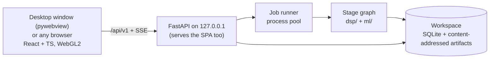

# Sanket — build plan

**Sanket** (संकेत, "signal") is our SIH26147 product: an offline, CPU-only workstation that takes an unknown `.iq` or `.wav` recording and works out how it was transmitted — sample format, bandwidth, SNR, symbol rate, modulation, interleaver, error-correction code and framing — then undoes each layer to recover the bits, showing the evidence for every claim.

This is the only plan. It ships **Sanket 1.0 as production software**, organised by milestones with measured exit gates. The PS requirements it answers are numbered R1–R5 in [PROBLEM_STATEMENT.md](PROBLEM_STATEMENT.md#requirements-as-sanket-reads-them). Last revised **3 October 2026**.

Related: [README](../README.md) · [Problem statement](PROBLEM_STATEMENT.md) · [Standards to beat](STANDARDS_TO_BEAT.md) · [UI](UI.md) · [Claude Code tooling](../.claude/CLAUDE_SKILLS_MCP.md)

---

## 0. Progress

*Checked against the repository on **3 October 2026**. This is the only place current status is tracked. Update it whenever an item lands; measurement history lives in `bench/results/`, the tests and the code's docstrings, not here.*

One decode chain runs end to end today (`dsp/analyse.py`, per detection, shown in the UI): BPSK/QPSK/8PSK/16QAM/64QAM, offset QPSK or 2/4/8-FSK (MSK/GMSK as a hypothesis) → optional conv code (K=7 r½ and its punctured rates from a catalogue, or any rate-1/n code found blind) → optional interleaver (block, helical, 802.11, QPP, convolutional from catalogues; block and helical also found blind) → optional RS(255,223) or catalogue LDPC → ASM or blind-found frames with a CRC (31-entry catalogue, or recovered blind) → Match against the known-system catalogue. VERIFIED only by a CRC pass, sync-word recurrence or re-encode match.

| Stage | State | Still open |
|---|---|---|
| M0 Foundations and identity | Done (27 Sep) | — |
| M1 Ingest, evidence model, lab, bench v0 | Done (27 Sep) | — |
| M2 Spectrum, detection, estimation, tiles | DSP core, tile pyramid, detections in the UI, capture quality, structural sample rate; gate not met | Drift, SSB/CW, eigenvalue/MDL SNR, cyclic rate refinement, first tile ≤ 2 s, real/complex branches, OpenAPI types |
| M3 Sync and demodulation | Feed-forward sync, PSK/QAM, 2/4/8-FSK, offset QPSK, MSK/GMSK, eye | Gardner/Costas and Doppler tracking, FSK rate at low SNR and on crowded channels |
| M4 Modulation classification | Cumulant ranking, confirmed only by CRC | Everything else: rules, CNN, open-set, ONNX, evaluation. `ml/` is empty |
| M5 GF(2), interleavers, FEC | GF(2) kernel, blind rate-1/n conv ID, Viterbi K ≤ 9 with puncturing, interleaver catalogues, blind block and helical, CCSDS RS, 13 LDPC codes (7 in the chain) | Blind Forney, RS GFFT/depth scan, TM LDPC in the chain, C2, DVB-S2, 5G NR, concatenated-chain ID, chain-matrix bench, Holm over the whole search |
| M6 Framing and known systems | ASM search, 31 CRCs, blind sync/header/CRC, descramblers, frame table and field map, Match stage with 6 systems | Meteor-M LRPT, CRC position search, named header fields beyond CCSDS, null-set near-misses |
| M7 Analyst workflow and reports | Open/upload/folder/sequence, background analysis, History, exports (JSON 0.6.0, CSV, summary, PDF, run record, SigMF), Save as SigMF, onboarding | Overrides with downstream re-run, process-pool job store, analyst-context checks, profiles, capture |
| M8 Hardening and 1.0 | Windows build and desktop window, bad-input tests | Linux build, CI smoke, fuzzing, real recordings, decoder truth, sealed run, head-to-head, docs |

**Open gates** (a missed number or known defect; each closes by M8)

| Gate | Target | State |
|---|---|---|
| M2 false detections | ≤ 0.05/scene | Linear modulations 0.00 (fixed 2 Oct: the noise floor's running percentile repeated the edge bin; the window now wraps). M-FSK 0.02–1.58, rising with SNR: unshaped tone splatter in `dsp.synth` (a Gaussian pre-filter breaks the analog kurtosis gate and the FSK rate), and `merge_tone_combs` needs tone SNRs within 6 dB ([bench](../bench/results/bench-v0-detect.md)) |
| M2 first tile | ≤ 2 s | Not benched. The sample scenes open in 0.14–0.6 s, but `RecordingStore.open` builds the whole pyramid and detects before returning; coarse-first tiles are not built |
| Null bench | 0 accepted decodes, 0 VERIFIED, 0 system matches on 1,000 files, decode time no worse than before a search widens | Held on every rerun, last on the final tree of 2 Oct: 0 / 0 / 0 on 4,373 detections ([bench](../bench/results/bench-v0-null.md)). Time is open: the chain is about 2.9× slower than before the Forney grid, QPP, 64QAM, the CRC catalogue, M-FSK and Match widened it (36,178 s against 12,689 s of summed chain time; per-file times in a worker pool are noisy). 2 Oct speed-ups (Numba RS, thread pool, Viterbi per-step scoring, FFT screen) cut the four-signal sample from about 60 s to 20–23 s. Remaining shares: Viterbi about a third, `structure_z` FFTs 27 %, LDPC alignment 18 %; the punctured grid still decodes cells that share bits; Match and the extra FSK demodulations are unprofiled |
| Wide-channel leak | Neighbours filtered out | A decimation-1 channel is mixed, not filtered; filtering breaks `snr_psd` and the analog test, which expect noise across the channel |
| M-FSK rate on crowded or narrow channels | Rate found on any channel | Improved (`tests/dsp/test_fsk_rate.py`): the true rate is among the three candidates for 2-FSK at 15 dB, 4-FSK at 18 dB and 8-FSK at 22 dB. Open: 2-FSK at 10 dB and 16 samples per symbol, a 64-samples-per-symbol channel decimated to 16, and crowded channels (untested) |

**Next** — the build order. The finale demo (December, dates unpublished) needs the first five; they are ordered by credibility risk and lead time. Estimates are working days.
1. **M4: the CNN and open-set rejection** (5–7). `ml/` is empty, so an AMC demo has nothing behind it; the biggest credibility risk.
2. **M7: overrides** (4–5): a stage cache, `POST` override, downstream re-run, before/after diff, UI. Judges demo it; no rival does it fully (D5).
3. **M8: real recordings, started now** (4–6 of work, 1–3 weeks elapsed): public datasets and remote KiwiSDRs first (Indian NAVTEX), manifest and expectations committed before the first run. The lead time is legal and external, not code.
4. **M3: FSK rate at low SNR, Gardner/Costas, drift** (6–9): NAVTEX and RTTY demos and LEO Doppler.
5. **M5: LDPC in the blind chain** (6–8): TM codes first, then DVB-S2, C2, 5G NR, each with a null-bench rerun.
6. **M5/M6 depth:** blind Forney (3–4), RS GFFT and depth scan, concatenated-chain ID, the chain-matrix bench, named header fields beyond CCSDS (1), Meteor-M LRPT once real recordings exist, null-set near-misses.
7. **M2 leftovers:** first tile ≤ 2 s (1–2), OpenAPI types (1), SSB/CW (2–3), real/complex branches (1–2), wide-channel leak (1).
8. **M7/M8 close-out:** job store on a process pool, profiles, capture; Linux build, CI smoke, fuzzing; the **sealed run once, last**, then head-to-head and `VALIDATION.md`.

---

## 1. What 1.0 is

The PS requirements (R1–R5, G1–G3) and how we read each are in [PROBLEM_STATEMENT.md](PROBLEM_STATEMENT.md#requirements-as-sanket-reads-them). 1.0 delivers all of them plus:

- **Every kind of input except real-time streams.** Every analysis runs on a file; files of any size are streamed.
  - **Formats (M1):** SigMF (full `core:datatype` vocabulary, archives, multi-capture, metadata pointing at another file); raw headerless files in all 28 SigMF datatypes, both byte orders, IQ or QI; WAV mono/stereo, integer/float, RF64/Wave64, the SDR `auxi` chunk; FLAC/MP3/Ogg; SDRangel `.sdriq`, MIDAS Blue, VITA 49, NumPy `.npy`, `.gz`/`.zip`; anything else as raw bytes with a header offset and the format sniffer.
  - **Routes:** open a path (nothing copied); drag-and-drop upload to the local server; a folder as a batch; a numbered file sequence as one recording; the `sanket analyse` CLI; capture from a locally connected receiver (M7): a USB SDR, or a sound-card input carrying a receiver's audio or IQ.
- **Analyst context:** known parameters, a suspected standard, capture details — checked against the data, never trusted.
- **Save as SigMF** for any confirmed non-SigMF recording.
- **Known-system verification** (M6): CCSDS telemetry coding, Meteor-M LRPT, AIS, NAVTEX, MF/HF DSC, POCSAG; VERIFIED only when that system's own check passes. NAVTEX messages and POCSAG alphanumeric pages are shown as text once verified.
- **Analyst profiles** (M7): save a found chain, apply it to later recordings, still checked every time.
- Multi-signal detection; slow frequency drift (a satellite pass's Doppler, an oscillator warming up) measured, reported and tracked; analog AM/FM/SSB/CW detected, labelled, measured and kept out of the digital chain; classification with open-set rejection.
- A local web GUI (waterfall, PSD, constellation, eye diagram, evidence, hypothesis ledger, frames, assumptions) with analyst overrides that re-run downstream stages.
- Exports: JSON, CSV, PDF, SigMF annotations, profiles, each tied to the recording by its SHA-256; the PDF and UI open with a plain-language summary generated from the results.
- One-folder builds for Windows 10/11 x64 and Ubuntu 22.04+ that run with networking off, in their **own desktop window** (pywebview) over the local server, with any browser at 127.0.0.1 as the fallback.

**Out of scope for 1.0:** real-time analysis of a live stream; capture from network-attached receivers (KiwiSDR, LAN SDRs, VITA 49 over UDP — it breaks the 0-outbound-connections rule; record with the receiver's tool, then open the file); transmitting; decrypting; generic pseudo-random permutation recovery; a large protocol library; multi-user deployment.

**After 1.0** (not scheduled): playable audio for analog AM/FM/SSB (digital voice stays out: patented codecs); Doppler pre-correction from orbital elements (TLEs); time-domain views (I/Q, amplitude, phase, instantaneous frequency); OFDM detection with subcarrier spacing and CP length (until then labelled unknown); an *illustrative* sine/cosine explain mode; ASK/OOK and pulse-position demodulation (enables ADS-B); payload text for further catalogued systems; more known systems (MIL-STD-188-110, STANAG 4285, ACARS).

## 2. The production bar

1.0 ships only when every row holds, each enforced by a test or a script. Signal-processing targets are in [STANDARDS §8](STANDARDS_TO_BEAT.md#8-our-bar--measurable-targets).

| Area | Requirement | Enforced by |
|---|---|---|
| Correctness | Every stage tested against exact ground truth from our generator, including a case where it must fail or abstain; whole chains tested as a cross-product (every modulation × code × interleaver × framing combination the catalogues support), so no stage passes only in the combination it was built with | pytest + `bench/` (chain matrix) |
| Honesty | Every value a `Parameter` with an evidence level; **0 silent defaults**; VERIFIED only from a CRC pass, sync-word recurrence or a re-encode match consistent with EVM; every value taken on a convention is a HYPOTHESIS listed under `needsReview` | Schema validation on every result; an ingest test over every unknown-format path |
| False accepts | **0 accepted decodes on ≥ 1,000 null files** (noise, uncoded, repetition, idle) | `bench run null` in CI (nightly) |
| Scale | Files ≥ 4 GiB end to end; peak memory bounded and independent of file size | Scale test on a generated 4 GiB file; RSS ceiling asserted |
| Performance | Full chain on 10 M samples ≤ 10 s on a 4-core laptop (excluding blind LDPC search); first tile ≤ 2 s after ingest starts; pan/zoom 60 fps at 1080p on integrated graphics | `bench perf` thresholds; frame-time check in E2E |
| Reliability | A throwing stage is marked FAILED with its error and the job continues; the server never crashes on bad input; jobs survive a restart | Fault injection; parser fuzzing; restart test |
| Offline | **0 outbound connections**; no CDN; fonts and assets bundled | Socket-blocking E2E in CI; build scan for external URLs |
| Security | Binds 127.0.0.1; upload size limits; sanitised export names; no shell interpolation; recorders run from an argument list; archive extraction guarded against traversal and bombs; profiles are schema-validated data, never code; dependency audit | Security tests; `pip-audit`, `npm audit` |
| Reproducibility | Same file + version + settings → byte-identical results JSON; results record the recording's SHA-256, version, catalogue versions, model hash, seeds and any applied profile; exports carry the results' SHA-256, so any report traces to the exact file and run | Hash test on the bench set |
| Accessibility | Keyboard-reachable controls; WCAG 2.2 AA contrast in both themes; evidence never colour-only; reduced motion respected | axe in E2E; manual keyboard pass per release |
| Observability | JSON-lines logs per job; per-stage timings in the run record, not the results; a diagnostics bundle with logs and versions, no recording data | Tests on bundle and run-record contents |
| Licensing | No GPL, AGPL or non-commercial code in the product; `THIRD_PARTY.md` generated from the lockfiles | Licence check fails the build |
| Data handling | Recordings never leave the machine; configurable workspace; deleting a job deletes everything derived from it; profiles hold no samples | Deletion and profile-content tests |
| Packaging | One-folder build per platform, one start command; frozen Numba works (pinned numba/llvmlite, writable `NUMBA_CACHE_DIR`, pre-warmed kernels); window or browser fallback, both passing the offline check | Frozen-build smoke test in CI on both platforms |

## 3. Architecture



One local process tree, no external services.

- **Stages:** Ingest → Detect → Estimate → Sync → Classify → Demodulate → De-interleave → FEC → Frame → **Match**. Each is a pure function `run(inputs, params, overrides) → StageResult {parameters, artifacts, warnings}`, cached on the hash of its inputs, parameters and code version, so an analyst override re-runs only that stage and its descendants (D5). Match runs last against the known-system catalogue and profiles, runs each candidate's own check, and never overwrites a blind result.
- **Evidence model:** `Parameter {value, unit, uncertainty, level, confidence, method, evidence[], alternatives[], warnings[], resolve_hint, proof, convention}` in [`dsp/src/dsp/evidence.py`](../dsp/src/dsp/evidence.py) is the source of truth; it enforces the honesty rules at construction (levels are defined in the [README](../README.md#evidence-levels)). Downstream proof may **promote** an upstream value (a CRC pass makes the modulation VERIFIED), recorded as evidence. The frontend's hand-written `lib/evidence.ts` and `lib/api.ts` are replaced by types generated from the OpenAPI schema.
- **Results and run record:** `results.json` ([`dsp/results.py`](../dsp/src/dsp/results.py), schema in `results.schema.json`) holds only conclusions — the Assumptions block, stage results, parameters, `needsReview` (every value resting on a convention, derived from the parameters) and, for each signal, its label, kind, headline with its level, the hypothesis ledger (rows of every layer including Match, `matchTried`) and the frame table (at most 500 frames; `SignalFindings` in [`dsp/findings.py`](../dsp/src/dsp/findings.py), shared with the chain's `DetectionReport`) — and is byte-identical across runs. It leaves out what only the live views draw (the constellation and the eye). `run.json` holds how the run went (job id, results SHA-256, per-stage timing and cache hits, peak memory, version, hardware class, OS); never hostname, username or paths.
- **Hypothesis ledger:** every blind search writes every candidate tried (statistic, p-value, corrected threshold, outcome, reason) plus shuffled-bit false-alarm runs. Known-system and profile matches are counted in the same ledger. The UI renders it directly (D8).
- **Inputs:** every route produces a *recording* (files + container description) behind one chunked, memory-mapped reader interface. Capture is a job that runs a recorder subprocess, then writes SigMF.
- **Tiles:** server STFT pyramid, uint8 dB, fixed-size tiles, max-pooled between levels so short bursts survive zooming out; the frontend draws them through a LUT shader.
- **API** (`/api/v1`; literal routes before parameterised ones; progress over SSE):

  | Endpoint | Purpose |
  |---|---|
  | `POST /recordings` | Chunked upload, or register a path, folder or file sequence without copying |
  | `GET /recordings/{id}` | Metadata, container, format candidates, assumptions |
  | `PUT /recordings/{id}/context` | Analyst context |
  | `POST /recordings/{id}/sigmf` | Write a `.sigmf-meta` for a confirmed recording |
  | `GET /devices` · `POST /captures` | Local receivers · record a set duration to SigMF |
  | `GET/POST /profiles` · `GET /profiles/{id}/export` · `POST /profiles/import` | Profiles |
  | `POST /jobs` · `GET /jobs/{id}/events` · `GET /jobs/{id}/results` | Analyse (optionally with a profile) · SSE progress · results, ledger, frames |
  | `GET /tiles/{rec}/{level}/{t}/{f}` | Waterfall tile |
  | `POST /jobs/{id}/overrides` | Analyst correction → downstream re-run |
  | `GET /jobs/{id}/export.{json,csv,pdf,sigmf}` | Exports, each with the Assumptions block; the run record is its own download (`format=run`) |

  Built today (3 Oct): `GET /health`; `POST /recordings` (a path, folder or sequence; analysis continues in the background) and `POST /inputs` (expands a folder or sequence); `GET /samples` and `POST /samples/{id}/open` (the bundled samples); `GET /recordings/{id}`; `PUT /recordings/{id}/assumptions` (analyst-entered sample rate, centre frequency, IQ order); `GET /recordings/{id}/events` (SSE); `PUT /uploads/{batch}/{name}` (streamed, size-capped, into the workspace); `GET /tiles/...`; the exports as `GET /recordings/{id}/results?format=json|csv|txt|pdf|run|sigmf` (the plan's `GET /jobs/{id}/export.*`, keyed by recording until the job store exists), `POST /recordings/{id}/sigmf` (Save as SigMF for a raw file) and `GET /recordings/{id}/detections/{i}/frames?format=`; `GET /history`, `GET /history/{id}/results?format=` and `DELETE /history/{id}`. Not built: `/jobs`, overrides, profiles, devices and captures.

- **Tech stack:**

  | Layer | Choice |
  |---|---|
  | DSP | CPython 3.12 (pinned), NumPy, SciPy, Numba (pinned) for GF(2), Viterbi, LDPC |
  | FEC | Our own code on `galois` (MIT) for finite fields and the RS encoder; the RS decoder is our Numba port of galois's algorithm (`dsp/fec/rs.py`, checked word for word against galois in `tests/dsp/test_rs.py`: galois recompiled about 45 s of JIT in every process before its first decode); scikit-commpy/pyldpc only as vendored references; komm (GPL) and PySDR code (CC BY-NC-SA) never in the product |
  | ML | PyTorch for training; ONNX Runtime FP32 for inference; trained on `dsp.synth`; TorchSig (WSL2) as independent test generator; RadioML only as a corrected benchmark |
  | Inputs | Own readers; `soundfile` (libsndfile, LGPL) for compressed audio; `sounddevice` (PortAudio, MIT) for sound-card capture; SDR recorders as subprocesses |
  | API | FastAPI + Uvicorn, SQLite, SSE |
  | GUI | React 19 + TS strict (Vite) + Tailwind 4; WebGL2 waterfall (R8 textures + LUT); uPlot; layout in [UI.md](UI.md) |
  | Quality | pytest + Hypothesis, Vitest, Playwright, ruff, pyright, ESLint, GitHub Actions |
  | Packaging | PyInstaller one-folder, offline wheelhouse, pywebview (WebView2 bundled on Windows, WebKit2GTK on Linux) |

- **Repository layout:**

  ```
  frontend/   React + TS + Vite (e2e/ holds the Playwright tests)
  dsp/        ingest, synth, spectrum, detect, channel, estimate, analog, sync, demod, fsk,
              deinterleave, fec, framing, gf2, systems, analyse, evidence, results
  ml/         AMC training, evaluation, ONNX export, model card (empty)
  backend/    FastAPI app, recordings, CLI; planned: jobs, storage, capture, profiles, exports
  bench/      presets, sealed set, null set, results, perf, decoder-truth harness
  tests/      Python tests, one folder per package
  tools/      THIRD_PARTY.md and licence check, inspect_iq, make_demo (sample recordings), schema
  docs/       this plan, problem statement, standards, UI
  ```

## 4. Product identity (fixed)

| Element | Decision | Source of truth |
|---|---|---|
| Name | **Sanket** (संकेत, "signal"); tagline "Blind signal analysis, with evidence" | `frontend/src/brand.ts` only |
| Mark | A waveform resolving into a four-point constellation | `frontend/src/components/Logo.tsx`, `frontend/public/favicon.svg` |
| Colour | Dark-first instrument UI with a light theme; accent "signal cyan"; all colours are shadcn-compatible tokens | `frontend/src/styles/index.css` |
| Evidence levels | VERIFIED green + shield · MEASURED blue + ruler · ESTIMATED violet + Σ · HYPOTHESIS amber + dashed circle · UNKNOWN grey + slashed circle | `frontend/src/components/levelStyles.ts` |
| Type | IBM Plex Sans (UI), IBM Plex Mono with tabular numerals (numbers), IBM Plex Sans Devanagari (native name) — bundled | `frontend/src/main.tsx` |
| Colormaps | "Sanket" house map plus Viridis, Inferno, Grayscale; monotonic luminance tested | `frontend/src/lib/colormaps.ts` |

**UI rules** for every screen:
1. An evidence level is always glyph + label + colour, never colour alone.
2. Every number shows its unit and, where estimated, its uncertainty; true minus signs; non-breaking space before units.
3. UNKNOWN always says why and what would settle it.
4. Synthetic data is always labelled as such, on screen and in any screenshot.
5. No dead controls: a button that can't work yet isn't shown.
6. Plots are dark in both themes.
7. A value taken on a convention says so and offers the alternative; `needsReview` items are visible without opening each parameter.
8. Layout follows [UI.md](UI.md); the page never scrolls as a whole.

## 5. Milestones

Dependencies: **M0 → M1 → M2 → M3 → (M4 ∥ M5) → M6 → M8**, with **M7** alongside from M2. The **build order** is §0 **Next**. Tooling per milestone: [CLAUDE_SKILLS_MCP](../.claude/CLAUDE_SKILLS_MCP.md#1-tooling-by-milestone).

**Gate policy:** a missed exit-gate number becomes an Open gate in §0 rather than blocking the next milestone; every open gate closes by M8.

**Work rules:** while iterating, run the ground-truth test file for the item; run the full check list (`.claude/CLAUDE.md`) before each commit; run `dsp-reviewer`/`evidence-auditor` and the benches at each milestone exit, and the null bench whenever a blind search widens. When an item lands, tick it here and update §0. Each item below is a status and its limits; how a method works is in the module's docstring and its tests.

### M0 — Foundations and identity ✅

- [x] Vite + React 19 + TS strict + Tailwind 4; §4 identity and tokens
- [x] uv workspace (`dsp`/`ml`/`backend`/`bench`), Python 3.12; ruff, pyright (strict on `dsp/`), pytest with pytest-socket (loopback only), pre-commit, generated `THIRD_PARTY.md` that fails on GPL/AGPL/non-commercial
- [x] FastAPI app and `sanket` bound to 127.0.0.1; Playwright smoke test with outside requests aborted; CI green on Windows and Ubuntu
- **Exit gate (met 27 Sep):** clean clone green in CI on both platforms; `sanket` serves the UI with networking off.

### M1 — Ingest, evidence model, ground-truth lab, bench v0 ✅

- [x] Evidence model with honesty rules at construction and `promote()`; generated JSON schema; `needsReview`; results with the Assumptions block
- [x] All 28 SigMF datatypes round-tripped; IQ/QI; chunked random-access reader with header offset and trailing bytes; 0 silent defaults tested for every reader
- [x] Format sniffer (code length under a linear predictor; ranked candidates; UNKNOWN on ties; a real/complex tie goes complex as a `needsReview` HYPOTHESIS): 0 wrong formats on 864 files ([sniffer.md](../bench/results/sniffer.md))
- [x] Sample-rate candidates (file-name hints, device rates, `auxi`) tested structurally at α = 1 %
- [x] Readers: WAV (RIFF/RIFX/RF64/Wave64, int/float, EXTENSIBLE, `auxi`, stereo quadrature check), SigMF archives/multi-capture/NCD, `.npy`, `.sdriq`, Blue, VITA 49, FLAC/MP3/Ogg (lossy flagged), `.gz`/`.zip` (traversal and bomb guards), numbered sequences
- [x] `dsp.synth`: bits → frames/CRC → scrambler → RS → byte interleaver → conv/LDPC/repetition → bit interleaver (block, helical, Forney, QPP, 802.11, random) → PSK/QAM/FSK/AM/FM → impairments; SigMF with truth in annotations; regenerable from (scene, seed). TorchSig 2.2.0 (WSL2) as an independent generator, dev-time only
- [x] Bench v0 (`uv run bench generate|run dev|null|sealed|torchsig`): [dev](../bench/results/bench-v0-dev.md) 200 files, [null](../bench/results/bench-v0-null.md) 1,000 files, [TorchSig](../bench/results/bench-v0-torchsig.md) 84 files; the sealed set has never been run
- **Exit gate (met 27 Sep):** round trip for every format; sniffer confusion matrix published; 0 silent defaults; bench v0 and null set generated.

### M2 — Spectrum, detection, estimation, real tiles

- [x] Reader dispatcher by magic and name; streaming Welch spectrogram/PSD bounded by `MAX_CELLS`
- [x] Detection (`dsp/detect.py`): OS-CFAR, split-sample significance Bonferroni-corrected over cells and searches, hysteresis, morphology, multi-FFT merge, sidelobe absorption, I/Q-image mirroring; channelisation by streaming mix + Kaiser low-pass + decimate
- [x] Estimation (`dsp/estimate/`): symbol rate from the |x|² line, CFO by M-th power (gated for QAM), occupied bandwidth, one SNR estimator, RRC roll-off fit, cumulants
- [x] Analog AM/FM detection with a kurtosis gate against M-FSK, and measurements (carrier, bandwidth, AM depth and audio bandwidth, FM deviation; RMS figures, not peaks); FM skips the digital chain
- [x] 4 GiB file streams with RSS < 512 MiB (`tests/dsp/test_scale.py`, `-m slow`); tile pyramid over `/api/v1/tiles`; detections as `Parameter`s with boxes on the real waterfall
- [x] Capture quality as `Parameter`s (`dsp/quality.py`): clipping (a plateau at the peak level, so constant-envelope signals are not called clipped), DC, I/Q imbalance, gaps, non-finite samples; a file over 2²⁶ samples is read as 64 evenly spaced pieces and says so
- [x] Structural sample rate for a raw file that states none: symbol rates of the three strongest linear signals tested against recognised rates at every candidate rate; a significant, unambiguous match gives a HYPOTHESIS under `needsReview`, else UNKNOWN. Linear signals only
- [x] HYPOTHESIS cap on a digital signal's labels from lossy audio or a real-valued recording; a CRC-verified chain stays VERIFIED
- [ ] **SNR from three estimators, agreement as confidence.** Built: PSD moments (within 0.7 dB over 0–30 dB on linear scenes), M2M4 and EVM; the confidence is an agreement score, not a probability. Open: eigenvalue/MDL; FSK is not scored. Limits: it raises when the signal fills the band or noise alone is present (the analysis falls back to EVM); rectangular pulses read up to 1.3 dB low
- [ ] Symbol-rate refinement by cyclic autocorrelation and FAM/SSCA; bandwidth fallback below β ≈ 0.1
- [ ] **Drift:** a slowly moving signal stays one detection with its drift rate (Hz/s) as an ESTIMATED `Parameter`
- [ ] SSB and Morse CW with synth generators
- [ ] First tile ≤ 2 s (pyramid in the background, coarse first); level-of-detail tiles (only `levels[0]` is fetched today)
- [ ] Real/complex ties carried as two branches decided by downstream proof (replaces the complex-by-convention rule)
- [ ] OpenAPI-generated frontend types (the hand-written `lib/api.ts` can drift from the schema)
- [ ] *Stretch:* frequency-hopper clustering; co-channel overlap detection
- **Exit gate:** STANDARDS §8 detection/estimation targets per SNR bucket (recall, rate and CFO met; SNR and false detections open); 4 GiB bounded memory (met); first tile ≤ 2 s.

### M3 — Synchronisation and demodulation (R2)

- [x] Sinc resampling to 4 samples/symbol, RRC matched filter, Oerder-Meyr timing per block, M-th-power carrier with per-block phase (`dsp/sync.py`)
- [x] BPSK/QPSK/8PSK/16QAM/64QAM Gray max-log LLRs, EVM-based noise variance, M-fold rotation candidates (`dsp/demod.py`); hard-decision BER within 1 dB of theory for all five. 16QAM and 64QAM differ by 0.06 in −C42, so the cumulant ranking only orders them and the CRC decides
- [x] 2/4/8-FSK (`dsp/fsk.py`): the tone count is the order whose equally spaced levels fit the per-symbol mean frequencies best, Gray-labelled max-log LLRs from tone energies, a mirrored spectrum as its own branch; the symbol rate from the edge-energy line at several averaging scales, candidates ranked by comb strength (a structured payload has combs of its own); decodes end to end to VERIFIED
- [ ] **FSK symbol rate at low SNR and on crowded channels** (Open gate), and a tone view in the UI
- [x] Eye diagram (`dsp/eye.py`, the Constellation/Eye toggle); linear signals only
- [x] **Offset QPSK** (Meteor-M LRPT's 80 kBd mode): found from the balanced line pair in x² at 2f ± R (its |x|² line cancels), timed from the x² line, both I/Q pairings searched as branches; then QPSK's demapper, codes, framing and Match. Limits: RRC-like pulses only, roll-off near 0.1 not found, carrier must hold still (drift past about 1/(2N²) cycles/sample² loses the pair), no eye, not yet in the structural-rate test
- [x] **MSK/GMSK** (for AIS): 2-FSK of index ½ whose rate comes from the pair of lines one symbol rate apart in x²; the rate rests on that index, so the symbol rate is a HYPOTHESIS naming it, promoted to VERIFIED by a known system's check. About 1 % raw errors at 18 dB Es/N0 (no Gaussian-matched filter or MLSE)
- [ ] **Gardner/Mueller-Müller with a Farrow interpolator; Costas plus decision-directed tracking for QAM; carrier tracking through a LEO pass's Doppler** (about ±3.5 kHz at 137 MHz). Feed-forward tracking verifies QPSK behind the K=7 code through 1×10⁻⁹ cycles/sample² of drift (70 % of frames), half at 1×10⁻⁸, none at 3×10⁻⁸ (`tests/dsp/test_drift.py`). The chain reads at most 2¹⁸ channel samples from a detection's start, so only the drift inside that window counts
- [ ] *Stretch:* π/4-DQPSK
- **Exit gate:** BER within 1 dB of theory on AWGN for every supported modulation.

### M4 — Modulation classification (R1)

- [x] Cumulant ranking (|C40|, −C42) over BPSK/QPSK/8PSK/16QAM/64QAM; confirmed only by a downstream CRC
- [ ] Explainable cumulant and spectral-line rules, each listing its evidence
- [ ] ~10K-parameter complex-as-real 1-D CNN on [I, Q, |x|, Δφ] at 4–8 samples/symbol, cumulants fused before the head, trained on `dsp.synth`; temperature calibration only if ECE improves
- [ ] Open-set rejection: SNR gate → energy score → Mahalanobis distance to class prototypes; an "analog" outcome beside "unknown"
- [ ] Fusion: agreement → ESTIMATED; disagreement → HYPOTHESIS with both rankings
- [ ] FP32 ONNX, no DSP in the graph; `ml/MODEL_CARD.md`
- [ ] Evaluation on data we didn't generate (TorchSig, HisarMod, RadioML with corrected labels): accuracy −20 to +30 dB; AUROC, FPR@95 %TPR, OSCR per SNR bin; organiser data, if supplied, for evaluation and fine-tuning only
- **Exit gate:** STANDARDS §8 AMC targets; labels suppressed outside the validated SNR range.

### M5 — GF(2) kernel, interleavers, FEC (R1, R3, R4)

The core differentiator (D9).

- [x] **GF(2) kernel** (`dsp/gf2`): bit-packed rows, Numba popcount, Gauss-Jordan (RREF, rank, null space), rank profile over windows, soft variant. The only elimination routine; rank matrices always have L ≥ w + 30 rows. Tested against `galois`. Not built: total-pivoting GJETP
- [x] **Convolutional identification** (`dsp/fec/convident.py`, in the chain): no prior n, K, generators, offset or polarity; soft input at about 3 % raw errors (K = 3–9, n = 2–4); 0 of 1,000 null streams identified (`-m slow`). A found code is an equivalent description (branch order, delay and common factors are not identifiable). Not searched: one inverted branch (CCSDS's second generator)
- [ ] Blind identification of punctured codes (the K=7 code at the four DVB-S rates is in a fixed grid instead; Marazin 2012 for the general case)
- [x] **Viterbi** for any K ≤ 9, rate 1/n, with depuncturing (`dsp.fec.viterbi`, `dsp.fec.puncture`: DVB-S 2/3, 3/4, 5/6, 7/8 at every phase). Not catalogued: 802.11's and other puncture patterns
- [ ] **Interleavers.** Built: catalogue aligned by the K=7 parity syndrome and decided by the CRC (block and helical at four sizes, 802.11 at four N_CBPS, LTE QPP at nine table entries, a generic Forney grid I ∈ {2..8} × M ∈ {1..8}); **block found blind** (`dsp/blind_interleaver.py`, R × C from 10×30 to 64×100 at 2 % hard errors) and **helical found blind** (R ≥ 6; 24×48 to 64×50). Both refuse random, zero, alternating, repeated, uninterleaved and shuffled streams. Limits: hard decisions, K=7 only, about 3 % raw errors at most. Open: Forney found blind (Xu 2019), soft input and other codes, DVB and J.83 byte-level convolutional interleavers scored by the outer code, LTE sub-block and DVB-S2 bit interleavers, the rest of the QPP table (add rows only when checked against TS 36.212), pseudo-random only against **standard permutations** (802.11 N_CBPS 48/96/192/288, LTE, DVB-S2) else UNKNOWN with its measured period
- [ ] **RS.** Built: CCSDS RS(255,223) (`dsp/fec/rs.py`, our Numba port of `galois`'s decoder, checked word for word) with the grid found from an error-free codeword. Open: binary rank scan then Galois-field Fourier over 16 primitive polynomials × symbol offsets and the CCSDS dual basis, the interleave-depth scan (I = 1–5, 8; `rs.scan_interleave_depths` exists, not wired), shortened codes (RS(204,188))
- [ ] **LDPC.** Built (`dsp/fec/ldpc.py`, tables generated mechanically from the MIT-licensed labrador-ldpc and yairmz/ldpc files, licences shipped beside them): 13 codes (802.11n n=648 at ½, ⅔, ¾, ⅚; CCSDS TC (128,64), (256,128), (512,256); CCSDS TM AR4JA k=1024 and 4096 at ½, ⅔, ⅘), layered normalised min-sum in Numba, a systematic encoder through `dsp.gf2`, and `find_alignment` scoring every offset by the soft syndrome (Moosavi–Larsson), `found` only when every scanned block converges. 0 false alarms in 3,000 noise streams per family. The seven unpunctured codes are in the chain, VERIFIED only by the CRC downstream (`tests/dsp/test_ldpc_chain.py`). Open: the TM codes in the chain (the screen costs seconds per branch; Match already recognises them), TM k=16384, CCSDS C2, DVB-S2 short, 5G NR BG2 (Sionna's Apache-2.0 base graphs), polarity search of its own, LDPC behind an interleaver, bursts shorter than about 3 blocks, a cross-check of the decoder against an independent implementation. Limit: the CCSDS tables' CRC-32s match labrador-ldpc's; the 802.11n tables are checked by structure and the known first row only, never against the standards' PDFs
- [ ] **Concatenated chains** identified inner code first
- [ ] **Chain-matrix bench** (`bench run chains`): every modulation × code × interleaver × framing combination at fixed SNRs, per-cell VERIFIED rate and false accepts
- [ ] **FEC/interleaver catalogue** as versioned data with source and licence per entry (the known-system catalogue is already TOML, `dsp/systems/catalogue.toml`, read with `tomllib`)
- [ ] **False-alarm control.** Built: every hypothesis counted in the ledger; the best three significant chains are re-run on shuffled bits and one that passes there is blocked. Open: Holm (or Benjamini–Hochberg) across the whole search in place of Bonferroni
- [ ] *Stretch:* a gradient-boosted code-family pre-classifier that only orders the search, built only if the search misses the §2 performance target
- **Exit gate:** per-family, soft-decision FEC-ID targets from STANDARDS §8; **0 false accepts on ≥ 1,000 null files**.

### M6 — Framing and known-system verification (R5)

- [ ] Known-sync library: CCSDS ASM and POCSAG are in (`framing.SYNC_WORDS`); short words (Barker-13, HDLC flag) match random positions too often for a bit-error search and are left to blind discovery
- [x] **Blind sync discovery** (`dsp.blind_framing.discover_sync`): an autocorrelation screen proposes frame lengths, column constancy finds the constant prefix, and the unread second half of the rows counts recurrences against the chance a random row matches. Inverted and NRZ-I streams handled. Needs ≥ 64 frames of one length; 0 of 300 structureless streams. Not built: k-gram recurrence for short or few frames
- [x] **Header fields** (`header_fields`): byte-aligned constant and counter fields after the prefix, each with a p-value, shown as one HYPOTHESIS parameter
- [ ] **CRCs.** Built: 31 catalogue entries (16 CRC-16, 8 CRC-8, 7 CRC-32 from reveng, each against its published check value), Numba frame check, and **blind CRC recovery** (`recover_crc`: Ewing's differential method, polynomial fitted on half the frames and a `crc` proof only on the held-out half). Open: a position search (CRC not at the frame end), CRC-24, mixed frame lengths
- [ ] Descramblers: CCSDS additive and G3RUH self-synchronising are in (`dsp/scramble.py`, each a hypothesis in the grid, decided by the frame check); 802.11 (per-frame seed) is not
- [x] **Frame table and export** (`dsp/frame_table.py`: JSON, CSV, hex, bits; the first 500 frames; Frames tab links, `sanket analyse --frames`), split at the header: blind frames at the fields found, a CCSDS-matched stream at the catalogue's 6-byte primary header
- [x] **Header and payload by correlation** (the Bit stream tab's field map, `lib/fieldmap.ts`, from the frame table alone): the first 512 bits of the CRC-passing frames (all frames when fewer than 8 pass; nothing is claimed from fewer than 8) compared column by column. Whole-byte counters (the commonest step, chance ≤ 10⁻⁶) then constants at any bit (chance 2^(−bits × (frames − 1)) × columns ≤ 10⁻⁶); shown as bars, a solid/hatched/dotted band, a table and where the fixed part ends. An analyst's tool, never evidence. No field in 300 sets of random frames. Limits: counters in whole bytes only
- [ ] Named header fields for catalogue systems other than CCSDS (POCSAG, NAVTEX, DSC show their own frame text); a stream framed by the generic ASM search and not matched keeps a fixed 4-byte header column
- [ ] **Known-system catalogue** (`dsp/systems`, `catalogue.toml`, versioned; an entry records its specification and licence note, signal parameters, sync, frame check and names the check in code that verifies it). Built: six entries below; open: Meteor-M LRPT, whose modes come from community decoder documentation and wait for real recordings

  | System | Specification | Signal | Proof (existing proof kinds only) |
  |---|---|---|---|
  | CCSDS telemetry coding | CCSDS 131.0-B-5, 132.0-B-3 | BPSK/QPSK; ASM `0x1ACFFC1D`; conv K=7 r½, RS(255,223) | ASM recurrence; frame CRC-16 |
  | CCSDS TM LDPC (AR4JA) | CCSDS 131.0-B | the six catalogued codes | ASM recurrence; up to six code words satisfy every check |
  | Meteor-M LRPT (M2-3, M2-4) | community documentation | QPSK 72 kBd; 80 kBd OQPSK, 36 × 2,048 convolutional interleaver; RS depth 4 | ASM recurrence; RS and CRC. **Open** |
  | AIS | ITU-R M.1371-6 | GMSK 9,600 bit/s; NRZI; HDLC | CRC-16/X.25 on at least two frames |
  | NAVTEX (SITOR-B) | ITU-R M.540-2, M.476-5/M.625-4 | 2-FSK 100 Bd, 170 Hz; 4-of-7; time diversity | Diversity copies agree (`reencode`) |
  | MF/HF DSC | ITU-R M.493-16 | 2-FSK 100 Bd, 170 Hz; 10-bit check; time diversity | Copies and check bits agree (`reencode`) |
  | POCSAG | ITU-R M.584-2 | 2-FSK 512/1,200/2,400 bit/s | Sync recurrence; BCH(31,21) re-encode |

- [x] **Match stage** (`dsp/systems/match.py`, after `frame`): compares each entry's parameters with the blind findings, runs the fitting entries' own check on this recording and counts every check in the ledger (layer `Match`, `matchTried`) with Holm correction among themselves at **α = 10⁻⁶** (not the blind search's 0.01: at 0.01 about 1 in 300 random streams passed NAVTEX's pre-filter). `system` is **VERIFIED** only when the entry's own check passes significantly, **HYPOTHESIS** "consistent with …" when the parameters fit but the check could not run, **UNKNOWN** naming every entry and why otherwise; an entry whose parameters conflict is listed and not checked. Blind results stand: Match adds a stage and rows, and its proof also promotes the modulation and bit mapping it ran on. A verified system ends the blind walk early (a POCSAG recording skips the code, interleaver and framing searches). Bench: `acceptedSystems` is counted apart from `acceptedDecodes`. Decoded text (POCSAG pages, NAVTEX messages) is shown only from verified frames, as a HYPOTHESIS under `needsReview`, and never used as evidence. Limits by entry:
  - **CCSDS TM LDPC:** not verified against CCSDS 131.0-B (no PDF was available). Assumed: a 32-bit ASM only (the standard may define 64 bits for some codings), the randomiser restarting per code word and skipping the ASM, the transmitted word being the first n − M columns with the message first, k bits being one transfer frame. Tables are labrador-ldpc's, shared by our encoder and decoder
  - **POCSAG:** needs two consecutive batches; no error correction (a page with a failed codeword is not rendered); numeric pages recognised, not rendered; 2-FSK only; a real service's ±4.5 kHz shift at 512 Bd (index 17.6) is untried against the detector's tone splatter, and the synth scenes use index 1
  - **NAVTEX:** the CCIR 476 table is as tabulated in the English Wikipedia article (citing the ARRL Handbook and ITU-R 625) and was not checked against the ITU text; the synth shares it with the decoder, so a wrong entry would not be caught. Both bit orders are decoded. Tests use index 1 (115 Hz) rather than the real 170 Hz, because tone splatter and the FSK rate on narrow channels stop the real shift reaching Match
  - **DSC:** read from the Recommendation's text; a complemented stream is also a valid DSC stream, so the check cannot settle polarity (the polarity in which a call reads wins, else upright is assumed); content shown as symbol numbers, not decoded fields; the synth call is simplified at its ends; VHF DSC is not in the entry
  - **AIS:** whole-byte messages only, no error repair, no time-division gaps in the synth; message type and MMSI shown as a HYPOTHESIS. At 18 dB Es/N0 8 of 42 packets pass (ISI leaves about 1 % raw errors), 90 % from 26 dB
- [ ] Each entry ships a `dsp.synth` preset and test (POCSAG, CCSDS, CCSDS LDPC, AIS have them); the null set gains near-misses (right rate, wrong sync; right sync, failing check: so far only unit tests)
- **Exit gate:** blind sync false-alarm rate ≤ 10⁻⁶ per stream, measured; every entry VERIFIED on its preset; 0 false system matches on the null set.

### M7 — Analyst workflow and reports (G1–G3)

- [x] **Background analysis:** open returns after tiles and detection; per-detection analysis runs as a job with SSE progress (`backend/jobs.py`)
- [x] **Every input route:** path, drag-and-drop or picker upload (`backend/uploads.py`, `--workspace`), a folder as a batch (`POST /inputs`), a numbered sequence as one recording, `sanket analyse <paths…>` (one results JSON per recording, byte-identical across runs)
- [ ] **Job store.** Built (`backend/history.py`): each finished analysis (results and run record exactly as produced) in `<workspace>/history.sqlite3`; `GET /history`, `GET /history/{id}/results?format=` and `DELETE /history/{id}` (SQLite `secure_delete`; tested); the History section (Alt+3). Open: the job on a process pool and resumable (today one in-memory worker thread, so a restart loses a running analysis), SigMF from a kept analysis (needs the recording's files), reopening a kept analysis in the workspace views
- [ ] **Raw files open.** Built: an unknown sample rate opens in normalised units with a rate prompt (an entered rate is MEASURED "by the analyst" and restarts the analysis), centre frequency and IQ order in the Assumptions modal (an IQ swap re-tiles from the mirrored samples), an UNKNOWN sample format is a prompt with the sniffer's candidates (`--datatype`). Open: entered values checked against the data; `needsReview` items shown as prompts
- [ ] **Analyst context:** known parameters, a suspected standard, capture details; entered values are MEASURED "entered by the analyst", checked against the data, conflicts shown as warnings; a suspected standard only reorders searches
- [x] **Save as SigMF** for raw files (`dsp/sigmf_out.py`, `sanket analyse --save-sigmf`, `POST /recordings/{id}/sigmf`): a Non-Conforming Dataset naming the file and its header length, never overwriting (409) and never touching the samples. Only what the results can stand behind goes in standard fields: `core:sample_rate` and `core:frequency` only when MEASURED or VERIFIED, a HYPOTHESIS rate recorded with its level in `sanket:provenance`; Q-first order and an UNKNOWN datatype are refused; WAV, archives and sequences are refused with the reason. **Validated with the reference `sigmf-python` validator (3 Oct, dev-time through `uvx`, not in CI: the package is LGPL)**, which found annotations out of sample order; they are now sorted
- [ ] **Overrides** on any stage → downstream re-run → before/after diff; batch and compare views. Needs the stage cache (cached on the hash of inputs, parameters and code version)
- [x] **Exports**, each tied to the recording by its SHA-256 and carrying the Assumptions block: JSON (schema 0.6.0: the recording's files by SHA-256, rule-set versions, capture stage, per signal its stages, headline, level, ledger and up to 500 frames), CSV (one row per value), the plain-language text summary, PDF (`dsp/report_pdf.py`, ReportLab; byte-identical across runs; IBM Plex TTFs, a missing glyph prints `?`), the run record `run.json` (`backend/runrecord.py`: per-phase timing, peak memory, versions, machine class; never host, user or path; `--no-run-record`), and SigMF annotations (each signal's sample span, band in Hz, label, headline and level, added to a copy of a SigMF recording's metadata or to a new description). The UI offers them from the bar at 1536 px and up and from one Results menu below, at every width to 390 px. Limits: the PDF carries the first 40 frames and no constellation or eye; no stage cache, so no cache-hit counts; the plan's "include run record" checkbox was dropped because the run record is its own download
- [x] **Plain-language summary:** deterministic templates over `results.json` (`dsp/summary.py`; no LLM, no network), one sentence per Parameter stating its level in words and never firmer than its level, `needsReview` items as open questions; the text download, the top of the PDF, and a collapsible strip above the pipeline rail (`SummaryStrip.tsx`)
- [ ] **Profiles:** the accepted chain (assumptions, channel, modulation, sync, interleaver, FEC, sync word, frame layout, named header fields) plus name, notes, author, versions and the source hash, no samples. Applied values enter as analyst-entered and are checked; VERIFIED only by this recording's own proof; on failure say so and run the blind chain. Suggested by Match and counted in the ledger. Exported and imported as schema-validated files, never executed; every edit is a new version
- [ ] **Capture** (receive-only): record a set duration to SigMF with device, gain, rate, frequency and time. USB SDRs through their own recorders as subprocesses (`rtl_sdr`, `hackrf_transfer`, `airspy_rx`, `rx_samples_to_file`), never linked; sound-card input via `sounddevice`. Devices shown only when present; the UI states that capture needs authorisation. Tested against a simulated recorder and a virtual audio input
- [x] **Onboarding and clarity:** nine bundled sample recordings (`data/demo/`, each labelled synthetic) on the start screen, welcome dialog and guided tour, Help button, glossary and InfoTips, plain-language headlines, Decoded-message card, Bit stream tab (timeline, recurrence, frame anatomy, pattern search, field map), WCAG AA, Lighthouse accessibility 100 in both themes. The in-browser scripted capture is gone: the UI only ever shows real engine output
- **Exit gate:** Playwright E2E covers open → analyse → override → save profile → apply to a second recording → export, with sockets blocked; the PDF opens with the summary; capture tested end to end against the simulated recorder.

### M8 — Hardening, validation and 1.0 release

- [ ] **Packaging.** Built for Windows: `uv run python tools/build.py` (PyInstaller one-folder, `packaging/sanket.spec`, 289 MiB), per-user Numba cache with pre-warmed kernels (`sanket warm`); the frozen build's results are byte-identical to a source run's. Open: the Linux build, the offline wheelhouse, a frozen-build smoke test in CI, a cold-cache first-run time
- [ ] **Desktop window.** Built (`backend/window.py`): pywebview over the local server (WebView2 on Windows, GTK/WebKit2GTK on Linux, never Qt or MSHTML), only 127.0.0.1 navigable, browser fallback with a message, closing the window stops the server, sized from the screen it opens on. Open: the WebView2 runtime is the system's, not bundled; asking before closing while jobs run; the Linux back end is untested
- [ ] **Robustness.** Started (`tests/backend/test_bad_input.py`: 22 broken files and 9 hostile sample sets; no 500s; it found and fixed a sub-window file giving a 500 and NaN/infinite samples breaking the tile pyramid). Open: ≥ 4 GiB files in that test, per-container parser fuzzing, malicious archives and profiles, the Canvas2D waterfall fallback
- [ ] **Security and accessibility:** review of uploads, exports and subprocesses; axe clean; full keyboard pass
- [ ] **Real recordings,** in this legal order (Telecom Act 2023 §3 makes possessing a receiver an authorisation question): (1) public licensed datasets (IQEngine/SigMF samples, ORACLE, DroneDetect); (2) remote public KiwiSDRs: Indian NAVTEX from the DGLL stations on 518/490 kHz as the primary Indian ground truth, plus AIR shortwave, VOLMET, HFDL; (3) own RTL-SDR captures only under an institutional umbrella after checking with the organisers or WPC (ADS-B, AIS, Meteor-M LRPT, or published Meteor-M recordings used with their author's permission, [STANDARDS §11](STANDARDS_TO_BEAT.md#11-references); NOAA APT and FM RDS only if confirmed on air in India). Each file listed in `bench/real/manifest.json` with source, licence and SHA-256, plus the result expected for it, **committed before the first run**. Results, including abstains and why, in `bench/results/real-v0.md`. Every failure on a real recording gets a `dsp.synth` reproduction as a regression test
- [ ] **Decoder truth:** a `bench/decoder_truth/` harness runs reference decoders (readsb, AIS-catcher, rtl_433, multimon-ng, SatDump: GPL, subprocess only; redsea MIT) and keeps only CRC-passing frames; real recordings of catalogued systems must be VERIFIED by Match and agree frame by frame
- [ ] AMC fine-tuned, or CORAL-adapted, on labelled real captures (e.g. Real-World IQ, Mendeley 2026), reported before and after
- [ ] **Sealed run, once, last,** then a **head-to-head** against public rival tools on the sealed bench where licences allow, published neutrally
- [ ] **Docs:** user guide, method notes per stage, limits page, `bench/VALIDATION.md` with every number, script, seed and hardware spec
- **Exit gate:** every §2 row holds and the §6 release checklist is complete.

## 6. Quality system

**Tests, fastest first:** unit tests against exact ground truth (including fail/abstain cases) → property tests (Hypothesis) for parsers, the GF(2) kernel and decoders → golden results per bench file → nightly null-set run → Playwright E2E with networking blocked plus axe → nightly parser fuzzing → `bench perf` regression thresholds → frozen-build smoke test on both platforms.

**Definition of done:** tested against ground truth including a failure case; outputs carry level, confidence, method and evidence (UNKNOWN with its reason); limits written in docstrings and user-facing text; `bench/` numbers updated, and the README or any deck quotes only those; visible and overridable in the GUI per §4; works offline.

**Release checklist (1.0):** all §2 rows green on the release commit; sealed-bench and null-set results in `bench/VALIDATION.md`; frozen builds pass on clean Windows and Ubuntu machines; `THIRD_PARTY.md` current; user guide and limits page match the shipped behaviour; version, results-schema, profile-schema, both catalogue versions and model hash tagged together.

## 7. Versioning and compatibility

Semantic versioning; results JSON carries `schema_version` (a breaking change is a major version). The FEC/interleaver catalogue, the known-system catalogue and the AMC model are versioned independently and recorded in every result. Profiles carry a schema version and a version per edit; an older minor version's profile must import, and a reference to a removed catalogue entry is reported. SQLite changes ship as migrations. A changelog entry for every user-visible change.

## 8. Risk register

| Risk | Mitigation |
|---|---|
| Blind FEC / de-interleaving is unsolved in general; many guesses cause false matches | Catalogue-bounded search; every hypothesis in the ledger; Holm correction; L ≥ w + 30; shuffled-bit runs; ≥ 1,000-file null set; VERIFIED only with proof |
| No absolute sample rate or centre frequency in a headerless file | Ranked candidates, promoted only by structural matches; normalised units; assumptions on every output |
| Pseudo-random interleaver with an unknown permutation | Standard-permutation catalogue; otherwise UNKNOWN with the measured period |
| A flat "95 % at 3 % BER" FEC target is unreachable for long codes | Per-family, soft-decision targets (STANDARDS §8) |
| AMC collapses at low SNR; synthetic-to-real gap | Publish the curve; suppress labels outside the validated range; impairment-rich generator; TorchSig tests; real-capture fine-tuning |
| Mono WAV mistaken for IQ; lossy audio distorts phase | Channel count, quadrature check, HYPOTHESIS caps with the reason |
| Analog voice mislabelled as digital | Analog check before classification (M2); "analog" outcome in open-set rejection (M4) |
| Analyst context, a profile or a known-system match is wrong | Entered and profile values are checked; hints only reorder searches; the system's own check must pass; near-misses in the null set |
| Many containers multiply parser bugs | One reader interface; round-trip tests and fuzzing per container |
| GPL or unlicensed code in the product (SDR drivers, rival repos, LDPC matrices) | Drivers only as subprocesses; licence check in CI; rival repos studied, never copied; matrices from published standards with a recorded source |
| Frozen Numba fails on Windows; WebView2 or WebKit2GTK missing; no WebGL2; huge files exceed texture limits | Pinned builds and a frozen-build test; bundled WebView2 runtime and browser fallback; Canvas2D fallback; tiled pyramid with level of detail |
| Receiver possession needs authorisation (Telecom Act 2023 §3) | Public datasets and remote KiwiSDRs first; own captures only under an institutional umbrella; the capture UI says so |
| RadioML label/SNR flaws and non-commercial licence | Train on our generator; RadioML only as a corrected benchmark |
| NOAA APT / Indian RDS may not be on air; TorchSig needs Linux and ~1 TB | Meteor-M LRPT and NAVTEX as primary targets; WSL2 and only the subsets needed |
| Scope too broad; gate-chasing stalls the build | Exit gates; FEC depth before UI polish; stretch items cut first; missed numbers become Open gates |

## 9. External dates (SIH)

- **Idea submission:** submitted by 30 Sep 2026; the deck was built outside this repository. Template, rules and evaluation criteria are in [PROBLEM_STATEMENT.md](PROBLEM_STATEMENT.md#sih-2026-facts).
- **Rival scan:** re-run on 30 Sep ([STANDARDS §5](STANDARDS_TO_BEAT.md#5-sih26147-rival-repositories)); re-run before every pitch ([STANDARDS §10](STANDARDS_TO_BEAT.md#10-how-to-refresh-this-document)).
- **Grand finale:** proposed for December 2026; dates not yet published. The finale demo is whatever state the milestones have reached, run from the offline build with networking off.
