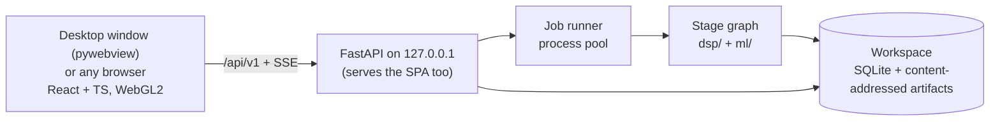

# Sanket — build plan

**Sanket** (संकेत, "signal") is our SIH26147 product: an offline, CPU-only workstation that takes an unknown `.iq` or `.wav` recording and works out how it was transmitted — sample format, bandwidth, SNR, symbol rate, modulation, interleaver, error-correction code and framing — then undoes each layer to recover the bits, showing the evidence for every claim.

This plan is written to ship **Sanket 1.0 as production software**, not a demo. It is organised by milestones with measurable exit gates rather than by calendar weeks or people. Last revised **28 September 2026**.

Related: [Problem statement](PROBLEM_STATEMENT.md) · [README](../README.md) · [Standards to beat](STANDARDS_TO_BEAT.md) · [Source dossier](SIHPS_ANALYSIS.md) · [Research report](../reports/SIH26147%20solution%20research.md) · [Claude Code tooling](../.claude/CLAUDE_SKILLS_MCP.md)

---

## 0. Progress

*Checked against the repository on **28 September 2026**. This section is the only place status is tracked; update it whenever an item lands. The milestones themselves are defined in [§5](#5-milestones).*

**Overall:** M0 is done: CI is green on Windows and Ubuntu, and `sanket` starts one local process that serves the workspace UI. M1 is done: the evidence model, the results schema, readers for every planned container, the raw-format sniffer, sample-rate candidates, the ground-truth generator and bench v0 exist; 0 silent defaults is tested for every reader, and the sniffer proposed 0 wrong formats on the 864-file sniffer bench, the 200-file dev set, the 1000-file null set and 84 files from TorchSig, an independent generator. M2 is in progress: the DSP core (streaming spectrogram, detection, channelisation, estimation, analog AM/FM detection, a reader dispatcher) exists and is tested against dsp.synth ground truth; STANDARDS §8's detection/estimation numbers are measured in `bench/` — recall, rate-error and CFO-error meet their targets, but SNR-error misses ±1 dB below 15 dB (a single estimator; M2M4 and eigenvalue/MDL aren't built) and false detections miss ≤ 0.05/scene at every bucket on both M-FSK (traced to unshaped tone splatter in `dsp.synth`, with a three-way conflict found in the obvious fix) and, untraced so far, the linear modulations too; a 4 GiB file streams through detection with RSS growth held under 512 MiB. Sanket can now open a real recording end to end from the UI: the server builds a real STFT tile pyramid and runs real detection, the frontend opens a recording by path and renders both from `/api/v1/recordings`/`/api/v1/tiles` in place of the demo texture — detection boxes on the waterfall and PSD, a real detections list, and real `Parameter` evidence cards for each one — with the recording's own Assumptions also shown as evidence cards; sync, classify, demod and their evidence are still M3+ work, so those panels say so rather than showing demo fixtures against a real waterfall. M2's exit gate still needs the SNR-error and false-detection numbers fixed and first-tile timing measured (and probably fixed — the pyramid and detection both build from a full file read today); M2's own scope also still needs `dsp/estimate/`'s and `dsp/analog.py`'s outputs wrapped as `Parameter`s the same way detection's now are, LOD tiling, and generated frontend types. M3–M8 have not started.

| Stage | State | Exit gate met |
|---|---|---|
| Idea submission (external, due 30 Sep) | In progress: docs done, deck not started | — |
| M0 Foundations and identity | Done | Yes: CI green on Windows and Ubuntu (27 Sep) |
| M1 Ingest, evidence model, ground-truth lab, bench v0 | Done | Yes: round trips for every format and container, sniffer confusion matrix published, 0 silent defaults tested, bench v0 and null set generated (27 Sep) |
| M2 Spectrum, detection, estimation, real tiles | In progress: DSP core, bench numbers, 4 GiB scale test, server tiles, detection results and boxes in the UI all landed; SNR-error and false-detection targets not met, first-tile timing unmeasured, estimate/analog not yet wired into `Results` | No |
| M3 Synchronisation and demodulation | Not started | No |
| M4 Modulation classification | Not started | No |
| M5 GF(2) kernel, interleavers, FEC | Not started | No |
| M6 Framing and known-system verification | Not started | No |
| M7 Analyst workflow and reports | Not started | No |
| M8 Hardening, validation and 1.0 release | Not started | No |

**Idea submission** ([§9](#9-external-dates-sih))
- [x] Plan, standards to beat, source dossier and research report
- [x] Workspace UI to screenshot, labelled *synthetic demo data*
- [x] Official PS text, category and theme recorded in [PROBLEM_STATEMENT.md](PROBLEM_STATEMENT.md)
- [ ] Confirm the submission template on sih.gov.in
- [ ] Re-run the rival scan ([STANDARDS §10](STANDARDS_TO_BEAT.md#10-how-to-refresh-this-document)); `gh` is logged in
- [ ] Build the deck; every number traced to STANDARDS or labelled as a target

**M0**
- [x] Vite + React 19 + TypeScript (strict) + Tailwind 4 frontend
- [x] Product identity (§4): name, mark, colour tokens, evidence levels, type, colormaps
- [x] Analysis workspace on a deterministic synthetic capture: WebGL2 waterfall, uPlot PSD, constellation and FSK tone views, evidence cards, hypothesis ledger, frames and assumptions tables
- [x] 26 unit tests pass; lint, typecheck and production build clean (all re-run 27 Sep)
- [x] Browser check in both themes at 390/1180/1512 px: no console errors, no requests beyond localhost
- [x] Python 3.12 + uv workspace for `dsp/`, `ml/`, `backend/`, `bench/`; ruff, pyright (strict on `dsp/`) and pytest clean; `ml/` kept out of the product install
- [x] FastAPI app serving the built frontend and `GET /api/v1/health`; `sanket` start command binding 127.0.0.1 by default; no CDN-backed `/docs` pages
- [x] Python tests may only open loopback connections (pytest-socket)
- [x] pre-commit hooks (large-file guard, ruff, ESLint, licence check)
- [x] `THIRD_PARTY.md` generated from the lockfiles by `tools/third_party.py`, which fails on GPL/AGPL, non-commercial or unrecognised licences
- [x] Playwright smoke test against `sanket`: every request outside 127.0.0.1 is aborted and fails the test; no console errors
- [x] CI on Windows and Ubuntu (`.github/workflows/ci.yml`): green on both, including the offline smoke test
- [x] Claude Code setup for M0 ([tooling map](../.claude/CLAUDE_SKILLS_MCP.md#1-tooling-by-milestone)): project MCP servers, permissions, `plan-status`, and the `ponytail` and `frontend-design` plugins (project scope)

**M1**
- [x] Evidence model (`dsp/evidence.py`) with the honesty rules enforced at construction, and `promote()` for downstream proof
- [x] All 28 SigMF `core:datatype` formats parsed, decoded to normalised samples and encoded; round-trip test for every format; IQ/QI swap
- [x] Chunked, random-access sample reader with header offset and trailing-byte count
- [x] SigMF metadata to Parameters: datatype, sample rate and centre frequency MEASURED, or UNKNOWN with a resolve hint, never defaulted; file size checked against the datatype
- [x] JSON schema generated from the evidence model (`dsp/results.schema.json`, honesty rules included, stale-schema test); results JSON with `schemaVersion` and the `Assumptions` block (datatype, data offset, sample rate, centre frequency, IQ order — each stated, UNKNOWN if need be)
- [x] `needsReview` in the results: every value taken on a convention rather than evidence (`Parameter.convention`), derived from the parameters and rejected on input if it disagrees with them
- [x] Raw files without metadata: format sniffer with ranked candidates (`dsp/ingest/sniff.py`), raw ingest with every layout fact stated (`dsp/ingest/raw.py`), and a confusion matrix over all 28 formats in [`bench/results/sniffer.md`](../bench/results/sniffer.md): 0 wrong formats on 864 files
- [x] Sample-rate candidates (`dsp/ingest/rate.py`): file-name hints (rate and centre-frequency tags, the gqrx naming scheme, rate units, SDR#/HDSDR `…Hz` names) and standard SDR device rates, ranked with the recorders that write the file's datatype first; a raw file's sample rate and centre frequency stay UNKNOWN with the candidates as alternatives. Structural-match test: every (candidate, recognised symbol rate) pair counted, tolerance 3σ within 0.01–0.1 %, file-name candidates and all candidates as two tiers sharing α = 1 %, and a match that implies more than one rate stays UNKNOWN; the null promotion rate is tested ≤ α. *M2's symbol-rate estimator calls it. A WAV header states its sample rate (MEASURED), so the `auxi` chunk contributes the centre frequency.*
- [x] WAV (`dsp/ingest/wav.py`): RIFF, RIFX, RF64/BW64 and Wave64; 8/16/24/32-bit integer and 32/64-bit float PCM, plain or `WAVE_FORMAT_EXTENSIBLE` (24-bit is `ri24_le`/`ci24_le`, a stated extension SigMF can't express); the `auxi` chunk before or after the data (centre frequency and start time, MEASURED); truncated and unfinished data chunks read with a warning; compressed encodings and more than two channels UNKNOWN with the reason. Stereo quadrature check on blocks sampled across the file: impropriety (mirror-frequency correlation) and spectral asymmetry against its Gamma null → I/Q as HYPOTHESIS, audio-like channels UNKNOWN with an analyst prompt, or I/Q on a stated convention under `needsReview`. Tested against the standard library's `wave` writer. *Mono WAV's analytic-signal path and HYPOTHESIS cap on digital labels land with the stages that use them (M2–M4).*
- [x] Other containers, all behind one chunked reader interface (`dsp/ingest/reader.py`: byte segments, kept as arrays for per-packet formats):
  - SigMF archives read in place from the tar (nothing extracted), multi-capture datasets with per-capture `header_bytes`, Non-Conforming Datasets via `core:dataset` (a bare file name, never a path) with `trailing_bytes`; multi-channel datasets UNKNOWN; a changing centre frequency is warned
  - NumPy `.npy` (header parsed as a literal, never executed; (N, 2) real arrays are I/Q by a stated convention; planar layouts and native-order dtypes UNKNOWN)
  - SDRangel `.sdriq` (header CRC-32 checked; a mismatch drops the header values to HYPOTHESIS; 24-bit builds flagged as 32-bit words)
  - MIDAS Blue type 1000/1001 (both byte orders, S/C × B/I/L/F/D, rate from `xdelta`, centre frequency from an `RF_FREQ` keyword, detached `.det` data)
  - VITA 49 packet recordings, plain or VRL-framed: stream, class ID, timestamps and trailer handled; rate, RF frequency and payload format from context packets; the sniffer proposes a format when no payload format is sent; extra streams warned
  - FLAC/MP3/Ogg via `soundfile` (libsndfile, LGPL): decoded on demand, stereo quadrature check, lossy codecs flagged so digital labels are capped at HYPOTHESIS
  - `.gz`/`.zip` decompressed into a target directory, disk cost reported first; refuses path traversal, symlinks, encrypted members, and bombs (absolute limit and 1000:1 ratio, checked on bytes produced); nothing partial is left
  - numbered file sequences (raw or WAV) read as one recording; formats must agree; gaps in the numbering are warned
  - `THIRD_PARTY.md` now also lists native libraries bundled in wheels (NumPy's OpenBLAS and GCC runtime, libsndfile and its codecs); the licence policy allows GPL only under the GCC Runtime Library Exception
  *Tested against files written by independent writers where one exists (`np.save`, `tarfile`, `wave`, `gzip`, `zipfile`, libsndfile); `.sdriq`, Blue and VITA 49 test files are written from the verified layouts.*
- [x] 0 silent defaults (`tests/dsp/test_no_silent_defaults.py`): every reader, given the barest file its container allows (named with rate and centre-frequency tags), reports each fact the file doesn't state (sample format, data offset, sample rate, centre frequency) as UNKNOWN or HYPOTHESIS with evidence, and the facts it does state as MEASURED; IQ order is never MEASURED; a file-name hint is a candidate, never a value. *It found two gaps, now fixed: an `.sdriq` header with a bad CRC still called its data offset MEASURED, and SigMF metadata without a sample rate or centre frequency offered no file-name or device-rate candidates.*
- [x] Recorder file extensions as sniffer hints (`dsp/ingest/sniff.py`): `.cu8`, `.cs8`/`.sc8`, `.cs16`/`.sc16`, `.cf32`/`.fc32` and `.cfile` each name the format their recorders write; `.raw`/`.bin`/`.dat`/`.iq` name none. A hint only puts its format first among the candidates of an UNKNOWN tie; it never decides a format, breaks a tie or raises a level, and an extension that contradicts the sniffer's proposal is a warning.
- [x] Ground-truth generator `dsp/synth` (NumPy): bits → frames with sync word and CRC → scrambler → Reed-Solomon → byte interleaver → convolutional/LDPC/repetition code → bit interleaver → PSK/QAM/FSK/AM/FM mapping → RRC or rectangular pulses → non-integer samples per symbol; impairments (CFO, phase noise, IQ imbalance, multipath and fading, clock offset and drift, AGC, clipping, AWGN), an explicit noise class, multi-signal scenes; SigMF output with the truth in annotations; everything regenerable from (scene, seed)
- [x] TorchSig 2.2.0 as an independent generator, dev-time only: `bench/torchsig/export.py` runs under WSL2 in its own environment (CPU PyTorch), exports 14 classes × 6 files with TorchSig's impairments and labels as SigMF, and `uv run bench run torchsig` scores them ([`bench/results/bench-v0-torchsig.md`](../bench/results/bench-v0-torchsig.md): 0 ingest mismatches, 0 wrong formats on 84 files). Nothing in the product imports it.
- [x] Bench v0 (`uv run bench generate|run dev|null|sealed`): every file follows from its seed (`bench/presets.py`), so only seeds and results are committed; a sealed set whose seeds are fixed in `bench/sealed/manifest.json` and whose results are totals only, not run during development; the null set (noise, uncoded bits, repetition code, idle flags). Results: [dev](../bench/results/bench-v0-dev.md) (200 files: 0 ingest mismatches, 0 wrong formats) and [null](../bench/results/bench-v0-null.md) (1000 files: 0 wrong formats, 0 VERIFIED values). *Accepted decodes are 0 by construction until FEC and framing land (M5/M6), and the results say so.*

**M2**
- [x] Reader dispatcher (`dsp/ingest/dispatch.py`): picks the reader for a file from its header magic and name, so a caller no longer has to pick one; refuses a compressed file with the reason (decompress first); exposes whether a recording is lossy, mono/real, or a raw file's real/complex reading tied
- [x] Streaming Welch spectrogram and PSD (`dsp/spectrum.py`): Hann/50 % overlap frames, cells bounded by `MAX_CELLS` regardless of recording length, real input keeping only non-negative frequencies; even- and odd-numbered frames accumulated separately for the split-sample significance test below
- [x] Detection (`dsp/detect.py`): OS-CFAR noise floor (Gamma-quantile corrected), candidates chosen on even frames and tested on odd ones so the significance test isn't biased by the selection it's given, Bonferroni-corrected over cells and searches, morphological clean-up and connected-component labelling, multiple FFT sizes plus a whole-recording integrated search merged finest-frequency-first, sidelobe absorption, time-edge refinement, I/Q-image mirroring
- [x] Channelisation (`dsp/channel.py`): streaming mix + Kaiser low-pass + decimate to a detection's band with margin; a real source's negative-frequency mirror is removed by the filter even when no decimation is needed
- [x] Estimation (`dsp/estimate/`): a generic significant-spectral-line finder (`lines.py`) behind symbol rate (linear modulations via |x|², FSK via tone-transition rate), carrier offset (M-th power, gated off for QAM and for 8PSK's too-weak line), occupied bandwidth, SNR (PSD in-band vs guard band; the other two estimators PLAN calls for, M2M4 and eigenvalue/MDL, aren't built yet, so there's no cross-check by agreement), RRC roll-off fit, and cumulants
- [x] Analog AM/FM detection (`dsp/analog.py`): envelope and instantaneous-frequency statistics tested against the floor AWGN alone would produce at the signal's own power, with a kurtosis gate so M-FSK's discrete tones aren't mistaken for FM; SSB and Morse CW aren't implemented (dsp.synth has no generator for either, so nothing claims to detect them)
- [x] `dsp-reviewer` run over the new modules; three real bugs it found are fixed: a real recording's mirror image surviving channelisation when no decimation was needed, `welch()` always treating input as complex, and `SnrEstimate.signal_power` off by a factor of `nfft` relative to `noise_density`
- [ ] STANDARDS §8 detection and estimation targets measured in `bench/` (`uv run python -m bench.detect_bench`, [`bench/results/bench-v0-detect.md`](../bench/results/bench-v0-detect.md): 8 scenes × 8 modulations × 8 SNR buckets, clean AWGN, one signal per scene — STANDARDS' own "multi-signal bench" wording isn't measured yet, only this single-signal characterisation curve). Recall meets its target (100%) at every bucket; rate-error meets ≤ 0.1% at ≥ 10 dB; CFO-error meets ≤ 1% of Rs wherever it has coverage. **SNR-error does not meet ±1 dB over 0–20 dB**: median error is −8.7/−8.6/−8.2/−6.6 dB at 0/3/6/10 dB, only landing inside ±1 dB at 15 and 20 dB — `snr_psd` (`dsp/estimate/params.py`) is a single estimator whose in-band/guard-band split degrades as the signal nears the floor; M2M4 and eigenvalue/MDL, still to build, are what PLAN's own design relies on to catch this by agreement. False detections don't meet the ≤ 0.05/scene target at any bucket, and **not only on M-FSK**: linear modulations alone already score 0.20/scene at 3, 6 and 20 dB (see the split column in the bench table), which the M-FSK explanation below doesn't cover — the extra detections there haven't been traced yet, and `merge`/`absorb_sidelobes` (`dsp/detect.py`) are the likely place to look first. For M-FSK, the bench's own notes trace it to `dsp.synth.modulate.fsk` shaping no pulse onto the frequency trajectory, which splatters real energy between tones that `merge_tone_combs`' honest "no spacing pattern, no merge" rule correctly refuses to absorb — a generator limitation, not a detector bug, for that share of it. A fix was attempted and `dsp-reviewer`-checked: `fsk()` gained an optional Gaussian premodulation filter (`bt`, GFSK-style; `dsp/synth/modulate.py`'s `_gaussian_taps`), wired through `SignalSpec.fsk_bt`. The review caught that the first sweep (`bt` = 1.0, 2.0) had picked values too weak to matter; a follow-up sweep over `bt` in [0.02, 2.0] against the full test suite found a genuine three-way conflict instead: `bt` in roughly [0.02, 0.15] does absorb the splatter into one detection, but by blurring M-FSK's discrete tone histogram toward FM's continuous one it fails `dsp.analog`'s kurtosis gate, and by smearing the sharp transitions `fsk_symbol_rate`'s edge-rate comb depends on, it breaks the FSK symbol-rate estimate; `bt` in [0.2, 0.4] fails two of those three at once; only `bt` = 0 or `bt` ≳ 0.5-2.0 (weak enough to be a near no-op) pass every test, and those barely move the bench numbers. `fsk_bt` stays 0 (unchanged behaviour) by default; still unmet, and needs a filter that cuts splatter without erasing the discrete-tone signature the other two stages rely on, not just a different `bt`
- [x] A 4 GiB file streams through detection with bounded memory (`tests/dsp/test_scale.py`, run explicitly with `-m slow` since it writes a multi-GB file): RSS growth stays under 512 MiB streaming a 4 GiB `cf64_le` file, and a planted burst is still found
- [x] Server STFT tile pyramid with max-pooling (`dsp/tiles.py`: quantised uint8 dB, pooled levels, fixed-size tiles) built and served from `backend/src/backend/recordings.py` over `POST /api/v1/recordings` and `GET /api/v1/tiles/...`, tested in `tests/dsp/test_tiles.py` and `tests/backend/test_recordings.py`
- [x] The frontend's switch from the demo texture to the server tiles: an "Open a recording by path" control in `TopBar` calls the new `frontend/src/lib/api.ts` client; `frontend/src/lib/waterfallSource.ts` adapts a `RecordingInfo` + fetched tile grid into the same shape `Waterfall`/`PsdPlot` already render (never defaulting a sample rate — a recording with an UNKNOWN rate is refused with that reason, not shown with a fabricated axis); the recording's own Assumptions render as real evidence cards (`RecordingAssumptionsPanel`, reusing `EvidencePanel`'s `ParameterCard`); panels with no backend data yet (detections, pipeline, symbol view, per-stage evidence) say so instead of showing demo fixtures against a real waterfall. Verified end to end in a browser (both themes, no console errors) against a `dsp.synth`-generated SigMF file; `frontend/src/lib/waterfallSource.test.ts` covers the adapter.
- [ ] First tile ≤ 2 s: unmeasured, and probably not met on a large file as built — `RecordingStore.open` (`backend/src/backend/recordings.py`) reads the whole file and builds the full pyramid before `POST /recordings` returns, so no tile is servable until the whole file has been read. Needs either a fast coarse first pass or building the pyramid in the background while early tiles are served, plus a Playwright timing assertion once it's true
- [x] Detection results as `Parameter`s (`dsp/detect.py`'s `detection_parameters`): each detection's centre frequency, bandwidth, start/stop and SNR, ESTIMATED with a stated uncertainty, in cycles/sample and samples (no sample rate needed) — a `dsp.results.Signal` model (`id` + `stages: tuple[StageResult, ...]`) carries this in `Results.signals`, with `needsReview` extended to cover signal-scoped conventions too. `dsp/estimate/`'s and `dsp/analog.py`'s outputs are still plain dataclasses, not yet wrapped
- [x] Detection boxes on the real waterfall from real results: `RecordingStore.open` (`backend/src/backend/recordings.py`) now also runs `dsp.detect.detect()`; `RecordingInfo.detections` (`backend/src/backend/app.py`) converts each detection to a box in seconds/Hz (via the recording's own known sample rate — empty when it's UNKNOWN, same rule as `freqsHz`) plus its Parameters. The frontend's `DetectionsPanel` (left nav list) and `DetectionEvidencePanel` (real evidence cards, reusing `EvidencePanel`'s `ParameterCard`) replace the "detection isn't built yet" placeholder for a real recording; `Waterfall`/`PsdPlot` now accept a `DetectionMarker` (id/label/level/boxes), a structural subset both the demo `Detection` and a real one satisfy, so the same box-drawing code renders both. Verified end to end in a browser (both themes, no console errors) against a `dsp.synth`-generated SigMF file: detection matched the file's own ground truth almost exactly (centre 0.1505 cycles/sample vs the true 0.15 offset). Two real bugs the check itself found and fixed: `DetectionsPanel`'s headline first divided the *raw cycles/sample Parameter* by 1000 as if it were Hz (showing "0.0 kHz" instead of the true value) — fixed to read the box, which is already in Hz; and `Workspace`'s `view` state didn't reset when switching from the demo to a real recording (or between recordings), so the first view after opening one could show a sliver of the true extent — fixed by keying `Workspace` on the recording id so it remounts with fresh view/selection state. No modulation kind, per-stage rail, hypothesis ledger or frames yet — those stay M3+/M4/M6, honestly labelled as not built
- [ ] Level-of-detail tile rendering: the frontend fetches only `levels[0]` and stitches the whole grid (`App.tsx`'s `openRecording`) rather than switching level with zoom, so a long recording shows no extra detail when zoomed in
- [ ] Estimation still missing per PLAN §5: symbol-rate refinement by cyclic autocorrelation and FAM/SSCA confirmation, the occupied-bandwidth fallback below β ≈ 0.1, and (see above) the second and third SNR estimators; and, per the item above, still not wrapped as `Parameter`s or wired into a `Signal`
- [ ] Analog AM/FM reports a label only, not the measurements PLAN §5 asks for (carrier, occupied bandwidth, FM deviation); no SSB, Morse CW or keying speed; nothing yet routes an analog signal away from the digital chain; not wrapped as `Parameter`s either
- [ ] Real/complex ties aren't carried forward as two branches yet (no stage graph exists to carry them); the interim "complex by convention" rule this was meant to replace is still in force
- [ ] `frontend/src/lib/evidence.ts` and `frontend/src/lib/api.ts` are still hand-written, not generated from the OpenAPI schema as PLAN §3 describes for M2
- [ ] Frequency-hopper clustering and co-channel overlap detection (stretch items)

**Next:** two exit-gate numbers are still open — SNR-error (±1 dB over 0–20 dB; currently off by 6–9 dB below 15 dB) and false detections (≤ 0.05/scene; currently failing on linear modulations too, not only M-FSK). A single Gaussian premod filter on `dsp.synth.modulate.fsk` can't resolve the M-FSK half alone (see M2's checklist for the three-way conflict a full sweep found), and the linear-modulation false detections haven't been traced yet. Beyond the exit gate, M2's own scope still needs `dsp/estimate/`'s and `dsp/analog.py`'s outputs wrapped as `Parameter`s the same way detection's now are, the LOD tiling, the remaining estimators and analog measurements, and the generated frontend types PLAN §3 calls for.

---

## 1. What 1.0 is

**In scope**

- **Every kind of input except real-time streams.** Every input ends up as a file on this machine, and every analysis runs on a file. Files of any size are streamed.
  - **File formats** (M1):
    - SigMF: the full `core:datatype` vocabulary, archives, multi-capture recordings, and metadata that points at another file.
    - Raw headerless files in all 28 SigMF datatypes, both byte orders, IQ or QI.
    - WAV: mono or stereo, integer or float, including RF64/Wave64 for files over 4 GiB and the SDR `auxi` chunk.
    - Compressed audio (FLAC, MP3, Ogg).
    - SDRangel `.sdriq`, MIDAS Blue, VITA 49 packet recordings, NumPy `.npy`, and `.gz`/`.zip`-compressed recordings.
    - Anything else is read as raw bytes, with a header offset and the format sniffer.
  - **Routes:**
    - Open a path (nothing is copied).
    - Upload by drag-and-drop to the local server.
    - Open a folder as a batch, or a numbered sequence of files as one recording.
    - The `sanket analyse` command line.
    - Capture from a locally connected receiver (M7): a USB SDR, or a sound-card input carrying a receiver's audio or IQ output.
- **Analyst context:** known parameters, a suspected standard or service, and capture details, entered before or during analysis.
- **Save as SigMF:** once its format is confirmed, any non-SigMF recording gets a `.sigmf-meta`, so its format is never guessed again.
- **Known-system verification** (M6): after the blind chain, the results are matched against a small catalogue of common public systems (CCSDS telemetry coding, AIS, NAVTEX, MF/HF DSC, POCSAG). A match is VERIFIED only when that system's own check passes on this recording.
- **Analyst profiles** (M7): save the chain a finished analysis found, then apply it to later recordings, so the work isn't redone. It is still checked on every recording.
- Multi-signal detection in time and frequency, parameter estimation, synchronisation and demodulation of PSK, QAM and FSK to soft bits.
- Analog signals (AM, FM, SSB, Morse CW) detected, labelled and measured, and kept out of the digital chain.
- Modulation classification with open-set rejection.
- Blind identification and decoding of block, convolutional, helical and catalogued pseudo-random interleavers; convolutional (incl. punctured), Reed-Solomon, concatenated and catalogued LDPC codes.
- Frame sync discovery, frame length, header fields, CRC checks.
- A web GUI served locally: waterfall, PSD, constellation, eye diagram, evidence, hypothesis accounting, frames, assumptions. Analyst overrides that re-run downstream stages.
- Exports: JSON, CSV, PDF, SigMF annotations; profiles as files.
- One-folder installable build for Windows 10/11 x64 and Ubuntu 22.04+ that runs with networking switched off. The build opens Sanket in its **own desktop window** (pywebview) over the same local server. The same UI stays reachable from any browser at 127.0.0.1, which is also the fallback when no system webview is available.

**Out of scope for 1.0**:
- real-time analysis of a live stream (capture always goes to a file first)
- capture from network-attached receivers (KiwiSDR, LAN SDRs, VITA 49 over UDP). It would break the 0-outbound-connections rule (§2). Record with the receiver's own tool, then open the file.
- transmitting
- decrypting protected payloads
- generic pseudo-random permutation recovery
- a large protocol library: the known-system catalogue verifies a few public systems, not thousands of modems
- multi-user server deployment

**After 1.0** (future scope; not scheduled in any milestone):

- Playable audio: demodulate analog AM, FM and SSB voice to a WAV the analyst can listen to and export. Digital voice (DMR, P25 and similar) stays out, because its voice codecs are patented.
- Time-domain views: I and Q, amplitude, phase and instantaneous frequency against time for the selected signal. The FSK instantaneous-frequency view is the first of these.
- OFDM (Wi-Fi, LTE, DVB-T): detect it and estimate its subcarrier spacing and cyclic-prefix length. Until then, OFDM is labelled unknown by the open-set rejection (M4) rather than forced into a single-carrier label.
- An explain mode that redraws the selected signal on a slow toy carrier, as sine and cosine, so phase flips (PSK), tone changes (FSK) and amplitude steps (QAM) are visible. It is always labelled *illustrative*, because the recording holds no carrier.
- ASK/OOK and pulse-position demodulation (garage remotes, 433 MHz sensors, RFID, ADS-B), which would let ADS-B join the known-system catalogue.
- Payload text for catalogued systems whose payload is plain characters (NAVTEX messages, POCSAG alphanumeric pages).
- More known-system entries, wherever the specification is public, e.g. MIL-STD-188-110 and STANAG 4285 serial-tone modems, and ACARS.

## 2. The production bar

1.0 ships only when every row holds, each enforced by a test or a script rather than a review comment. Numeric targets for the signal-processing itself are in [STANDARDS §8](STANDARDS_TO_BEAT.md#8-our-bar--measurable-targets); these are the product-level requirements around them.

| Area | Requirement | Enforced by |
|---|---|---|
| Correctness | Every stage is tested against exact ground truth from our generator, including a case where it must fail or abstain | pytest + `bench/` |
| Honesty | Every reported value is a `Parameter` with an evidence level; **0 silent defaults**; VERIFIED only from a CRC pass, sync-word recurrence or a re-encode match consistent with EVM; every value taken on a convention is a HYPOTHESIS listed under `needsReview` | Schema validation on every result; an ingest test that enumerates every unknown-format path |
| False accepts | **0 accepted decodes on ≥ 1,000 null files** (noise, uncoded, repetition, idle) | `bench run --null` in CI (nightly) |
| Scale | Files ≥ 4 GiB processed end to end; peak memory stays bounded and independent of file size | Scale test on a generated 4 GiB file; RSS ceiling asserted |
| Performance | Full chain on 10 M samples ≤ 10 s on a 4-core laptop (excluding blind LDPC catalogue search); first waterfall tile ≤ 2 s after ingest starts; pan/zoom holds 60 fps at 1080p on integrated graphics | `bench perf` with thresholds; a frame-time check in E2E |
| Reliability | A stage that throws is marked FAILED with its error and the job continues where it can; the server never crashes on bad input; jobs survive a restart | Fault-injection tests; parser fuzzing; restart test |
| Offline | **0 outbound connections** at runtime; no CDN; fonts and assets bundled | Socket-blocking E2E run in CI; build scan for external URLs |
| Security | Binds to 127.0.0.1 by default; upload size limits; export filenames sanitised (a rival had path traversal here); no shell interpolation of filenames; capture recorders run from an argument list, never through a shell; archive extraction is guarded against path traversal and decompression bombs; imported profiles are schema-validated data, never code; dependency audit | Security tests; `pip-audit` and `npm audit` in CI |
| Reproducibility | Same file + same Sanket version + same settings → byte-identical results JSON. Results record the Sanket version, the FEC and known-system catalogue versions, the model hash, seeds, and the profile (name and version) if one was applied | Hash test on the bench set |
| Accessibility | Every control keyboard-reachable; WCAG 2.2 AA contrast in both themes; evidence never conveyed by colour alone; reduced-motion respected | axe checks in E2E; manual keyboard pass per release |
| Observability | Structured local logs (JSON lines, per job); per-stage timings in the run record (§3), kept out of the results so they stay reproducible; a "diagnostics bundle" export with logs and versions but no recording data | Tests on the bundle and run-record contents |
| Licensing | No GPL, AGPL or non-commercial code in the product; `THIRD_PARTY.md` generated from the lockfiles | Licence check in CI fails the build |
| Data handling | Recordings never leave the machine; the workspace directory is configurable; deleting a job deletes everything derived from it. Profiles hold no samples, only parameters and the source recording's hash, so they outlive the job they came from. | Tests on deletion and on profile contents |
| Packaging | One-folder build per platform, one start command, frozen Numba works (pinned numba/llvmlite, writable `NUMBA_CACHE_DIR`, kernels pre-warmed); the start command opens the desktop window, or the browser when no webview is available; the window passes the same 0-outbound-connections check as the browser | Frozen-build smoke test in CI on both platforms, including window launch and the browser fallback |

## 3. Architecture



One local process tree, no external services. The pieces and the contracts between them:

- **Stage graph.** Each stage is a pure function `run(inputs, params, overrides) → StageResult {parameters, artifacts, warnings}`; its duration goes to the run record. Its cache key is the hash of its input artifacts, parameters and stage code version. An analyst override invalidates that stage and its descendants only, which is what makes "correct a stage, re-run the rest, show the diff" (D5) cheap.
- **Evidence model.** `Parameter {value, unit, uncertainty, level, confidence, method, evidence[], alternatives[], warnings[], resolve_hint, proof, convention}` in [`dsp/src/dsp/evidence.py`](../dsp/src/dsp/evidence.py) is the source of truth; its JSON uses the frontend's camelCase field names. It enforces the honesty rules when a value is built: UNKNOWN has no value and must state why and what would settle it, an ESTIMATED number carries its uncertainty, and VERIFIED requires a CRC, sync-recurrence or re-encode proof. A value the evidence can't decide, taken on a stated convention instead (a raw file's IQ order, say), is a HYPOTHESIS whose `convention` field names the convention. Downstream proof may **promote** an upstream value (a CRC pass makes the modulation VERIFIED); the promotion is recorded as evidence and clears any convention. The frontend type in [`frontend/src/lib/evidence.ts`](../frontend/src/lib/evidence.ts) predates it: the demo data puts uncertainty inside the unit text. That type is replaced by one generated from the API schema when real results reach the UI (M2).
- **Results and run record.** A job writes two documents, each with its own schema version. `results.json` ([`dsp/results.py`](../dsp/src/dsp/results.py), schema generated to `results.schema.json`) holds only what the analysis concluded — the `Assumptions` block, stage results, parameters — and is byte-identical across runs. Its top-level `needsReview` lists every value taken on a convention, derived from the parameters so it can't disagree with them: one field tells a reader, a script or the PDF whether anything rests on a guess. `run.json` holds how the run went: the job id and the SHA-256 of the results it belongs to, per-stage duration and whether the stage was computed or served from cache, start and end times, peak memory, Sanket version, and hardware class and OS version. It never contains the hostname, username or file paths. `bench perf` reads run records.
- **Hypothesis ledger.** Every blind search writes every candidate it tried — statistic, p-value, corrected threshold, outcome, reason — plus its shuffled-bit false-alarm runs. The D8 hypothesis table renders this ledger directly. Known-system and profile matches (M6, M7) are hypotheses too and are counted in the same ledger.
- **Stages.** Ingest → Detect → Estimate → Sync → Classify → Demodulate → De-interleave → FEC → Frame → **Match**. Match runs after the blind chain. It compares the results with the known-system catalogue and the analyst's profiles, and runs each candidate system's own check. It never overwrites a blind result; a VERIFIED match may promote upstream values, as any proof does.
- **Inputs.** Every route (path, upload, folder, file sequence, CLI, capture) produces a *recording*: one or more files plus a container description. Readers for each container expose the same chunked sample interface, so nothing downstream knows where a recording came from. Capture is a job that runs a recorder subprocess into the workspace and then writes SigMF metadata.
- **Profiles.** A profile is a schema-versioned document that lists the confirmed stage settings (see M7). It is stored in the workspace database and can be exported and imported as a file. A job may run with a profile; its settings enter as analyst-entered values and are checked like any other.
- **Streaming.** Readers are memory-mapped and chunked; detectors run on chunks; nothing loads a whole file.
- **Tiles.** The server computes a multi-resolution STFT pyramid quantised to uint8 dB in fixed-size tiles, **max-pooled** between levels so short bursts survive zooming out. The frontend already renders a uint8 dB texture through a LUT shader; switching it from one demo texture to server tiles is an M2 task.
- **API.** Versioned under `/api/v1`. The OpenAPI schema generates the TypeScript types the frontend compiles against, so a contract break fails the build. Progress over server-sent events. Literal routes are registered before parameterised ones.

  | Endpoint | Purpose |
  |---|---|
  | `POST /recordings` | Chunked upload; or register a local path, a folder (one recording per file) or an ordered file sequence (one recording), without copying |
  | `GET /recordings/{id}` | Metadata, container, format candidates, assumptions |
  | `PUT /recordings/{id}/context` | Analyst context: known parameters, suspected standard, capture details |
  | `POST /recordings/{id}/sigmf` | Write a `.sigmf-meta` for a confirmed non-SigMF recording |
  | `GET /devices` · `POST /captures` | Locally connected receivers and sound-card inputs · record a set duration into a new SigMF recording |
  | `GET /profiles` · `POST /profiles` | List · save a profile from a finished job |
  | `GET /profiles/{id}/export` · `POST /profiles/import` | Profile as a file · import one |
  | `POST /jobs` · `GET /jobs/{id}/events` | Start analysis, optionally with a profile · SSE progress |
  | `GET /jobs/{id}/results` | Stage results, parameters, ledger, frames |
  | `GET /tiles/{rec}/{level}/{t}/{f}` | uint8 dB waterfall tile |
  | `POST /jobs/{id}/overrides` | Analyst correction → downstream re-run |
  | `GET /jobs/{id}/export.{json,csv,pdf,sigmf}` | Exports, each carrying the assumptions block; the run record is included unless the analyst opts out |

- **Repository layout.**

  ```
  frontend/   React + TS + Vite (identity, workspace, demo data; e2e/ holds the Playwright tests)
  dsp/        ingest, synth (ground-truth generator), detect, estimate, sync, demod, gf2, deinterleave, fec, framing, systems (known-system catalogue and match), evidence
  ml/         AMC training, evaluation, ONNX export, model card
  backend/    FastAPI app, job runner, storage, capture, profiles, exports, CLI, packaging
  bench/      generator presets, sealed set, null set, results, perf, decoder-truth harness
  tests/      Python tests, one folder per package
  tools/      repo scripts (THIRD_PARTY.md and licence check)
  docs/       plan, standards, dossier
  ```

## 4. Product identity (fixed)

The identity is implemented in [`frontend/`](../frontend/) and is the reference for every screen, export and slide.

| Element | Decision | Source of truth |
|---|---|---|
| Name | **Sanket** (संकेत, "signal"); tagline "Blind signal analysis, with evidence" | `frontend/src/brand.ts` — change it there only |
| Mark | A waveform resolving into a four-point constellation: signal in, symbols out | `frontend/src/components/Logo.tsx`, `frontend/public/favicon.svg` |
| Colour | Dark-first instrument UI with a light theme; accent "signal cyan"; all colours are tokens with shadcn/ui-compatible names | `frontend/src/styles/index.css` |
| Evidence levels | VERIFIED green + shield · MEASURED blue + ruler · ESTIMATED violet + Σ · HYPOTHESIS amber + dashed circle · UNKNOWN grey + slashed circle | `frontend/src/components/levelStyles.ts` |
| Type | IBM Plex Sans for UI, IBM Plex Mono with tabular numerals for every number, IBM Plex Sans Devanagari for the native name — all bundled | `frontend/src/main.tsx` |
| Colormaps | "Sanket" house map plus Viridis, Inferno, Grayscale; all tested for monotonic luminance | `frontend/src/lib/colormaps.ts` |

**UI rules** that every new screen follows:

1. An evidence level is always glyph + label + colour, never colour alone.
2. Every number shows its unit and, where it's estimated, its uncertainty. True minus signs; non-breaking space before units.
3. UNKNOWN always says why and what would settle it.
4. Demo or synthetic data is always labelled as such, on screen and in any screenshot.
5. No dead controls: a button that can't work yet isn't shown.
6. Plots are dark in both themes; their overlays use the dark palette.
7. A value taken on a convention says so and offers the alternative; the `needsReview` items are visible without opening each parameter.
8. Workspace layout: detections and pipeline on the left; waterfall, PSD and the hypotheses/frames/assumptions tabs in the centre; symbol view and evidence on the right. Below 1280 px the page scrolls and panels stack.

## 5. Milestones

Dependencies: **M0 → M1 → M2 → M3 → (M4 ∥ M5) → M6 → M8**, with **M7** running alongside from M2 onward. Every exit gate is measured in `bench/` or CI, never asserted. Status is tracked in [§0](#0-progress); the Claude Code skills, plugins and MCP servers for each milestone are mapped in the [tooling map](../.claude/CLAUDE_SKILLS_MCP.md#1-tooling-by-milestone).

| | Milestone |
|---|---|
| M0 | Foundations and identity |
| M1 | Ingest, evidence model, ground-truth lab, bench v0 |
| M2 | Spectrum, detection, estimation, real tiles in the UI |
| M3 | Synchronisation and demodulation |
| M4 | Modulation classification |
| M5 | GF(2) kernel, interleavers, FEC |
| M6 | Framing and known-system verification |
| M7 | Analyst workflow and reports |
| M8 | Hardening, validation and 1.0 release |

### M0 — Foundations and identity

- **Frontend:** Vite + React 19 + TypeScript (strict) + Tailwind 4; the §4 identity and design tokens; the full analysis workspace driven by a deterministic synthetic capture generated in a Web Worker — WebGL2 waterfall (R8 dB texture + LUT shader, zoom/pan/keyboard, detection overlays, hover readout), uPlot PSD locked to the waterfall's frequency window, constellation and FSK tone views, evidence cards, hypothesis ledger, frames and assumptions tables; unit tests for FFT, colormaps, generator, view maths and formatting.
- **Python:** 3.12 (pinned) + uv workspace for `dsp/`, `ml/`, `backend/`, `bench/`.
- **Backend:** FastAPI skeleton that serves the built frontend; a `sanket` start command.
- **CI** on Windows and Ubuntu: ruff, pyright (strict on `dsp/`), pytest, `tsc`, ESLint, Vitest, build, licence check.
- pre-commit hooks; `THIRD_PARTY.md` generated from lockfiles.
- Playwright smoke test (the identity-pass browser checks become the first E2E), run once with sockets blocked.
- **Exit gate:** a clean clone goes green in CI on both platforms, and `sanket` starts one process that serves the UI with networking off.

### M1 — Ingest, evidence model, ground-truth lab, bench v0

- **Evidence model** in `dsp/evidence` (§3); JSON schema generated from it; every result validated against the schema.
- **Ingest:**
  - SigMF full `core:datatype` vocabulary; raw formats in both byte orders and IQ/QI; WAV mono (analytic signal, flagged HYPOTHESIS for digital labels) and stereo (quadrature check plus an analyst prompt)
  - **every container we can name**, each behind the same chunked reader interface:
    - WAV: integer and float PCM, `WAVE_FORMAT_EXTENSIBLE`, RF64/Wave64 over 4 GiB. The `auxi` chunk written by SDR#, HDSDR and SDRuno is read as MEASURED metadata (centre frequency, start time).
    - SigMF archives (`.sigmf`), multi-capture recordings, and metadata that points at another file with a header offset. "Save as SigMF" (M7) writes that last form.
    - SDRangel `.sdriq`, MIDAS Blue and VITA 49 packet recordings: their headers or context packets give sample rate and centre frequency.
    - NumPy `.npy`.
    - Compressed audio (FLAC, MP3, Ogg) via `soundfile` (libsndfile, LGPL-2.1). Lossy formats distort phase, so digital labels from them are capped at HYPOTHESIS, with the reason stated.
    - `.gz`/`.zip` recordings, decompressed into the workspace first, because analysis needs random access; the disk cost is shown before decompressing.
    - A numbered sequence of files, read as one recording.
    - Anything else: raw bytes with an analyst-set header offset, and the format sniffer.
  - recorder file extensions (`.cfile`, `.cu8`, `.cs8`, `.cs16`, `.cf32`, `.raw`, `.bin`, `.dat`) are only **hints** that rank the sniffer's candidates, never taken as fact
  - chunked, random-access reader with memory bounded by the chunk size; file-size-versus-datatype consistency check (ORACLE's metadata says 32-bit, its data is complex128)
  - **format sniffer** that proposes ranked candidates and never picks silently: header detection, then every SigMF datatype scored by estimated code length (bits/byte) under a linear predictor on blocks sampled across the file — a wrong byte order, width or signedness looks like random bytes, and invalid floats cost their full width; report the margin over the runner-up, and UNKNOWN with the tied candidates when formats with different components tie. Real vs complex is decided on prediction gain; where the samples can't tell them apart (noise, real low-pass signals), complex is proposed as a HYPOTHESIS on a stated convention, listed under `needsReview`. IQ/QI stays an analyst toggle — a swap only mirrors the spectrum. Validated with a confusion matrix over all format permutations.
  - **sample-rate candidates**, ranked: filename hints, the WAV `auxi` chunk, standard SDR device rates, and structural matches (a recognised symbol rate × candidate Fs within 0.1 % promotes it to HYPOTHESIS). With no candidate, output in normalised units.
  - an `Assumptions` block in every output
- **Ground-truth lab:**
  - `dsp/synth`, a NumPy generator, as the main source: modulation × pulse shape × FEC × interleaver × framing with CRC, writing SigMF with the truth in annotations; Sig53-style impairments (AWGN, CFO, phase noise, IQ imbalance, multipath/fading, timing drift, clipping, AGC), ±10–20 % samples-per-symbol jitter, an explicit noise class
  - TorchSig (WSL2) as an **independent** test generator; generate only the subsets needed (full corpus is about 1 TB)
- **Bench v0:** fixed seeds; a **sealed** held-out set never inspected during development; the null set; `bench run` writes versioned results JSON.
- **Exit gate:** round-trip tests pass for every format and container (read-only containers and lossy audio are tested against files of known content); sniffer confusion matrix published; 0 silent defaults (tested); bench v0 and null set generated.

### M2 — Spectrum, detection, estimation, real tiles

- **Detection:** streaming Welch PSD and spectrogram; percentile noise floor; OS-CFAR + hysteresis + morphological clean-up + connected-component labelling; run at 2–3 FFT sizes and merge with NMS; channelisation (mix, filter, decimate).
- **Analog signals:** detect AM, FM, SSB and Morse CW before digital classification, from the envelope, the FM discriminator output and the spectrum's sideband symmetry. Label and measure them: carrier, occupied bandwidth, FM deviation, Morse keying speed. A signal labelled analog skips the digital chain, and the reason is stated. FM carrying audio otherwise looks like FSK or PSK (STANDARDS §6.11).
- **Estimation:** occupied bandwidth; RRC roll-off by least-squares PSD fit, snapped to standard values; SNR from three estimators (PSD in-band vs guard, M2M4 for PSK, eigenvalue/MDL) with their agreement as the confidence; symbol rate from the |x|² line (x²/x⁴ for BPSK/QPSK), refined by cyclic autocorrelation and confirmed by our own FAM/SSCA, with an occupied-bandwidth fallback below β ≈ 0.1; FSK rate from instantaneous frequency; CFO by M-th power (gated for QAM); cumulants C20, C40, C42.
- **Tiles in the UI:** server STFT pyramid with max-pooling; frontend switches from the demo texture to tiled level-of-detail rendering; detection boxes from real results.
- **Real/complex ties:** when the format sniffer can't tell the real and complex readings apart, the stage graph carries both forward, as with phase ambiguity (M3), and downstream proof (sync recurrence, CRC) decides. This replaces the interim "complex by convention" rule; a branch that finds nothing is dropped and its cost goes to the run record.
- *Stretch:* frequency-hopper clustering (DBSCAN over detections); co-channel overlap *detection* via multiple cyclic lines or MDL > 1.
- **Exit gate:** STANDARDS §8 detection and estimation targets met per SNR bucket; a 4 GiB file streams through detection with bounded memory; first tile ≤ 2 s.

### M3 — Synchronisation and demodulation

- RRC matched filter; Gardner / Mueller-Müller timing with a Farrow interpolator; Costas loop plus decision-directed tracking for QAM; FSK discriminator averaged over each symbol interior.
- BPSK, QPSK, 8PSK, 16/64-QAM, 2/4/8-FSK (stretch: MSK/GMSK, OQPSK, π/4-DQPSK); Gray demapping to LLRs; EVM and lock metrics; eye diagram in the UI.
- Phase ambiguity: carry every rotation forward; FEC and sync stages resolve it.
- **Exit gate:** BER within 1 dB of theory on AWGN for every supported modulation.

### M4 — Modulation classification

- Explainable cumulant and spectral-line rules, each decision listing its evidence.
- A ~10K-parameter complex-as-real 1-D CNN on [I, Q, |x|, Δφ] after resampling to 4–8 samples per symbol, cumulant features fused before the head, trained on our impaired generator. Temperature calibration only if expected calibration error improves.
- Three-layer open-set rejection: SNR gate → energy score → Mahalanobis distance to class prototypes with per-class thresholds; logits averaged over windows. An "analog" outcome sits beside "unknown", so AM/FM/SSB audio that slipped past the M2 check is never given a digital label.
- Organiser data: the PS suggests using training data in both `.IQ` and `.wav` formats. If the organisers supply a labelled set, ingest it through the normal readers, evaluate on it, then fine-tune and report both results. It is never used as the sealed test set.
- Fusion: agreement → ESTIMATED; disagreement → HYPOTHESIS with both rankings.
- FP32 ONNX with no signal processing in the graph; model identity pinned in `ml/MODEL_CARD.md`.
- Evaluation on data we didn't generate (TorchSig, HisarMod, RadioML with corrected labels — its SNR labels, AM-SSB class and 2018.01A class mapping are wrong, and its licence is non-commercial); accuracy vs SNR −20 to +30 dB; open-set AUROC, FPR@95 %TPR, OSCR per SNR bin.
- **Exit gate:** STANDARDS §8 AMC targets met; labels are suppressed outside the validated SNR range.

### M5 — GF(2) kernel, interleavers, FEC

The core differentiator (D9): no public implementation of these methods exists.

- **Kernel first:** one bit-packed, Numba-JIT GF(2) Gauss-Jordan elimination (GJETP) reused for code length, sync offset, puncturing period, parity-check recovery and interleaver period; soft variant (rows ordered by LLR reliability) and rank iteration.
- **Catalogue** (versioned YAML, each entry with source and licence): convolutional K=3–9 at ½ and ⅓ with CCSDS / DVB / 802.11 punctures; RS(255,223) CCSDS, RS(204,188) DVB and shortened variants; concatenated RS + conv with a byte interleaver; LDPC from CCSDS, DVB-S2 short frames, 802.11n and 5G NR base-graph subsets.
- **Identification:** convolutional via dual-code parity checks, punctured codes via Marazin's two-stage method, scored by parity-check probability from LLRs; RS via a binary rank scan then a Galois-field Fourier transform over 16 primitive polynomials × symbol offsets plus the CCSDS dual basis (`galois`); LDPC by soft syndrome-posterior scoring against the catalogue; concatenated chains inner-first.
- **Interleavers:** block via rank-drop plus a KS test on rank distributions; Forney via an (I, J, phase) grid; helical via the dedicated period/row/column estimators; pseudo-random only against a catalogue of **standard permutations** (3GPP turbo, LTE QPP, 802.11, DVB-S2) — anything else is UNKNOWN with its measured period.
- **False-alarm control:** every hypothesis counted into the ledger; Holm (or Benjamini–Hochberg) across the whole search; rank matrices always have L ≥ w + 30 rows; every detector also runs on shuffled bits and reports its empirical false-alarm rate.
- **Decoders:** Numba Viterbi (soft), RS via `galois`, normalised min-sum LDPC.
- *Stretch:* a gradient-boosted code-family pre-classifier on handcrafted bitstream features (run length, entropy, autocorrelation, rank features) that only **orders** the catalogue search; the full search still runs and decides. Built only if the search misses the §2 performance target; versioned and recorded in results like the AMC model.
- **Exit gate:** per-family, soft-decision FEC-ID targets from STANDARDS §8; **0 false accepts on ≥ 1,000 null files**.

### M6 — Framing and known-system verification

- Known-sync library (CCSDS ASM, Barker, POCSAG and others) plus blind sync discovery with a significance test against control words.
- Frame length from autocorrelation; constant-bit and counter-field tests on headers; CRC-16/32 checks.
- Frame table with header/payload split, exportable as bits, hex and JSON.
- **Known-system catalogue** (`dsp/systems`): versioned YAML like the FEC catalogue.
  - **What an entry records:** its public specification and licence note; modulation, symbol rate, tone shift or bandwidth; pulse shaping; interleaver; FEC; sync word or preamble; frame layout; and the system's own check. It may also name link-layer steps from a small fixed set: NRZI, HDLC bit de-stuffing, descrambling, time-diversity combining.
  - **1.0 entries**, chosen because each is public, is relevant to Indian real-world targets (M8), and has a check that can prove a match:

    | System | Specification | Signal | Proof that can make it VERIFIED (evidence-model proof kind) |
    |---|---|---|---|
    | CCSDS telemetry coding (also Meteor-M LRPT) | CCSDS 131.0-B, 132.0-B | BPSK/QPSK; ASM `0x1ACFFC1D`; conv K=7 r½, RS(255,223) | ASM recurrence (`sync_recurrence`); frame CRC-16 (`crc`) |
    | AIS | ITU-R M.1371 | GMSK 9,600 bit/s; NRZI; HDLC | CRC-16 per packet (`crc`) |
    | NAVTEX (SITOR-B) | ITU-R M.540, M.476/M.625 | 2-FSK 100 Bd, 170 Hz shift; 4-of-7 constant-ratio code; time diversity | Phasing-signal recurrence (`sync_recurrence`); the two time-diversity copies agree (`reencode`, of the repetition) |
    | MF/HF DSC | ITU-R M.493 | 2-FSK 100 Bd, 170 Hz shift; 10-bit check code; time diversity | Phasing recurrence (`sync_recurrence`); check bits and diversity copies agree (`reencode`) |
    | POCSAG | ITU-R M.584 | 2-FSK 512/1,200/2,400 bit/s | Sync codeword `0x7CD215D8` recurrence (`sync_recurrence`); BCH(31,21) check bits reproduced from the data bits (`reencode`) |

    No new proof kind is added: every check above is one of the three the evidence model already accepts.

    AIS needs the GMSK demodulator, a stretch item in M3. If that slips, AIS moves after 1.0.
  - **Match stage**, run after the blind chain:
    1. Each entry's parameters are compared with the blind results, within stated tolerances.
    2. Candidates that fit run their own link layer and check on this recording's demodulated bits.
    3. Every entry tried is counted in the hypothesis ledger, with the Holm correction.
    4. The output is a `System` parameter:
       - VERIFIED "POCSAG 1200 (ITU-R M.584)", when the check passes above the corrected threshold
       - HYPOTHESIS "consistent with …", when the parameters fit but the check can't run or doesn't pass
       - UNKNOWN "no catalogued system matches", listing the closest entries and why each failed
  - **Blind results always stand.** A verified system whose nominal values differ from them shows the difference, rather than hiding it. A VERIFIED match may promote upstream values (modulation, symbol rate) through the normal proof mechanism.
  - **Testing:** each entry ships with a `dsp/synth` preset and a test that the blind chain plus Match identifies it. The null set gains near-misses (right rate, wrong sync word; right sync, failing check) that must not match.
- **Exit gate:**
  - blind sync false-alarm rate ≤ 10⁻⁶ per stream, measured and reported
  - every catalogue entry VERIFIED on its synth preset
  - 0 false system matches on the null set

### M7 — Analyst workflow and reports

- Open-recording flow: drag-and-drop or path, format candidates shown before analysis, assumptions editable (centre frequency, sample rate, IQ swap). Every `needsReview` item (a value resting on a convention rather than evidence, e.g. a real/complex tie) is shown as a visible prompt in the Assumptions table, and exports and the PDF report list them.
- **Analyst context**, optional, at open time or later:
  - What it takes: known parameters (sample rate, centre frequency, symbol rate, modulation, bandwidth), a suspected standard or service, and capture details (receiver, location, time).
  - What entered values become: MEASURED with the method "entered by the analyst", and still checked against the data. A conflict (entered 9,600 Bd, measured 4,800 Bd) is shown as a warning, and the analyst resolves it.
  - What a suspected standard does: it can name a known-system entry or a profile. It only reorders the FEC and known-system catalogue searches, which still run in full, so a wrong hint cannot hide the true answer.
  - Where it is recorded: in the results beside the assumptions block.
- **Every input route in the UI:** open a path; drag-and-drop upload; open a folder as a batch; select a numbered file sequence as one recording. The same routes are available from the `sanket analyse <paths…>` command line, which writes the same results JSON.
- **Save as SigMF:** for any non-SigMF recording, write a `.sigmf-meta` holding the confirmed datatype, sample rate, centre frequency, IQ order and provenance. The samples stay untouched, and the source file is referenced with its header offset. The next open reads it as MEASURED instead of sniffing it.
- **Capture from a connected receiver** (receive-only):
  - Records a set duration into a SigMF recording, stamped with the device, gain, sample rate, centre frequency and time. The recording is then analysed like any file.
  - **USB SDRs:** RTL-SDR, HackRF, Airspy, USRP and others. Their drivers (librtlsdr, libhackrf, UHD) are mostly GPL, so each runs as a **subprocess** through its own command-line recorder (`rtl_sdr`, `hackrf_transfer`, `airspy_rx`, `rx_samples_to_file`). Other recorders can be added as an argument template, run without a shell. No driver is ever linked or imported.
  - **Sound-card input:** records a receiver's audio output, or an IQ output wired to a stereo input, to WAV via `sounddevice` (PortAudio, MIT). This is how HF receivers are commonly connected.
  - Devices appear only when their recorder or input is present. No dead controls: with no device, the capture button isn't shown.
  - Tested against a simulated recorder process and a virtual audio input.
  - The UI states that capture needs authorisation (§8).
- **Analyst profiles:** so the work isn't redone.
  - **What a profile holds:** after an analysis the analyst accepts, the chain it found — assumptions (datatype, sample rate, IQ order), channel (offset, bandwidth), modulation and its parameters, sync settings, interleaver, FEC, sync word, frame layout, and the header-field names the analyst assigned. Plus a name, notes, author and version, the Sanket and catalogue versions, and the source recording's hash. No samples.
  - **How it's applied:** to a new recording, a folder, or at open time.
    - Profile values enter as analyst-entered (MEASURED, with the method naming the profile) and are still checked against the data.
    - The decode is VERIFIED only by this recording's own CRC, sync or re-encode proof.
    - If the checks fail, Sanket reports that the profile doesn't fit and why, then runs the blind chain.
  - **How it's suggested:** the Match stage (M6) also compares results with saved profiles and suggests "matches your profile *X*". Suggestions are counted in the ledger like catalogue entries.
  - **Sharing:** profiles are exported and imported as schema-versioned files. They are validated on import and never executed. Moving them by file keeps stations air-gapped.
  - **Versions:** editing a profile creates a new version. Results record which version was applied.
- Overrides on any stage → downstream re-run → before/after diff.
- Job history; batch view; compare view.
- Exports: JSON (schema-versioned), CSV, PDF report, SigMF annotations; each carries the assumptions block and the Sanket/catalogue/model versions.
- Run record in exports: an "Include run record (timings, machine details)" checkbox in the export dialog, ticked by default and remembering the last choice; unticked, `run.json` is left out and the PDF drops its timing table. The CLI and batch export take `--no-run-record`.
- **Exit gate:** Playwright E2E covers open → analyse → override → save profile → apply it to a second recording → export, with sockets blocked. Capture is tested end to end against the simulated recorder.

### M8 — Hardening, validation and 1.0 release

- **Packaging:** PyInstaller one-folder builds for Windows and Linux with pinned numba/llvmlite, hidden imports, writable `NUMBA_CACHE_DIR`, kernels pre-warmed on first launch; offline wheelhouse.
- **Desktop window:** the start command launches the local server, then opens it in a pywebview window (BSD-3-Clause). It uses the same React UI, so there is no second frontend.
  - **Windows** uses Edge WebView2. Air-gapped or older Windows 10 machines may lack its runtime, so the build bundles Microsoft's fixed-version WebView2 runtime instead of relying on an online install.
  - **Linux** uses the GTK backend (WebKit2GTK, LGPL, a system package). Never the Qt backend through PyQt, which is GPL.
  - With no usable webview, the start command says so and opens the default browser instead; `sanket --browser` does that on purpose.
  - The window allows only 127.0.0.1: any other navigation is refused, and it gets the same socket-blocked smoke test as the browser.
  - Closing the window stops the server, unless jobs are still running, in which case Sanket asks first.
- **Robustness:** wrong format and wrong sample rate deliberately; truncated, corrupt and NaN files; ≥ 4 GiB files; parser fuzzing for every container; malicious archives and profiles; a Canvas2D waterfall fallback for machines without WebGL2.
- **Security and accessibility:** security review (uploads, exports, subprocess use); axe clean; full keyboard pass.
- **Real-signal validation**, sourced in this legal order (Telecommunications Act 2023 §3 makes *possessing* a receiver an authorisation question):
  1. public licensed datasets (IQEngine/SigMF samples, ORACLE, DroneDetect; licence per file)
  2. remote public KiwiSDRs — **Indian NAVTEX** from the seven DGLL stations on 518/490 kHz is the primary Indian ground truth; also AIR shortwave, VOLMET, HFDL
  3. own RTL-SDR captures only under an institutional umbrella after checking with the organisers or WPC: ADS-B and AIS (CRC-verified), **Meteor-M LRPT** as the primary satellite target; NOAA APT and FM RDS only if confirmed on air in India

  Ground truth comes from a `bench/decoder_truth/` harness that runs reference decoders (readsb, AIS-catcher, rtl_433, multimon-ng, SatDump — GPL, so **subprocess only**; redsea is MIT) and keeps only CRC-passing frames. Real recordings of catalogued systems (NAVTEX, AIS, POCSAG, Meteor-M LRPT) must be VERIFIED by Sanket's Match stage and, where a reference decoder exists, agree with it frame by frame. AMC is fine-tuned on labelled real captures (e.g. CORAL) and reported before/after.
- **Head-to-head** against the leading public rival tools on the sealed bench where their licences allow, published neutrally including where they win.
- **Docs:** user guide, method notes per stage, a limits page, `bench/VALIDATION.md` with every number, script, seed and hardware spec.
- **Exit gate:** every row of §2 holds, and the release checklist in §6 is complete.

## 6. Quality system

**Tests, from fastest to slowest**

1. Unit tests against exact ground truth (bits in, exact values out), including failure and abstain cases.
2. Property-based tests (Hypothesis) for parsers, the GF(2) kernel and decoders.
3. Golden results: each bench file has a committed results JSON; any change is a reviewed diff.
4. Null-set run for false accepts (nightly).
5. Playwright E2E with networking blocked, plus axe checks.
6. Parser fuzzing (nightly).
7. `bench perf` with regression thresholds.
8. Frozen-build smoke test on both platforms.

**Definition of done** for any feature:

- [ ] Tested against known ground truth, including a failure case.
- [ ] Outputs carry an evidence level, confidence, method and evidence; UNKNOWN carries its reason.
- [ ] Limits written down in docstrings and in the user-facing text.
- [ ] `bench/` numbers updated; the README and any deck quote only those numbers.
- [ ] Visible and overridable in the GUI, following the §4 UI rules.
- [ ] Works with networking switched off.

**Release checklist (1.0)**

- [ ] All §2 rows green in CI on the release commit
- [ ] Sealed-bench and null-set results published in `bench/VALIDATION.md`
- [ ] Frozen builds pass the smoke test on a clean Windows and a clean Ubuntu machine
- [ ] `THIRD_PARTY.md` and the licence check up to date
- [ ] User guide and limits page reviewed against the shipped behaviour
- [ ] Version, results-schema version, profile-schema version, both catalogue versions and model hash tagged together

## 7. Versioning and compatibility

- Semantic versioning for Sanket. The results JSON carries `schema_version`; a breaking schema change is a major version.
- The FEC/interleaver catalogue, the known-system catalogue and the AMC model are versioned independently and recorded in every result, so any result can be reproduced.
- Profiles carry their own schema version and a version per edit. A profile saved by an older minor version must still import; a profile that references a catalogue entry that no longer exists is reported, not silently ignored.
- SQLite schema changes ship as migrations; the workspace from the previous minor version must open.
- A changelog entry for every user-visible change.

## 8. Risk register

| Risk | Mitigation |
|---|---|
| Blind FEC / de-interleaving is unsolved in general | Catalogue-bounded search; VERIFIED only with proof; publish the false-accept rate |
| No absolute sample rate or centre frequency in a headerless file | Ranked candidates, promoted only by structural matches; normalised units otherwise; assumptions on every output |
| AMC collapses at low SNR | Publish the curve; suppress labels outside the validated range |
| Synthetic-to-real domain gap | Impairment-rich generator; independent TorchSig tests; real-capture fine-tuning in M8 |
| Mono WAV mistaken for IQ | Channel count, quadrature check, HYPOTHESIS labels |
| Analog voice in real recordings mislabelled as a digital mode | Analog check before digital classification (M2); "analog" outcome in open-set rejection (M4) |
| GPL SDR drivers leaking into the product via capture | Drivers run only as subprocesses; licence check in CI |
| Analyst context is wrong | Entered values are still checked against the data; hints reorder the search but never skip it |
| A profile is applied to a signal it doesn't fit | Its values are checked on each recording; VERIFIED only from that recording's own proof; on failure, say so and run the blind chain |
| A known-system match is a coincidence | The system's own check must pass; every entry is counted with Holm correction; near-miss signals in the null set |
| Many containers multiply parser bugs | One chunked reader interface; round-trip tests and fuzzing per container |
| Lossy audio (MP3, Ogg) distorts the waveform | Accepted with a warning; digital labels capped at HYPOTHESIS |
| False matches from many code/interleaver guesses | Ledger of every hypothesis; Holm correction; L ≥ w + 30; shuffled-bit runs; ≥ 1,000-file null set |
| Pseudo-random interleaver with an unknown permutation | Standard-permutation catalogue; otherwise UNKNOWN with the measured period |
| A flat "95 % at 3 % BER" FEC target is unreachable for long codes | Per-family, soft-decision targets (STANDARDS §8) |
| Frozen Numba fails on Windows | Pinned numba/llvmlite, one-folder build, writable cache, frozen-build test in CI |
| WebView2 runtime missing on an air-gapped Windows machine, or no WebKit2GTK on Linux | Bundle the fixed-version WebView2 runtime; fall back to the default browser with a clear message; `sanket --browser` |
| No WebGL2 on a target machine | Clear message today; Canvas2D fallback over the same tiles in M8 |
| Huge files exceed GPU texture limits | Tiled pyramid with level of detail, never one texture per file |
| Receiver possession needs authorisation (Telecom Act 2023 §3) | Public datasets and remote KiwiSDRs first; own captures only under an institutional umbrella after checking. The capture feature states this in the UI, and the operator is responsible for it. |
| RadioML label/SNR flaws and non-commercial licence | Train on our generator; RadioML only as a corrected benchmark |
| NOAA APT / Indian RDS may not be on air | Meteor-M LRPT and NAVTEX as primary targets |
| TorchSig needs Linux and ~1 TB | WSL2; generate only needed subsets |
| LDPC matrix licences unclear | Matrices from published standards with a recorded source |
| GPL or unlicensed code leaking into the product | Licence check in CI; rival repos studied, never copied |
| Scope too broad for 1.0 | Milestone exit gates; FEC depth before UI polish; stretch items cut first |

## 9. External dates (SIH)

- **Idea submission: Tuesday 30 September 2026.** The deck draws on this plan: the problem, the §3 architecture, the §4 identity with screenshots of the workspace (labelled *synthetic demo data*), and the STANDARDS §9 competitive matrix with our column labelled as targets. The PS text is in [PROBLEM_STATEMENT.md](PROBLEM_STATEMENT.md); confirm the submission template on sih.gov.in before submitting.
- **Grand finale:** date not yet announced; confirm on sih.gov.in. The finale demo is whatever state the milestones have reached, run from the offline build with networking switched off.
